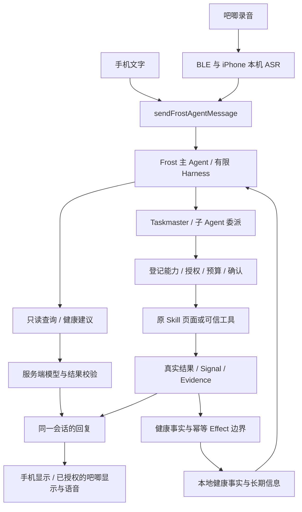

# Pocket Buddy 系统架构

本页对应当前 Pocket Buddy 源码。产品介绍见 [README](README.md)，历史产品基线见 [产品文档索引](docs/product/README.md)。

## 1. 统一输入与任务执行

模型只能提出候选动作或结果。会话日志、权限、确认门、取消和超时由宿主执行；没有实际结果时保持等待、失败或未知。

## 2. 组件职责

- **界面**：[FrostBuddyPage](src/app/components/FrostBuddyPage.tsx) 展示对话和计划；App 级 Companion 承接硬件输入及页面间状态。
- **统一入口**：[frostAgentRuntime](src/app/lib/frostAgentRuntime.ts) 与 [frostConversation](src/app/lib/frostConversation.ts) 连接主会话、只读问答、记忆和 Skill 交接。
- **Harness**：[runtime](frost-agent/runtime/) 提供 Session Log、Inbox、有限循环、工具注册、审批和 Goal Driver。
- **子 Agent**：[subagents](frost-agent/subagents/) 与 [委派监督](frost-agent/taskmaster/subagentDelegation.ts) 隔离 Skill 任务上下文；子 Agent 不获得任意设备控制或健康写权限。
- **健康执行边界**：[taskmaster](frost-agent/taskmaster/README.md) 处理任务、Signal、确认、幂等 Effect 与 Health Event。
- **Canvas**：[skill-canvas](frost-agent/skill-canvas/) 用于编译、结构预览和保存；旧 `skill-taskmaster/` 仅兼容转发，不是另一套真实执行器。

更细的职责、预算、失败和恢复规则见 [Frost 架构](frost-agent/ARCHITECTURE.md)。

## 3. 健康记忆

[HealthMemoryPanel](src/app/components/HealthMemoryPanel.tsx) 与 [frostHealthMemory](src/app/lib/frostHealthMemory.ts) 将已确认事件按本地日期汇总，展示今天、最近有记录日期及长期目标和限制。

- Photos 观察结果必须经用户确认后才成为餐食事实。
- 训练页面的真实完成回调可以形成运动事件；打开页面本身不是一次运动。
- 手机步数是有读取时间的累计快照，不与跑步步数重复相加。
- 撤回保留审计，但从后续摘要和建议依据中排除。
- 云端请求只使用授权的有限上下文；建议绑定记忆版本和已有证据 ID。
- 只有持久存储实际可用时，才能承诺记录跨刷新保留。

服务端校验入口：[health-memory.mjs](server/health-memory.mjs)。它不能根据一句模型回复直接修改本地健康事实。

## 4. Photos、运动与硬件

Photos 实际入口是 [FoodPhotosTab](src/app/components/FoodPhotosTab.tsx)，不是旧照片浏览页面。Qwen 视觉与 SAM 推理经 [photo-harness](server/photo-harness.mjs) 返回带质量状态的候选；模型与 Python 服务独立部署。

练了吗和 Her Motion 各保留自己的运行时、摄像头权限及开始/结束协议。Frost 交接可以请求进入能力与相机流程，但不会伪造系统授权；训练子页面必须在主应用打包前重建。

吧唧由 [OJBadge 固件](hardware/ojbadge-agent-link/) 与 [iOS 桥接](native/frost-badge/) 协同。吧唧不是独立联网的大模型，手机负责本机 ASR 和云请求；显示回执与音频实际播放是不同证据。黑屏/后台链路需要逐包真机验收。

## 5. 模型、配置与部署

- 参赛部署通过官方 `@google/genai` SDK 在 Cloud Run 调用 Gemini 3.5；Taskmaster 的确定性控制面、工具注册和证据门不交给模型绕过。
- 所有服务端 Gemini / Qwen 文本请求先经过版本化 [Prompt Harness](docs/backend/PROMPT_HARNESS.md)；前端旧 `system` 文本只是低权威任务说明，不能覆盖服务端策略。
- Firestore 只保存 Agent 运行状态、模型、时延、字符计数和 Cloud Run 修订等证据元数据，不保存提示词、回复正文、健康事实或位置。
- Qwen 兼容路径仍可按服务端配置启用，且继续用于既有视觉能力；任何云端密钥都不进入前端包。
- MiniMax 用于已接入的语音合成路径；录音转写与本地提示音有自己的路径。
- 地图和路线展示继续使用高德地图（AMap）；它是独立第三方展示层，不是参赛 Agent 的推理或云基础设施。
- SAM、训练模型、原始音频等外部输入不进入普通 Git 源码快照。
- MNN 等模型兼容代码仍可存在，但不是当前所有手机功能的必需前提。
- 参赛 Cloud Run 发布入口是 [deploy/all-things-agentic](deploy/all-things-agentic/README.md)；常规 Web 发布入口仍是 [deploy/pocketbuddy](deploy/pocketbuddy/README.md)。
- 当前 GCP 拓扑与“已实现/已预留”数据范围见 [当前 GCP 架构](docs/backend/CURRENT_GCP_ARCHITECTURE.md) 与 [云数据边界](docs/backend/CURRENT_DATA_BOUNDARIES.md)。

## 6. 验证边界

自动测试检查协议、路由、权限、记忆、取消和状态机；模型质量、真机相机、健康授权、硬件播放和锁屏仍需独立实测。源码、构建、部署、安装、真实完成证据不能互相替代。

历史“双 Taskmaster”与完整 Canvas Graph 执行设计保留在产品和历史规范中，仅用于理解演进；参赛版 Google Cloud 接入范围与实际部署证据以 [参赛说明](docs/competitions/all-things-agentic-2026/README.md) 为准。
