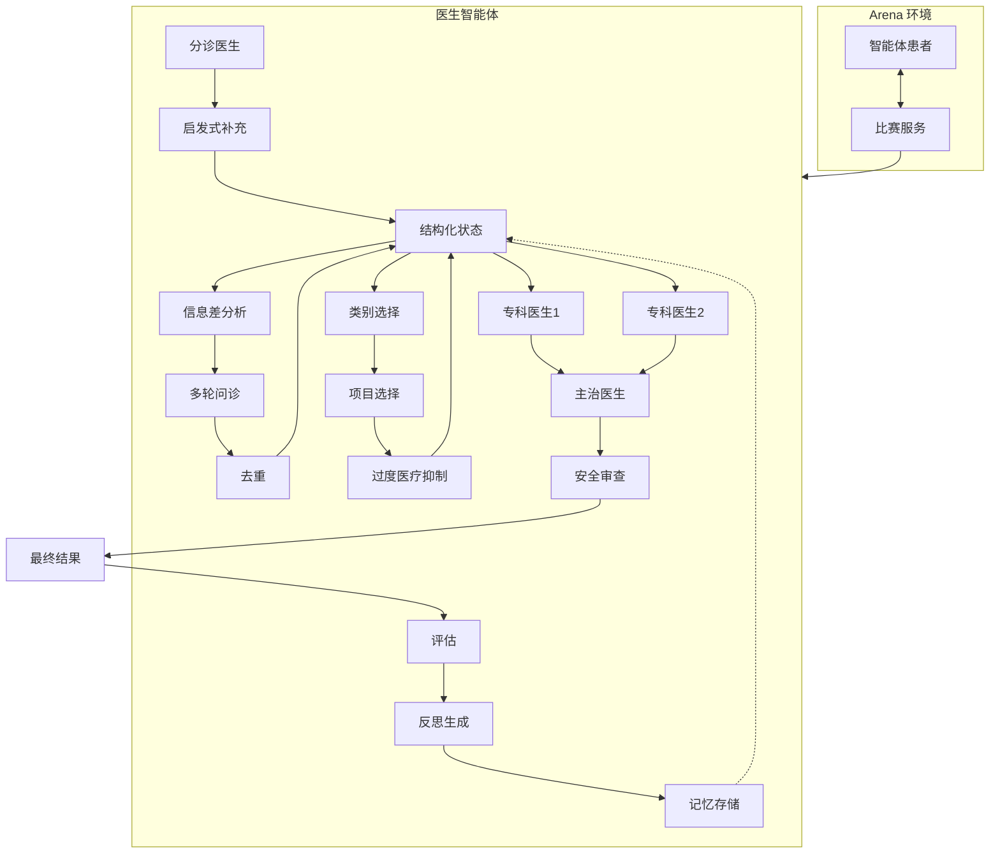
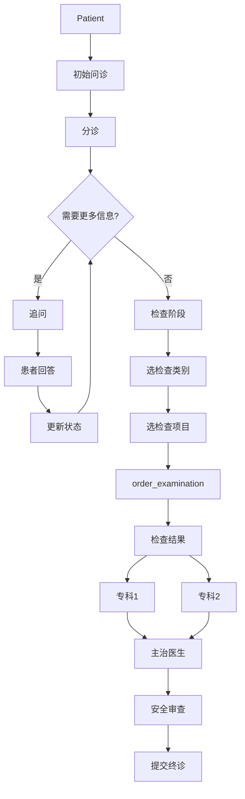
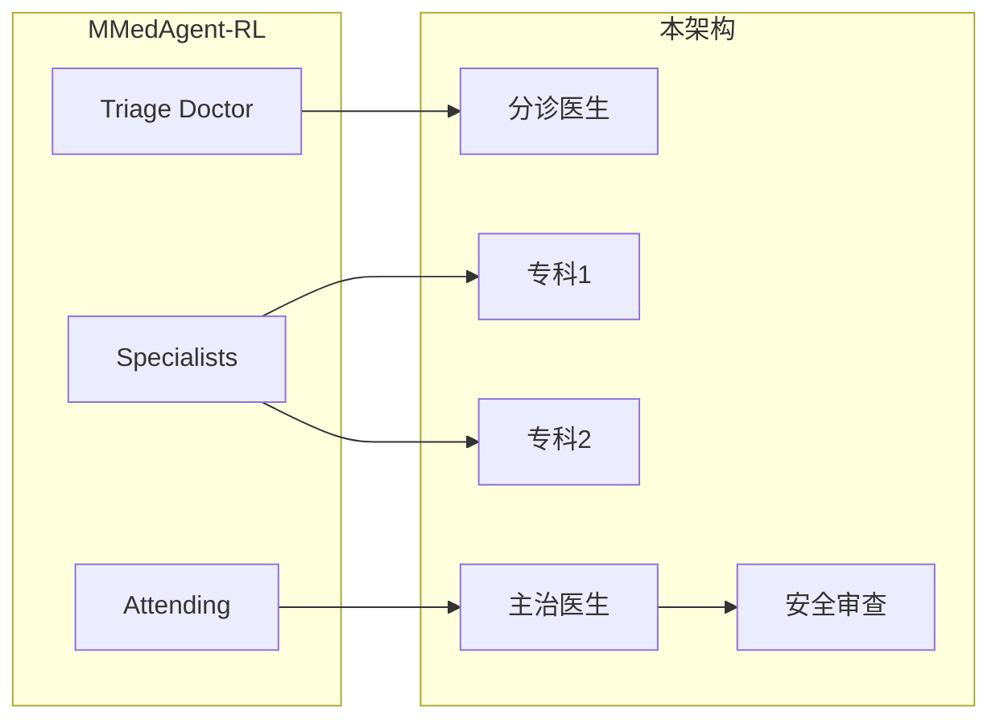
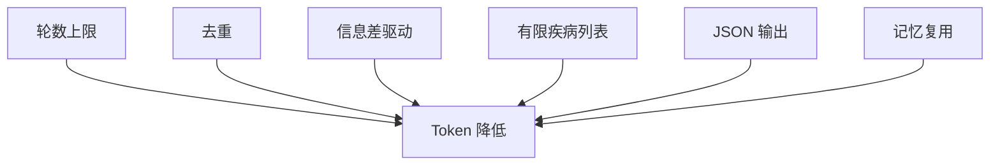
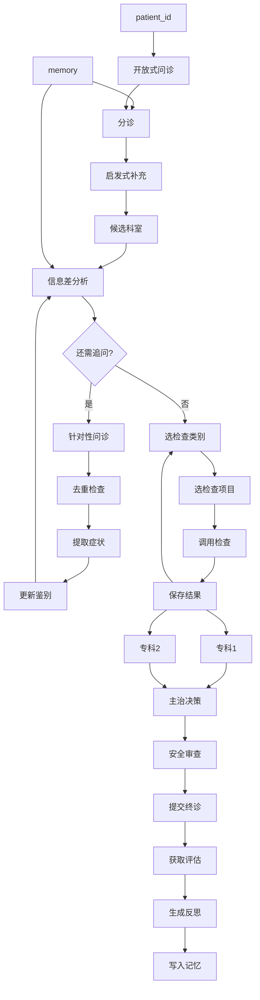
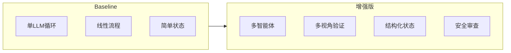

# 多智能体医生架构（Mermaid 图）

## 1. 总体架构总览

## 2. 数据流主循环

## 3. 论文对应关系

## 4. Token 优化

## 5. 完整流程图

## 6. 角色一览

| 角色 | Prompt | 职责 |
|------|--------|------|
| 分诊医生 | TRIAGE_PROMPT | 判断科室 |
| 信息差分析 | INFO_GAP_PROMPT | 决定追问 |
| 专科医生1 | SPECIALIST | 全科评估 |
| 专科医生2 | SPECIALIST | 鉴别诊断 |
| 主治医生 | ATTENDING | 综合决策 |
| 安全审查 | SAFETY_REVIEW | 检查禁忌 |

## 7. 对比

