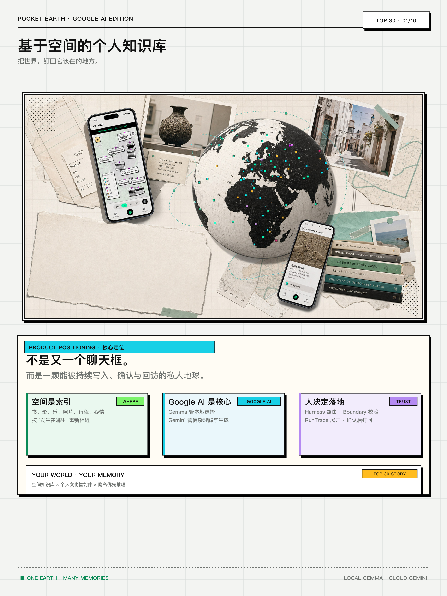

# Pocket Earth · Architecture & Evidence Index

本页集中展示 Pocket Earth 的产品架构、Google AI 推理平面、Public Earth 核验系统与 Frost Edge 真机证据。所有图均依据当前代码、自动测试和实际设备边界绘制；代码锚点直接链接到仓库中的运行实现。

## 产品与系统架构

| # | 图 | 回答的问题 |
|---:|---|---|
| 01 | [产品定位](../assets/architecture/system/01-product-spatial-knowledge-cover.png) | 地球如何成为跨媒介个人知识的统一空间索引？ |
| 02 | [用户痛点与空间索引](../assets/architecture/system/02-user-fragmentation-spatial-index.png) | 记录分散、文化语境和隐私问题如何被同一空间对象协议收敛？ |
| 03 | [端到端产品闭环](../assets/architecture/system/03-end-to-end-product-workflow.png) | 输入、路由、草稿、确认和空间落点如何形成可回访对象？ |
| 04 | [Google 双推理平面](../assets/architecture/system/04-google-edge-cloud-inference-plane.png) | Gemma、MediaPipe、WebGPU 与 Gemini 如何分工？ |
| 05 | [Gemma 3n 浏览器运行时](../assets/architecture/system/05-gemma-3n-browser-runtime-evidence.png) | 端侧能力如何从权重、加载、运行时和 UI 四层被核验？ |
| 06 | [跨文化看展工作流](../assets/architecture/system/06-cross-cultural-exhibition-workflow.png) | 显式同意、双语导览、时间线、文化桥与用户确认如何形成闭环？ |
| 07 | [Harness / RunTrace / 长期记忆](../assets/architecture/system/07-frost-agent-harness-memory-trace.png) | 多 Agent 如何被路由、委派、校验、追踪并最终钉回地球？ |
| 08 | [公私双地球与 FactRelay](../assets/architecture/system/08-private-public-earth-factrelay.png) | 私人记忆与公共事实怎样物理分轨，模型为何不能自我发布？ |
| 09 | [Frost Edge 软硬件共生](../assets/architecture/system/09-frost-edge-hardware-software-system.png) | 日落电台、口袋播客和地球答案如何在树莓派上共享公共事件边界？ |

## 最短代码锚点

- Gemma + MediaPipe + WebGPU：`frost-agent/edge/gemmaEdge.ts`、`src/app/components/OnDeviceBrainPanel.tsx`；
- Gemini task 路由与 Google-only provider：`frost-agent/harness/taskModels.ts`、`frost-agent/provider-compat/`、`server.mjs`；
- 看展闭环与云图片同意：`src/app/lib/exhibition/`、`src/app/lib/privacy/cloudUploadBoundary.ts`；
- Harness 与 RunTrace：`frost-agent/harness/`、`src/app/lib/observe/bus.ts`、`src/app/components/RunTrace.tsx`；
- Public Earth / FactRelay：`src/app/components/PublicEarthPage.tsx`、`src/app/lib/publicKnowledge/review.ts`、`knowledge/agent-harness.mjs`；
- Daily Knowledge / Pocket Podcast：`knowledge/daily-worker.mjs`、`knowledge/podcast-agent.mjs`；
- Frost Edge：`frost-feed-service.mjs`、`hardware/frost-edge-google/frost-hardware-bridge.mjs`、`hardware/frost-edge-google/raspi/`。

## Frost Edge 硬件图集

硬件图、三入口界面和 12 张 Whisplay 实际渲染画面见 [Frost Edge 硬件视觉证据](../assets/hardware/README.md)。技术细节、目录隔离、事件白名单和实测命令见 [Frost Edge Google AI 硬件技术说明](../hardware/FROST-EDGE-GOOGLE.md)。

## 运行状态边界

- 官方 Gemini API 有有效 Key 时优先；当前生产健康检查显示 GMI 仅作为 `google/gemini-*` 的备用传输，模型所有者仍为 Google。
- Gemma 权重由服务器同源 Range 分发，但推理在浏览器 MediaPipe + WebGPU 中发生；3.04 GB 权重不进入 Git。
- Frost Edge 的 Gemma 4 E4B 权重只存在于 Raspberry Pi 本机，服务绑定 `127.0.0.1:8787`；真机服务已经运行并通过真实生成验收，权重、设备缓存和密钥不进入 Git。
- 八个公共知识领域的 Agent 接口均已实现；实时版次取决于 provider / snapshot，无数据会明确显示 `unavailable`。
- Frost Feed 当前线上默认关闭；硬件完成度通过实物、视频、源码、事件白名单和 smoke test 证明，而不是声称公开 Demo 与实体设备实时在线。

4K 硬件图生成脚本：[`scripts/render_hardware_core_4k.mjs`](../../scripts/render_hardware_core_4k.mjs)。真机验收记录：[`hardware/frost-edge-google/raspi/GEMMA-4-E4B-VALIDATION.md`](../../hardware/frost-edge-google/raspi/GEMMA-4-E4B-VALIDATION.md)。
