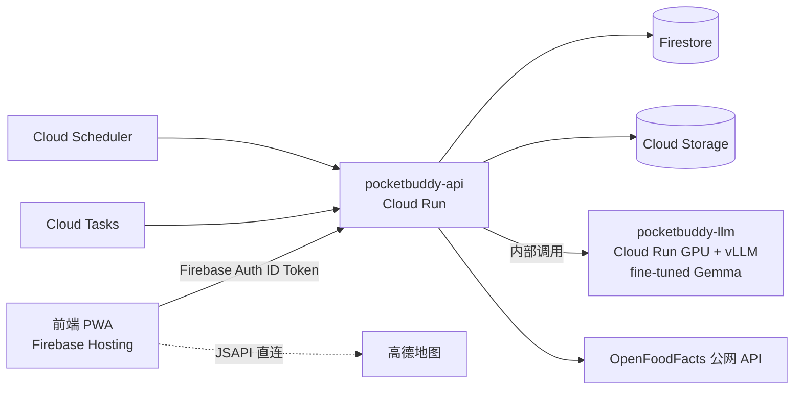

> **历史规划资料（2026-08-21 至 2026-08-23）**：从此前 main `eaffa7ff` 恢复，保留正文用于追溯。下面的“唯一权威”“强制”“当前已具备”等表述只属于当时方案，不是当前工程指令或部署事实；不覆盖当前 `server.mjs`、`server/` 和 Frost 实现。最新入口见 [产品文档索引](../product/README.md) 与 [当前系统架构](../../ARCHITECTURE.md)。

# Pocket Buddy 后端开发总规范（BACKEND_SPEC）

> **版本**：v1.0 · 2026-08-21
> **用途**：本文件是 Pocket Buddy 后端的**唯一权威规范**。所有开发者（以及协助生成代码的 LLM）在写任何前端 API 调用或后端代码前，**必须**先阅读本文件，并配合以下两份文件使用：
> - `API_REFERENCE.md` — 所有 API 端点的请求/响应定义
> - `DATA_SCHEMA.md` — 所有数据实体的存储格式与 GCP 数据库选型
>
> 三份文件冲突时，以 `DATA_SCHEMA.md` 的字段定义为准、以 `API_REFERENCE.md` 的端点定义为准、其余以本文件为准。**现有仓库 `server/` 目录下的旧后端代码一律作废，不作为参考。**

---

## 1. 项目背景

Pocket Buddy 是一个运动健康陪伴 Agent PWA（React 18 + Vite）。当前前端 100% 端侧存储（localStorage / IndexedDB），无用户体系。本次目标：搭建部署在 **GCP** 上的全新后端，实现多用户、云端持久化与核心闭环 API。

**本期范围（核心闭环）**：

1. 用户认证（Firebase Auth）与用户档案
2. Buddy（宠物伙伴）及其记忆、立绘
3. 健康事件（HealthEvent）云端同步（餐食 / 运动 / 自然时刻 / skill）
4. 跑步路线 Session、Her Motion 相机 Session
5. 自然时刻识别 + 虚拟树
6. 营养查询（OpenFoodFacts 代理）与餐食照片分析
7. LLM 推理代理（fine-tuned Gemma）
8. 宠物抠图 pipeline（图片 → 萌化 → 去背）
9. 每日总结（Daily Summary）

**明确不在本期范围**：Plaza 社群发布、Skill 商店/签章分发、Agent Session 云端续跑、设备性能证据上传。前端这些功能继续留在端侧。

---

## 2. 技术栈与 GCP 服务选型（强制）

| 层 | 选型 | 说明 |
|---|---|---|
| API 服务 | **Cloud Run**（Node.js 20 + TypeScript + Fastify） | 单一服务 `pocketbuddy-api`，容器化，自动扩缩，闲时缩到 0 |
| 认证 | **Firebase Auth** | 支持 Google 登录 + 匿名登录（匿名可后续升级绑定）。后端用 Firebase Admin SDK 验证 ID Token |
| 主数据库 | **Firestore（Native mode）** | 所有结构化数据。选型理由见 `DATA_SCHEMA.md` §1 |
| 对象存储 | **Cloud Storage (GCS)** | 所有二进制：立绘、餐食/自然照片、抠图产物。桶定义见 `DATA_SCHEMA.md` §5 |
| LLM 推理 | **Cloud Run GPU (L4) + vLLM，部署 fine-tuned Gemma**（见 §5） | 前端只经过 `pocketbuddy-api` 代理访问，永不直连 |
| 异步任务 | **Cloud Tasks** | 宠物抠图 pipeline 的分阶段任务投递 |
| 定时任务 | **Cloud Scheduler** | 每日总结生成、临时文件清理 |
| 密钥 | **Secret Manager** | AMap key、模型服务 token 等。**禁止**写进代码或环境变量明文 |
| 日志/监控 | **Cloud Logging + Error Reporting** | Fastify 输出结构化 JSON 日志（stdout 即可被收集） |
| 前端托管 | **Firebase Hosting** | 静态 PWA + rewrite 到 Cloud Run |
| CI/CD | **Cloud Build**（连 GitHub，push main 自动部署） | |

**禁止引入**：Cloud SQL、自建 Redis、Kubernetes(GKE)、自建消息队列。Hackathon 周期内保持最小运维面。

## 3. 系统架构



- 前端**只允许**调用：`pocketbuddy-api`、高德 JSAPI、Open-Meteo（天气，直连保留）。其余一切外部服务由后端代理。
- `pocketbuddy-llm` 是内部服务（`--no-allow-unauthenticated`），只接受来自 `pocketbuddy-api` 的服务间调用（IAM invoker）。

## 4. 后端仓库结构约定

```
backend/
  src/
    index.ts            # Fastify 启动、插件注册、GET /v1/healthz
    plugins/auth.ts     # Firebase Token 验证中间件
    routes/             # 每个资源一个文件，对应 API_REFERENCE.md 各资源（nature 与 trees 分两个文件）
      me.ts  buddies.ts  healthEvents.ts  runSessions.ts
      motionSessions.ts  nature.ts  trees.ts  food.ts
      llm.ts  pets.ts  media.ts  summaries.ts  internal.ts
    services/           # Firestore/GCS/LLM 访问封装，routes 不直接碰 SDK
    schemas/            # 所有实体的 zod schema（与 DATA_SCHEMA.md 同步，是唯一校验来源）
    lib/                # 错误、日志、idempotency 工具
  test/                 # vitest，每个 route 至少一条 happy path + 一条 401
  Dockerfile
  cloudbuild.yaml
```

## 5. LLM 推理架构（fine-tuned Gemma）

结论：**微调用 Vertex AI，推理自架在 Cloud Run GPU**。不需要自管 GPU VM。

1. **微调**：用 Vertex AI Custom Training（或本地/Colab）对 **Gemma 3 4B** 做 LoRA 微调，产物（merged weights 或 base+adapter）存 GCS。
2. **推理**：Cloud Run GPU（NVIDIA L4）跑 **vLLM**，加载微调后模型，暴露 OpenAI 兼容 `/v1/chat/completions`。选 Cloud Run 而非 Vertex AI Endpoint 的原因：**可缩到 0**（Vertex 在线端点 GPU 全天计费，hackathon 成本高一个数量级）；冷启动约 30–60s，demo 前预热一次即可（`min-instances=1` 开关随用随开）。
3. **视觉任务**（餐食照片分析、自然时刻识别）：Gemma 3 4B 具备多模态能力，同一服务承接；若微调影响视觉质量，允许在 `pocketbuddy-api` 内 fallback 到 **Vertex AI Gemini Flash**（配置开关 `LLM_VISION_FALLBACK=gemini`）。
4. **契约隔离**：前端与业务代码只认 `POST /v1/llm/generate`（见 API 文件），**不感知**底层是 Gemma 还是 Gemini。换模型 = 只改 `services/llm.ts`。
5. 端侧 MNN 路线保留为前端可选项，与后端无关。

## 6. 通用开发规范（LLM 生成代码必须遵守）

### 6.1 API 风格

- REST + JSON，所有端点前缀 `/v1`。
- **字段命名：完全沿用 `DATA_SCHEMA.md` 中每个实体既有的字段名**（多数为 snake_case，Buddy 相关为 camelCase——这是前端既有契约，禁止“统一重命名”）。新增字段一律 snake_case。
- 时间一律 ISO 8601 UTC 字符串（`2026-08-21T08:00:00Z`）。前端已如此。
- 客户端生成 ID 的可变实体（run/motion session）用 `PUT` upsert；不可变事件类实体（health_events）只走 `POST :batchSync`；服务端生成 ID 的用 `POST`。
- 列表端点必须支持分页：`?limit=`（默认 50，最大 200）+ `?page_token=`，响应含 `next_page_token`（无更多则省略）。例外：有固定小上限的集合（如 buddies ≤16）可不分页。

### 6.2 认证

- 除 `GET /v1/healthz` 外，**所有 `/v1/*` 端点**要求 `Authorization: Bearer <Firebase ID Token>`。`/internal/*` 端点不对前端开放，改用 Cloud Scheduler / Cloud Tasks 的 OIDC 服务间认证。
- 中间件验证后将 `uid` 注入请求上下文；**所有读写必须以 `uid` 为数据边界**，任何查询不得跨用户。`user_id` 字段值即 Firebase `uid`（取代前端现在硬编码的 `'local-user'`）。
- 匿名用户与正式用户权限相同；账号升级由 Firebase 客户端 SDK 处理，后端无感。

### 6.3 错误格式（统一）

```json
{ "error": { "code": "not_found", "message": "buddy not found", "details": {} } }
```

| HTTP | code 示例 |
|---|---|
| 400 | `invalid_argument`（zod 校验失败，`details` 带字段错误） |
| 401 | `unauthenticated` |
| 403 | `permission_denied` |
| 404 | `not_found` |
| 409 | `conflict`（幂等冲突 / revision 不符） |
| 429 | `rate_limited` |
| 500 | `internal` |

### 6.4 幂等与同步（重要）

前端是 offline-first，实体自带 `sync: { state, revision }` 字段：

- 批量同步端点（如 `POST /v1/health-events:batchSync`）以 `event_id` 为幂等键：同 id 且内容（canonical JSON，忽略 `sync` 字段）相同 → 静默成功；同 id 内容不同 → 该条返回 `conflict`，不影响批次内其他条目。
- 有副作用的 POST 端点支持 `Idempotency-Key` 请求头（24h 内同 key 返回首次结果）。
- 服务端写入成功后返回的实体 `sync.state` 一律为 `"synced"`。

### 6.5 校验与安全

- 所有请求体先过 zod schema（`src/schemas/`），再进业务逻辑。schema 与 `DATA_SCHEMA.md` 字段一一对应，长度/范围限制照抄（如 buddy `name ≤ 24`、`memories ≤ 120`）。
- 图片上传：只收 `image/jpeg | image/png | image/webp`，单文件 ≤ 12MB，服务端校验 magic bytes。
- 自然识别置信度 < 0.7 时 `label` 强制为 `"unknown"`（产品红线，不许模型硬猜）。
- 长期记忆（FrostLongTermMemory）**本期不上云**，后端不得新增相关端点。（Her Motion session 虽带 `privacy: 'private-local'` 字段，但该标注指摄像头画面不离开设备，其会话元数据允许同步，见 DATA_SCHEMA §3.6。）
- CORS：只允许 Firebase Hosting 域名与 `http://localhost:5173`。
- 不在日志中输出请求体中的照片 base64、prompt 全文（截断到 200 字符）。

### 6.6 开发流程

- 前后端并行开发，双方以这三份 md 为唯一接口契约；改契约必须先改 md（PR 里同时改文档与代码）。
- 前端在接通后端前，用相同契约写本地 mock（`src/app/lib/api/mock.ts`）。
- 每个端点合并前须有 vitest 测试；`npm test` 全绿才可部署。

### 6.7 给 LLM 的 Do / Don't

**Do**：按 §4 目录结构落文件；复用 `services/` 封装；每个实体只在 `schemas/` 定义一次 zod schema 并推导 TS 类型；错误一律走 §6.3 格式。

**Don't**：不要参考仓库现有 `server/*.mjs` 旧代码；不要引入 §2 禁止的服务；不要自行发明新字段名或改既有字段大小写；不要在前端代码里直连 Firestore/GCS（一切走 `pocketbuddy-api`，唯一例外是 Firebase Auth 客户端 SDK）；不要把密钥写进代码。
