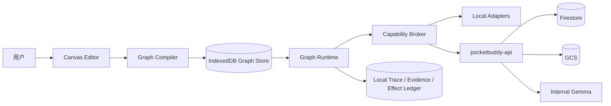

# Pocket Buddy Skill Taskmaster 统一协议与前后端协同规范

> **版本**：v1.2 · 2026-08-23
> **用途**：定义 Skill Taskmaster 如何把可视化能力卡牌编译为可真实执行、可恢复、可审计的 Skill Graph，并约束它与 Pocket Buddy 现有前端、端侧 Runtime 和云端 API 的协作方式。  
> **适用对象**：产品、前端、端侧 Runtime、后端、测试，以及协助生成代码的 LLM。

## 与现有后端规范的关系

本文件是 `docs/backend/` 下的第四份**补充规范**，不覆盖前三份权威文档：

1. [`DATA_SCHEMA.md`](./DATA_SCHEMA.md) 决定云端字段、实体与存储位置。
2. [`API_REFERENCE.md`](./API_REFERENCE.md) 决定云端端点、请求与响应。
3. [`BACKEND_SPEC.md`](./BACKEND_SPEC.md) 决定其余后端架构、认证、安全与开发流程。
4. 本文件只定义 Skill Taskmaster 的端侧协议、编译、运行，以及它如何绑定上述既有契约。

如需新增 Skill 相关的 Firestore 集合、字段、媒体 `purpose` 或 `/v1` 端点，必须先同时修改前三份文档，再修改 zod、服务、前端 mock 与 UI，并在同一 PR 提交。不得以本文件为由先实现影子后端。

---

## 0. 执行摘要

### 0.1 产品判断

“卡牌好看”解决理解门槛；“卡牌合同可执行”才解决产品可信度。

Skill Taskmaster 的成功标准不是拼出一个 UI，而是让非程序员在不写代码的情况下，构建一份被同一端侧 Runtime 真实执行、可恢复且可审计的 Skill Graph。

### 0.2 四个不变量

1. **唯一执行物**：Canvas 编译得到的 `graph_id`、`version`、`graph_hash` 必须与 Runtime 实际加载的一致；禁止另有隐藏硬编码流程。
2. **统一能力合同**：照片、声音、位置、健康、地图、Gemma 与通知的差异只体现为端口、配置、执行位置和 Provider Binding。
3. **后端契约优先**：Skill Taskmaster 不自行新增云端字段、集合或服务。
4. **数据最小化**：Graph、运行轨迹、设备证据与长期记忆默认留端侧；只把前三份后端规范允许的 HealthEvent、Session、Nature、Media 等业务事实同步上云。

### 0.3 当前架构结论

- 端侧 Canvas、Compiler 和 Runtime 使用同一份不可变 Skill Graph。
- 能力模块使用 `pocket-capability/v1` 合同，Graph 使用 `pocket-skill-graph/v1`。
- 草稿、Graph、Run、Trace、Evidence 与 Effect Ledger 存 IndexedDB。
- 云端严格复用 `pocketbuddy-api`、Firebase Auth、Firestore、GCS 与内部 Gemma 服务。
- 本期不建设云端 Skill 商店、Graph Registry、Agent Session 云端续跑或设备证据上传。

---

## 1. 产品定位与真实边界

### 1.1 核心用户任务

用户不需要理解 SDK、回调或数据库，只需回答五件事：

1. 什么时候开始？
2. 读取什么数据？
3. 如何处理和判断？
4. 做什么动作？
5. 留下什么结果？

典型 Skill：

- **植物观察**：拍照 → 上传已批准的自然照片 → 自然观察 API → Gemma 识别 → 展示结果。
- **鸟声记录**：录音 → 端侧鸟声分类 → 置信度门 → 保存本地 Evidence。当前后端无音频上传契约，因此原始音频不上云。
- **城市恢复跑**：手动开始 → 获取位置 → AMap 路线 → 语音陪跑 → 同步 Run Session 与 `run_completed` HealthEvent。

### 1.2 当前实现与缺口

| 能力 | 当前已具备 | 仍需补齐 |
|---|---|---|
| Skill Canvas | 目标、能力卡、拖拽组合、结构检查、保存和 dry-run | 节点端口与配置还需完全合同化；preview 不得伪装真实 GPS/健康/模型调用 |
| Health Taskmaster | 确认、权限、Signal、Effect Ledger、checkpoint、SAFE_STOP、IndexedDB | 从固定 `toolsForTask` 映射升级为直接执行用户 Graph |
| Skill Manifest | `pocket-skill/v1` 校验、签名、本机安装/装备/回滚 | 云端 Skill 商店与签章分发不在本期 |
| Provider/工具 | Gemma API、MNN、Her Motion、AMap、自然观察适配面 | 统一命名、I/O Schema、错误、执行位置与数据去向 |

### 1.3 禁止的产品捷径

- 为每个新 Skill 新建 React 页面、TaskKind 或 orchestrator 分支。
- 用 preview、fallback、静态 JSON 或旧缓存冒充真实 Provider 调用。
- 前端绕过 `pocketbuddy-api` 直连 Firestore、GCS、vLLM 或 Gemini。
- 为 UI 方便自行新增 Firestore 字段、集合、媒体 `purpose` 或 `/v1` 端点。

---

## 2. 用户构建链路

### 2.1 六步主流程

| 步骤 | 用户动作 | 系统产物 | 阻断条件 |
|---|---|---|---|
| 01 定义目标 | 编辑名称、期望结果、场景和安全边界 | `GoalSpec` | 名称为空、目标不可验证 |
| 02 选择能力 | 按工程类别筛选并查看卡牌正反面 | `CapabilityRef + config` | Provider 不可用、版本不兼容 |
| 03 组合技能 | 拖拽到可扩展画布并连接端口 | `SkillCanvasDraft` | 类型不兼容、循环、孤立节点 |
| 04 完善配置 | 填写模型、阈值、路线、输出、重试/超时 | `ValidatedNodeConfig` | 缺少必填项、越权 |
| 05 选择形象 | 为完整 Skill 命名并选择动物头像 | `SkillIdentity` | 形象不得影响运行权限 |
| 06 编译运行 | 预检权限、dry-run、真实运行、保存/安装 | `CompiledGraph + Run + Evidence` | 校验失败、权限拒绝、安全停止 |

### 2.2 交互规则

- 组合画布默认只展示一行，点击后展开；新增模块时按行自动扩展。
- 能力卡只表达单个 building block，不使用动物头像；动物头像只属于最后生成的完整 Skill。
- 卡面中文为主、技术 ID 为辅。正面解释用途，背面展示端口、Provider、权限、执行位置、证据和风险。
- Skill 名称、目标、模块别名、提示语、输出文案与形象名均可编辑。
- 协议 ID、端口类型、权限和数据去向不能被自由文本覆盖。
- 不兼容端口必须就地报错；可推荐显式转换模块，但不得静默改线。

---

## 3. 能力模块分类

分类采用工程语义，避免“触发、感知、思考”等含混标签。一个模块只承担一种可复用能力，并通过 Typed Ports 与其他模块组合。

| 类别 | 职责 | 典型模块 | 端口示例 |
|---|---|---|---|
| 启动条件 Trigger | 创建一次 Skill Run | 手动启动、定时、设备事件、地理围栏 | `event.manual → run.start` |
| 数据输入 Input | 读取用户或环境数据 | 位置、照片、录音、健康摘要、文件 | `image/jpeg`、`audio/pcm`、`geo.point` |
| 处理与模型 Processor | 转换、识别、推理、聚合 | Gemma 文本/视觉、鸟声分类、姿态识别、OCR | `image → classification[]` |
| 流程控制 Control | 分支、阈值、确认、重试、并行与停止 | 置信度门、安全门、用户确认、合并 | `boolean`、`error`、`decision` |
| 动作输出 Action | 产生外部可见动作 | 语音、通知、地图标记、设备指令 | `message → effect` |
| 状态与证据 State | 保存事实、证据与中间状态 | IndexedDB Evidence、HealthEvent/Session 同步 | `record`、`event_id` |

Auto Renderer、权限解释、Provider 选择、日志和 Evidence Viewer 是跨层服务，不伪装成普通节点。只有用户确实需要表单或确认时，才使用 `ui.form`、`ui.confirm` 等交互模块。

---

## 4. Pocket Skill Protocol Family

### 4.1 分层协议

| 层 | 协议 | 负责内容 | 主要实现 |
|---|---|---|---|
| 产品身份层 | `pocket-skill/v1` | 名称、形象、版本、本机安装/装备状态 | 端侧 Skill Registry |
| 可执行图层 | `pocket-skill-graph/v1` | 节点、边、端口、配置、错误分支、权限和 Graph Hash | IndexedDB Graph Store |
| 能力合同层 | `pocket-capability/v1` | Typed Ports、Config Schema、执行位置、API/Host Binding | 端侧 Catalog / Broker |
| 运行任务层 | `frost-task/v1` | Run、Node 状态、检查点、确认、取消和 SAFE_STOP | 端侧 Graph Runtime |
| 异步与副作用 | `task_signal/v1` + `effect_record/v1` | 外部恢复、本机幂等、重放与运行审计 | IndexedDB Store / Ledger |
| 云端业务事实 | `health_event/v1` + 既有 Session 实体 | 只同步已批准的健康、自然、跑步和动作结果 | `pocketbuddy-api → Firestore` |

### 4.2 共享原语

- **Stable ID**：`capability_id`、`skill_id`、`graph_id`、`node_id`、`run_id`、`action_id`、`signal_id`、`effect_id`、`evidence_id`。
- **版本**：协议版本 + 能力 SemVer + Graph SemVer + Provider revision；Run 固定解析后的版本与 `graph_hash`。
- **Typed Ports**：声明 `schema_ref`、`required`、`cardinality`、`streaming`、`sensitivity` 和允许的 coercion。
- **统一错误**：端侧错误映射到 `code/category/retryable`；HTTP 错误严格使用 `BACKEND_SPEC.md` 规定的 `{error:{code,message,details}}`。
- **权限**：浏览器/设备权限、Firebase 身份、API 写入和模型调用分开；自由文本和安装状态不能扩权。
- **来源与证据**：端侧记录 node/provider/model/hash；云端只写既定 `provenance`、`media_ids`、`sync` 和 `supersedes_event_id`。

### 4.3 Capability Contract

每张能力卡的正反面都从同一份 Capability Contract 渲染。合同同时声明执行位置（`local` 或 `pocketbuddy-api`）、输入输出 Schema、所需权限与允许的数据落点；前端不得维护第二份展示契约。

```jsonc
{
  "protocol": "pocket-capability/v1",
  "identity": {
    "id": "sensor.location",
    "version": "1.0.0",
    "family": "input"
  },
  "ports": {
    "inputs": [
      { "name": "request", "schema_ref": "pocket://schema/location.request/v1" }
    ],
    "outputs": [
      { "name": "point", "schema_ref": "pocket://schema/geo.point/v1" },
      { "name": "error", "schema_ref": "pocket://schema/error/v1" }
    ]
  },
  "config_schema": {
    "type": "object",
    "properties": { "accuracy": { "enum": ["balanced", "high"] } }
  },
  "runtime": {
    "execution": "local",
    "binding": "host.location.getCurrent",
    "providers": ["web.geolocation", "amap-jsapi-v2"]
  },
  "permissions": ["read:location"],
  "side_effect": "none",
  "data_policy": { "cloud": "none", "raw_retention": "none" },
  "limits": { "timeout_ms": 10000, "retry": { "max": 1 } },
  "fallback": ["provider-alternative", "user-confirmation", "stop"]
}
```

### 4.4 Typed Port 基础类型

| 域 | 建议 Schema | 示例生产者 | 示例消费者 |
|---|---|---|---|
| 事件 | `event.manual/v1`、`device.event/v1`、`schedule.tick/v1` | 按钮、设备、定时器 | 任何 Trigger |
| 媒体 | `image/jpeg-ref`、`audio/pcm-ref`、`video/frame-ref` | 相机、相册、麦克风 | 视觉、声音、姿态模型 |
| 位置与路线 | `geo.point/v1`、`route.plan/v1`、`route.progress/v1` | GPS、地图 SDK | 路线规划、地图标记 |
| 健康 | `health.summary/v1`、`pose.signal/v1` | HealthKit/Health Connect、姿态引擎 | 安全门、训练处方 |
| 模型结果 | `classification/v1`、`structured.answer/v1`、`decision/v1` | Gemma、分类器、OCR | 阈值门、Renderer、Action |
| 事实与证据 | `local.evidence/v1`、`health_event/v1`、session refs | State / Action | 本机审计、总结、地图世界 |

---

## 5. Graph Compiler

### 5.1 编译流水线

1. **Normalize**：锁定能力版本，补齐默认配置，把可编辑标签与协议 ID 分离。
2. **Type Check**：校验端口 Schema、必需输入、基数、streaming 和敏感度；需要转换时插入显式确认节点。
3. **Graph Check**：检查悬空边、重复边、循环、不可达节点、启动条件和成功/错误/停止终点。
4. **Provider Resolve**：依据设备、地区、联网状态、模型资产和用户偏好选择 Provider；把不可用原因返回前端。
5. **Policy & Permission**：计算最小权限集合、确认门、公开发布和敏感数据规则。
6. **Execution Plan**：生成拓扑分组、并行段、重试/超时、错误边、Signal wait point 和 Effect boundary。
7. **Freeze**：输出 canonical JSON、`graph_hash`、版本、编译报告和测试向量。保存结果就是 Runtime 加载的工件。

### 5.2 Graph 最低字段

```jsonc
{
  "protocol": "pocket-skill-graph/v1",
  "graph_id": "skill.plant-observer@1.0.0",
  "graph_hash": "sha256:...",
  "goal": {
    "result_schema": "nature.observation/v1",
    "safety_rules": ["no_diagnosis"]
  },
  "nodes": [
    {
      "id": "n3",
      "capability_ref": "pb.nature.observe@1.0.0",
      "config": {
        "api": "POST /v1/nature/observations",
        "threshold": 0.70
      }
    }
  ],
  "edges": [
    {
      "from": { "node": "n2", "port": "image" },
      "to": { "node": "n3", "port": "image" }
    }
  ],
  "permissions": ["capture:camera", "read:location", "run:model", "write:nature_event"],
  "entrypoints": ["n1"],
  "outcomes": { "success": ["n6"], "safe_stop": ["n5"] },
  "compiled": {
    "compiler": "skill-taskmaster@1.0.0",
    "at": "2026-08-21T00:00:00Z"
  }
}
```

### 5.3 编译与运行一致性

P0 不新增 `/v1/runs`。`runtime.start(graph_id, graph_hash)` 必须从 IndexedDB Graph Store 重读 canonical Graph 并核对 Hash。每条 `node.started` / `node.completed` Trace 记录同一 Hash，以证明 Demo 执行的是用户刚编译的图。

---

## 6. Graph Runtime 与 Capability Broker

### 6.1 运行状态

| 对象 | 状态 | 语义 |
|---|---|---|
| Run | `created → planned → running` | 已加载图、完成预检并开始调度 |
| Run | `waiting_confirmation / waiting_external` | 等待用户授权或外部 Provider 通过 Signal 恢复 |
| Run | `completed / failed / safe_stopped / cancelled` | 终态；只有 `completed` 可满足成功结果 |
| Node | `pending / ready / running / waiting` | 依赖满足后可运行；waiting 必须保存 checkpoint |
| Node | `succeeded / failed / skipped / cancelled` | 终态；失败按 error edge、fallback 或 stop 处理 |

### 6.2 Capability Broker

Broker 是统一协议与真实 SDK/API 的边界。它读取 Capability Contract，选择本地 Adapter 或已登记的 `pocketbuddy-api` 端点，并把 Firebase 身份、浏览器权限、超时、错误与结果统一封装为 typed output 或 `task_signal/v1`。

| 能力 | 首选 Provider | 备选/离线 | 不可伪造的证明 |
|---|---|---|---|
| 位置 | Web Geolocation / AMap JSAPI | 用户确认位置 | `accuracy`、`timestamp`、`provider`；默认不云存 |
| 地图路线 | AMap JSAPI v2 | 离线不可用则 stop | `session_id`、`planned_path`、`distance` |
| Gemma 文本 | `POST /v1/llm/generate` | 端侧 MNN / 规则 / stop | `model_version`、schema pass；前端不感知底模 |
| 自然视觉 | Media upload + `/v1/nature/observations` | 低置信度 `unknown` | `media_id`、`input_hash`、`confidence`、`event_id` |
| 姿态 | Her Motion / 本地视觉 | 无相机则 stop | `poseConfirmed`、`confidence`；原始帧不上云 |
| 语音/通知 | Web Speech / Native notification | 屏幕文本 | `effect_id`、`committed_at` |
| 状态与同步 | IndexedDB + 既有 REST API | offline queue | `event_id/session_id`、`sync.revision`、idempotency |

### 6.3 复用现有 Taskmaster 能力

- 保留 `task_signal/v1` 作为外部模型、设备和子 Agent 的唯一异步恢复入口；重复 `signal_id` 不重做。
- 保留 `effect_record/v1` 的 `proposed → approved → committed`；同一幂等键只提交一次写入、通知或发布。
- 保留 `beforeToolUse`、`afterToolUse`、`beforeTaskComplete`，但输入从固定步骤改为 `CompiledSkillNode`。
- 保留 checkpoint、最大步骤/工具次数、deadline、SAFE_STOP 与 Trace；增加分支、并行和逐节点状态。
- 将固定 `toolsForTask` 映射降级为官方模板兼容层；正式路径统一为 Graph Runtime。

### 6.4 后端调用强制规则

- 除 `GET /v1/healthz` 外，所有 `/v1` 请求携带 Firebase ID Token；服务端以 uid 覆盖 `user_id`。
- 前端不直连 Firestore/GCS；媒体必须 `POST /v1/media/uploads → PUT signed URL → POST confirm`。
- 有副作用的 POST 使用 `Idempotency-Key`；HealthEvent 批量同步按 `event_id` 幂等，冲突不得覆盖。
- 请求体先通过与 `DATA_SCHEMA.md` 一致的 zod schema；模型 JSON 输出由 `/v1/llm/generate` 校验。
- 提示词、照片 base64 和高精度敏感数据不得写日志；自然识别 `confidence < 0.7` 强制 `unknown`。

---

## 7. 前后端协同架构



### 7.1 组件分工

| 组件 | 职责 | 部署位置 | P0 形态 |
|---|---|---|---|
| Capability Catalog | 能力合同、分类、版本、执行位置与数据政策 | PWA bundle | TypeScript registry + JSON Schema |
| Canvas Editor | 卡牌、连线、可编辑字段、扩展画布 | PWA | React + 本地草稿 |
| Graph Compiler | 类型、拓扑、权限、Provider、canonical Hash | PWA shared library | 纯 TS；编译即冻结 |
| Graph Store | 保存草稿、不可变 Graph 与版本 | IndexedDB | 本期不上云 |
| Graph Runtime | 调度、checkpoint、Signal、取消、恢复 | PWA / host | 改造 FrostHealthTaskmaster |
| Capability Broker | 本机 Adapter 与 `pocketbuddy-api` 路由 | PWA / host | ToolRegistry + API client |
| Evidence / Effect | 本机来源、幂等副作用与审计 | IndexedDB | 结果可再映射到既有云实体 |
| `pocketbuddy-api` | 认证、Firestore/GCS、业务 API、Gemma 代理 | Cloud Run | Node 20 + Fastify 单一服务 |
| Auto Renderer | 根据 output schema 渲染卡片、地图、列表和媒体 | PWA | schema component registry |

### 7.2 端侧 Host Bridge（不是云端 REST）

| 操作 | 本机接口 | 关键输入/输出 |
|---|---|---|
| 查询能力 | `catalog.list(filter)` | family/device profile → capability contracts |
| 校验草稿 | `compiler.validate(draft)` | typed issues、permission delta、data destinations |
| 编译 Graph | `compiler.compile(draft, lockfile)` | canonical graph、`graph_hash`、compile report |
| 创建运行 | `runtime.start(graph_id, graph_hash)` | 重读本地 Graph、核 Hash → `frost-task/v1` |
| 确认/取消 | `runtime.confirm/cancel(run_id)` | updated checkpoint；不调用未定义云端端点 |
| 外部恢复 | `runtime.signal(task_signal/v1)` | 幂等 `signal_id` |
| 运行事件 | `runtime.subscribe(run_id)` | node、permission、effect、local evidence、terminal |

### 7.3 已批准的云端 API 映射

| 能力模块 | 既定接口 | 数据落点 |
|---|---|---|
| 媒体上传 | `POST /v1/media/uploads → signed PUT → /confirm` | GCS + `users/{uid}/media/{media_id}` |
| 自然识别 | `POST /v1/nature/observations` | Gemma 推理；服务端写 `nature_captured` HealthEvent |
| 通用模型 | `POST /v1/llm/generate` | 内部 Cloud Run GPU + vLLM / Gemma；不保存 Graph |
| Skill 完成事实 | `POST /v1/health-events:batchSync` | `users/{uid}/health_events/{event_id}` |
| 跑步 | `PUT /v1/run-sessions/{session_id}` | `users/{uid}/run_sessions`；完成另写 `run_completed` |
| Her Motion | `PUT /v1/motion-sessions/{sessionId}` | 只同步 Session 元数据；原始相机帧留端侧 |
| 每日总结 | `GET /v1/summaries/daily/{day}` | `daily_summaries`；Cloud Scheduler 只负责 rollup |

---

## 8. 数据、版本与生命周期

### 8.1 核心实体和本期落点

| 实体 | 本期存储 | 关键约束 |
|---|---|---|
| `SkillCanvasDraft` | IndexedDB | 可变、自动保存；不新增 Firestore 集合 |
| `CapabilityLockfile` | IndexedDB / bundle | 锁定 capability、Provider、schema 与 API contract 版本 |
| `CompiledSkillGraph` | IndexedDB | 不可变；`graph_hash` 唯一；P0 不上传 |
| `SkillManifest` | localStorage / IndexedDB | 本机身份、形象、安装与装备；商店/发布不在本期 |
| `SkillRun / NodeRun` | IndexedDB | 固定 `graph_hash`；端侧 checkpoint；不承诺跨设备续跑 |
| `TaskSignal / EffectRecord` | IndexedDB | append-only / 幂等；关联 run、node、correlation |
| `HealthEvent / Session` | Firestore | 只按 `DATA_SCHEMA.md` 既有字段同步；uid 由服务端覆盖 |
| `MediaObject / binary` | Firestore metadata + GCS | `media_id` 引用；签名 URL；不存 base64/blob |

### 8.2 生命周期

本期生命周期：

`draft → validate → compile → test → save local → install local → equip → run local → sync allowed result → update/rollback → disable/uninstall`

- 安装不自动授予权限。
- 装备只表示可被 Frost Router 选择。
- 卸载不删除已同步的 HealthEvent/Session。
- 云端 Skill 发布、共享和跨设备 Graph 恢复不在本期范围。

### 8.3 新增 Skill 的数据影响检查

1. 先判断每个节点的数据是否只需端侧；Skill Graph、设备自检、运行 Trace 和长期记忆默认不上云。
2. 若复用云实体，字段逐字匹配 `DATA_SCHEMA.md`，端点来自 `API_REFERENCE.md`，不得以 UI 需求追加字段。
3. 图片等二进制只使用已批准的 `purpose/content_type` 和媒体上传流程。当前音频没有上传契约，鸟声原音必须留端侧。
4. 若确需新集合、字段、`purpose` 或端点，先同步修改前三份后端文档，再修改 zod、服务和前端 mock，并在同一 PR 提交。
5. 上线前验证 Firebase uid 边界、分页、`Idempotency-Key/event_id` 幂等、`sync.revision`、TTL 与日志脱敏。

---

## 9. 三个同构 Skill 验收样例

三个 Skill 必须由同一 Canvas、Compiler、Runtime 和 Broker 生成并执行，差异只允许来自节点选择、端口、配置和 Provider。

| Skill | Graph | 关键配置 | 输出 / Evidence |
|---|---|---|---|
| 植物观察 | 手动 → 相机 → media upload/confirm → nature API → `unknown` 门 → 展示 | `purpose=nature-photo`；`threshold=0.70` | GCS `media_id` + 服务端 `nature_captured` HealthEvent |
| 鸟声记录 | 手动 → 麦克风 → 端侧音频分类 → 置信度门 → 本地 Evidence | `window=10s`；`threshold=0.75`；`cloud=none` | 本地分类与位置；不上传原音、不伪装云端自然事件 |
| 城市恢复跑 | 手动 → 位置 → AMap 路线 → 语音 → PUT Session → batchSync 完成事件 | `route=10min`；`privacy=private`；`pain=stop` | RunRouteSession + `run_completed` HealthEvent |

### 9.1 Demo 必须证明

1. 现场新建此前不存在的 Skill，不修改代码、不增加页面、不增加 FrostTaskKind。
2. 编译界面展示 `graph_id` 和 `graph_hash`，运行监视器展示同一 Hash。
3. 临时断开 Provider，系统显示 `waiting_external/provider_unavailable`，不伪造成功。
4. 拒绝位置权限，Graph 沿错误边进入确认或 SAFE_STOP，不生成虚构位置。
5. 刷新后从端侧 checkpoint 恢复；重复 Signal、Idempotency-Key 和 `event_id` 不产生第二次副作用。
6. 结果可追溯 node、Provider、model revision 和 `graph_hash`；云端只展示规范已定义的 event/session/media 标识。

---

## 10. 安全、隐私与治理

| 控制面 | 强制规则 |
|---|---|
| 最小权限 | Compiler 计算权限并在运行时复验；Token 绑定 user、skill、run、node、scope 和 expiry |
| 敏感媒体 | 相机帧、麦克风原音和长期记忆默认留本机；用户明确拍摄的自然/餐食照片才经 media API 上传 |
| 确定性优先 | 数字、位置、路线、权限、停止门和写入由工具/规则给出；Gemma 只经 `pocketbuddy-api` 做组织、解释和受限推理 |
| Unknown | 低置信度、缺 Provider、缺证据时返回 `unknown` 或 `waiting`，不以自然语言补造 |
| 副作用 | 写入、通知和设备指令进入端侧 Effect Ledger；云端 POST 使用 Idempotency-Key 或 `event_id` |
| 审计 | Trace 记录边界、工具、策略、事件与状态；日志不写照片 base64 或 prompt 全文，prompt 最多 200 字 |

---

## 11. 实施路线图

| 阶段 | 目标 | 关键工作 | 退出标准 |
|---|---|---|---|
| P0 · 合同收口 | 一套端侧协议词汇 | Capability Contract、Typed Ports、执行位置、`data_policy`、API Binding | 8 张卡由同一合同渲染并通过 schema tests |
| P1 · 一条真链 | 用户 Graph 真执行 | Runtime 读取 compiled graph；接位置、Gemma API、语音、本地 Evidence | 不新增 TaskKind；运行 Hash 与编译 Hash 一致 |
| P2 · 既有后端闭环 | 允许结果可靠同步 | Firebase Auth、batchSync、Run/Motion PUT、media/nature flow、offline queue | 符合前三份 md；重复提交不重写事实 |
| P3 · 多能力同构 | 照片/音频/跑步同一 Runtime | Camera/Mic/AMap/Health adapters；Auto Renderer；音频保持 local | 三类 Skill 通过数据去向与隐私验收 |
| P4 · 契约化扩展 | 评估云端 Graph/发布 | 先修订前三份规范，再加 API、Firestore schema、zod、mock 与迁移 | 文档与代码同 PR；不得提前实现影子后端 |

### 11.1 推荐首条垂直切片

`手动启动 → 位置 → POST /v1/llm/generate → 语音通知 → skill_completed batchSync`

它覆盖 Trigger、Input、Processor、Action、State 五类积木，同时严格复用 AMap、Firebase Auth、Gemma 代理和 HealthEvent 契约。Graph Trace 与生成文本留端侧，云端只记录 `DATA_SCHEMA.md` 已允许的完成事实。

### 11.2 2026-08-23 已落地的首条垂直切片

本仓库已经把推荐切片从产品原型升级为可执行实现：

1. Canvas 的 8 张卡片读取同一份 `CapabilityContract`，不再各自维护一套展示字段；模型卡固定绑定 `POST /v1/llm/generate`，完成卡固定绑定 `POST /v1/health-events:batchSync`。
2. Compiler 对 typed ports、必需输入、能力版本锁和 Provider binding 做校验，并对 canonical Graph 计算真实 SHA-256；`graph_id` 从该 Hash 派生。
3. Graph、Run Trace 和 Evidence 进入 IndexedDB。Runtime 启动时不是使用 React 内存中的草稿，而是按 `graph_id` 重读、重新计算并校验同一 `graph_hash` 后才执行。
4. 浏览器 Runtime 已接入真实 Geolocation、Speech Synthesis 和 API Client。位置权限拒绝或超时会在对应节点 `blocked`，下游节点 `skipped`；不会把 preview、旧缓存或静态文本冒充成功。
5. `backend/` 实现 Node 20 + TypeScript + Fastify 服务。生产认证使用 Firebase ID Token，健康事件按 uid 写入 Firestore，Gemma 密钥只存在服务端；开发模式的固定 Token、内存仓库和确定性模型必须显式开启且禁止在 `NODE_ENV=production` 使用。
6. 完成节点先在本机写入完整 Evidence，再同步一条规范允许的 `skill_completed` HealthEvent。服务端覆盖客户端 uid，按 `event_id + sync.revision` 幂等处理，冲突返回结构化结果。

当前验证结果：

- 端到端集成测试通过同一个真实 Fastify HTTP 进程执行 `手动 → 固定位置适配器 → Gemma API → 语音适配器 → Evidence/batchSync`，并断言编译 Hash、Runtime Hash 和 Evidence Hash 完全一致。
- 本地浏览器完成 `手动 → Gemma API → 系统语音 → Evidence/batchSync` 的真实运行并保存到“我的技能”；浏览器定位超时时，五节点模板在位置节点诚实阻断。
- `npm run typecheck`、`npm test` 和 `npm run build` 同时覆盖 Web 与 API。

尚未宣称完成的部分：生产 Gemma/Firestore 凭据、Android/iOS 原生权限桥、AMap 路线 Adapter、相机/麦克风/姿态 Provider、离线副作用队列与云端跨设备发布。这些能力在接入前仍必须显示为缺失或阻断。

### 11.3 鲁棒性与自动修复边界

Skill Taskmaster 不以“尽量跑下去”为容错目标，而以“只在证据充足时自动修复，其余情况诚实阻断”为原则。

| 故障 | 系统行为 | 是否自动 | 原因 |
|---|---|---|---|
| 重复/空白 Node ID | 生成稳定唯一 ID，重建线性依赖 | 是 | 不改变模块语义或权限 |
| 无效、重复、悬空或成环连线 | 按卡片的工程阶段和顺序重建单向链 | 是 | Canvas P0 以卡片顺序为唯一用户意图来源 |
| Config 越界、类型错误或未知字段 | 按 Capability Contract 归一为默认值并报告修复 | 是 | 修复后权限和数据去向不扩张 |
| 缺启动条件 | 阻断编译，提供“添加手动启动” | 用户一键确认 | 不擅自创建运行入口 |
| 缺动作或状态输出 | 阻断编译，让用户在通知与证据间选择 | 否 | 两者副作用、权限和数据去向不同 |
| 多启动器、未知 Capability、合同不匹配 | 阻断编译并定位到 Node/Contract | 否 | 存在多个可能意图，不可猜测 |
| 缺宿主 Provider、Firebase 身份或 API | 运行前 Preflight 阻断，返回 Node、原因和操作建议 | 否 | 不使用 preview、伪数据或旧缓存冒充 Provider |
| 无副作用的短暂读取/模型故障 | 最多自动重试 1 次，Trace 记录 attempts | 是 | 读取与候选生成可安全重放 |
| 通知、事实写入等副作用失败 | 默认不自动重放；本地 Evidence 保留并显示恢复建议 | 否 | 防止重复播报、写入或外部动作 |
| 用户取消或 Safety Gate 阻断 | 完结 Trace 为 `cancelled` / `safe_stopped`，下游全部 `skipped` | 否 | 终止优先，不得自动续跑 |

编译报告必须分开 `repairs[]` 与 `issues[]`；运行前报告必须使用结构化 `SkillPreflightIssue`；运行失败必须记录 `code/retryable/suggested_action/attempts`。任何自动修复都必须在 UI 中向用户显示，不允许静默改变技能意图。

---

## 12. 验收标准

| 领域 | 必须通过的测试 |
|---|---|
| 用户创建 | 非程序员可在 5 分钟内完成目标、模块、配置、形象、编译和运行；无代码字段必填 |
| 执行真实性 | Run 的 `graph_hash` 与刚编译结果一致；新 Skill 不引入专属页面、TaskKind 或 orchestrator 分支 |
| 类型系统 | 不兼容端口、缺必需输入、循环、孤立节点和无错误终点均阻断编译并给出可操作提示 |
| Provider | 缺失、不可用或超时有结构化错误；不把 preview、fallback 或旧缓存冒充真实调用 |
| 权限 | 拒绝定位、相机、模型或写入后确定性进入等待、替代或 SAFE_STOP；自由文本不能扩权 |
| 可靠性 | 刷新恢复；取消可中止；重复 `signal_id`、`idempotency_key` 不重复执行副作用 |
| Evidence | 本地结果可追溯 node、Provider、model revision、timestamp 和 `graph_hash`；云端不出现未定义 EvidenceRecord |
| 后端契约 | 云端调用只使用 `API_REFERENCE.md` 现有端点；字段匹配 `DATA_SCHEMA.md`；Firebase uid、幂等、sync 和 TTL 通过 |
| 生命周期 | 本机保存、安装、装备、运行、升级、回滚、禁用和卸载均有明确状态；不宣称云端发布/续跑 |
| 自动化 | Compiler、Validator、Runtime、Store、Provider adapters 有单元/集成测试；三个同构样例有端到端测试 |

---

## 13. 当前代码到目标架构的映射

| 当前位置 | 保留价值 | 目标改造 |
|---|---|---|
| `frost-agent/skill-taskmaster/contracts.ts` | `pocket-skill-graph/v1` 与 Canvas 类型 | 增加端口、配置、错误边、lockfile、hash 和运行引用 |
| `frost-agent/skill-taskmaster/compiler.ts` | 结构、拓扑、权限基础 | 能力合同驱动；类型检查、执行位置、`data_policy`、API Binding、canonical hash |
| `frost-agent/skill-taskmaster/runtime.ts` | 诚实 preview 边界 | 保留 dry-run；增加端侧真实 Graph Runtime，不新增 `/v1/runs` |
| `frost-agent/taskmaster/orchestrator.ts` | 确认、Signal、checkpoint、Effect、Trace | 调度 `CompiledSkillNode`；移除 `toolsForTask` 作为主路径 |
| `frost-agent/taskmaster/tools.ts` | 真实 Provider 适配与 Tool Registry | 升级为 Local Adapter + `pocketbuddy-api` Client 的 Capability Broker |
| `src/app/lib/skill/*` | `pocket-skill/v1`、本机安装/装备/回滚 | Manifest 指向 immutable `graph_id + hash`；本期不做云端发布 |
| `src/app/components/SkillCanvasTab.tsx` | 中文卡牌和完整构建 UX | 全部卡片/表单由 Capability Contract 与 schema renderer 生成 |
| `docs/backend/*.md` | 云端唯一事实来源 | 新 Skill 字段/端点/集合先改前三份 md，再改 zod、服务、mock 与 UI |

---

## 14. 决策记录与待定项

### 14.1 已决定

- 顶层子页名称使用“技能画布”，移除独立“卡牌实验”命名，但保留其卡牌视觉与交互方案。
- 动物头像只代表最终 Skill 身份，不占用能力模块语义。
- 统一协议采用分层协议族，不制造难以演进的单一超级 Schema。
- 首版支持有限但真实的能力集合，优先端到端可信，而非展示大量不可执行卡牌。
- P0 Graph、Run、Trace、设备证据和长期记忆留端侧；云端只存前三份规范已经定义的业务实体。
- 云端统一采用 Cloud Run + Firebase Auth + Firestore + GCS；模型经 `pocketbuddy-api` 调用内部 Gemma，不再把 TiDB/Qwen 作为既定架构。

### 14.2 进入实现前需锁定

- Typed Port Schema Registry 的 URI 规则和兼容策略（严格相等、向后兼容、显式 converter）。
- Graph Store 的 IndexedDB schema、容量、清理和草稿迁移策略。
- 用户自定义 Prompt 是节点 config 还是独立模型模板资产；无论哪种都必须限定输入变量和输出 schema。
- Capability Contract 如何引用前三份后端规范版本，并在规范升级时提示重新编译。
- 若未来需要音频上传、云端 Graph、Skill 发布或跨设备续跑，先定义新字段、`purpose`、集合、端点和迁移。
- Graph 版本升级时的草稿迁移、旧 Run 重放与本地 Evidence 保留期限。

### 14.3 最终判断

最可信的产品叙事不是“我们为每个 Skill 写了后端”，而是：

> 同一个端侧 Taskmaster 执行用户刚编译的 Graph；每张能力卡只绑定已批准的本地 Adapter 或 `pocketbuddy-api` 契约；任何云端变化都先更新三份权威文档。
