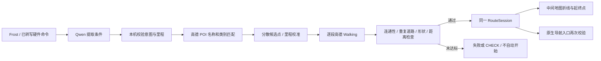

# 跑步路线：T 形折返修复与开源架构参考

2026-08-28。用户的手机 Task 1321 将「去西湖，三公里」规划成 3.08 km 的 T 形单程，且终点误选「村上西湖」。这是选路与地点解析缺陷，不能用“里程相近”解释成正确结果。

此前 2026082832 的三/四/五公里测试只充分检查了里程与交接，没有充分检查重复道路；原记录保留作历史证据，不再作为路线形状合格的证明。

## 调研与选择

| 参考 | 核验到的能力 | 对本项目的用法 |
| --- | --- | --- |
| [GraphHopper](https://github.com/graphhopper/graphhopper/blob/master/core/src/main/java/com/graphhopper/routing/RoundTripRouting.java) | 环线候选生成、路网吸附、已走边惩罚；源码还说明虚拟吸附点会产生路线尾巴。该文件采用 Apache-2.0。 | 借鉴分散候选点、重复道路独立约束的设计；没有把 Java 引擎直接接入高德。 |
| [openrouteservice](https://github.com/GIScience/openrouteservice) | 开源路线后端；[维护者说明](https://ask.openrouteservice.org/t/description-of-round-trip-feature/4170)给出 length / points / seed 的近似环线生成机制。仓库为 GPL-3.0。 | 参考参数与服务分层；本次没有复制其源码或部署另一套路网。 |
| [Trail Router 作者的架构说明](https://trailrouter.com/blog/how-trail-router-works/) | 2020 年公开设计使用 ORS、OSM 与 PostGIS；通过已走边惩罚减少重复，并围绕绿地、水体生成候选后评分。 | 借鉴“先检查路网与重复，再评里程/偏好”；它是产品架构参考，不能把整套产品说成已找到可直接复制的开源包。 |
| [AMap-Web/amap-lbs-skill](https://github.com/AMap-Web/amap-lbs-skill) | MIT 的高德 POI、步行、驾车等 Web Service 封装，明确区分步行起终点与驾车途经点。 | 可参考后端适配层；它不是已经具备指定里程、避重复能力的完整跑步引擎。 |

[另一个开源跑步编辑器](https://github.com/AjaniStewart/route-planner)支持贴路绘制，但 README 明确说明不支持从零生成指定距离环线，因此不作为本问题的核心实现。

当前接入的 [AMap.Walking](https://lbs.amap.com/api/javascript-api/reference/route-search) 提供起终点步行查询，没有公开 GraphHopper 那样的已访问道路权重接口。高德[步行 Web Service 文档](https://lbs.amap.com/api/webservice/guide/api/direction)也需要专门的 Web 服务 Key。不能把驾车的途经点/避让参数当成步行能力，不能把 JS Key 或 OSM 路网当成高德后端。

本次采用独立 TypeScript 实现借鉴上述设计，不复制第三方引擎代码；继续让高德负责实际步行路段。未来需要更强的风景偏好时，先补足可验证的公园入口/滨水道路数据，再扩展候选，不能把“附近有湖”直接说成整条路风景已验证。

## 已实现的改动

当前前台规划流程：

- `amapRunRoute.ts`：保留地点类型与城市。自然地标查询排除「村上西湖」这样的部分名称命中，也排除「西湖观光巴士」、售票点等关联服务。找不到合适地点时提示补充城市/入口，不静默采用相似商户。
- 单程增加里程时，候选点分散到不同方向，避免狭窄的起终点走廊把两个途经点吸附到同一路上。用实际高德距离校准，最多四个方向、每方向三轮，同方向路段在本任务内缓存。明确往返时单独查询回程。
- `runRouteGeometry.ts`：在米制局部坐标中每约 8 米采样，以空间网格和行进方向检查非相邻重复路段。去回程分段不同也能检测，不依赖高德点序号完全相同。明显支路折返先淘汰，不能靠提高里程评分通过。
- 检测容许很短的路口/入口重合；连续逆向重走超过 45 米、总逆向重走或重复道路超过相应上限会拦截。该结果是道路几何检查，不是现场安全保证。明确的往返只豁免正常去回程之间的重合，两半仍分别检查额外支路。
- 环线仍需闭合和足够面积。未找到满足条件的路线时，失败或显示距离不符的 CHECK 结果，不能标成已满足请求或自动启动。
- 地图与导航入口都重新检查道路形状。旧保存路线也会检查；本次浏览器中，2026082832 留下的五公里折返路线已被拦截且启动按钮禁用。不删除用户历史路线。
- 地图增加起终点文字与终点方块，并为顶部头像和底部面板留白。规划道路、实际 GPS 轨迹继续分开。
- 拼接已生成的去程与回程时，先移除中间到达提示，再生成真正的折返点动作；避免中间的 arrival 遮蔽掉头提示。该修正不改变上表单程道路的坐标与里程。

## 真实浏览器链路验证

明确指定杭州龙翔桥为起点，使用实际 Qwen（可见 Trace：`qwen3.7-max + 本地校验`）与高德在线道路。没有伪造手机 GPS，没有启动实际跑步导航。

| 输入 | 目标 | 高德总长 | 偏差 | 额外重复道路估计 | 地图任务 |
| --- | ---: | ---: | ---: | ---: | --- |
| 从杭州龙翔桥出发，帮我规划下去西湖的跑步路线，三公里 | 3000 m | 2989 m | -11 m | 0 m | Task 200 |
| 改成四公里 | 4000 m | 4037 m | +37 m | 0 m | Task 216 |
| 从杭州龙翔桥出发，帮我规划下去西湖的跑步路线，五公里 | 5000 m | 4950 m | -50 m | 0 m | Task 232 |

三条终点均为高德查询所得「杭州西湖风景名胜区-湖滨晴雨」，折线不同，实际跑步均为 0.00 km。逐张检查地图，未见原先的 T 形支路折返。证据在 `evidence/route-quality-20260828/`：截图、可见 DOM 折线、里程与形状文本、Qwen Trace。

开发中的失败结果也保留：第一轮误选观光巴士，第二轮候选虽无重复但只有 2363 m，均没有记为通过。随后收紧 POI 语义和候选分布，再得到上表结果。

最终自动检查：225 个 Vitest 文件通过、3 个跳过；2814 项通过、16 项跳过。类型检查、Bird v3 源码检查通过。覆盖 T 形里程恰好达标但被拒、不同坐标分段的重复道路、正常 U 形、正常往返与额外支路、重复绕圈、自然地标与商户/巴士混淆、3/4/5 公里组合、底层导航拒绝旧错误路线，以及去回程拼接保留掉头提示。网格道路测试是测试数据，不是高德实测。

## 发布与尚未完成的边界

2026082833 已通过完整归档与包内核验，但手机安装的 XPC 连接中断（CoreDevice 3002 / IXRemoteErrorDomain 6）；随后回读手机仍为 2026082832，未记为安装成功。补充往返点播报修正后，最终候选改为 2026082834，重新从完整源码归档；归档/安装结果以后续回执为准。

手机曾在开发工具中显示 unavailable，后恢复 paired/available；安装结果仍须以回读为准。实体硬件收音、手机 ASR、BLE 实际可听见播报、移动中的转弯和锁屏没有因这些浏览器测试而记为通过。

“已启动导航后锁屏继续”保留此前原生 GPS/BLE 代码；“手机已经锁屏后再新发起路线”仍未实现，必须补原生/后端规划与高德 Web 服务配置。本次没有绕过前台保护，也不承诺 iOS 在断电、蓝牙关闭或系统终止等情况下绝不掉线。

系统盘曾低至约 110 MB 并导致源码写入失败。仅将可重建的 Vite 依赖缓存和 Xcode ModuleCache 复制到 `/Volumes/PocketBuddy-iOS-Dev/RunRouteQuality*Cache-20260828`，逐文件校验相同后保留原路径软链接，未删除个人数据或项目源码。系统盘仍需要用户释放空间。

### 最终归档与安装阻塞记录

2026082834 全量重建主应用与两个子应用，使用全新 DerivedData，归档成功。归档后再次核验实际 App 的 provenance、技能画布、Frost Skills、Bird v3、编译图标；并确认实际 JS 分包 `runRouteNavigation-BhnNryjM.js` 包含重复道路拦截代码。

- 归档：`/Volumes/PocketBuddy-iOS-Dev/Current/Releases/2026082834-UxPEk7/PocketBuddy-2026082834.xcarchive`
- Source SHA-256：`b0e3509de93f9d9236e0d8f4bf99455c8b3fa9f974db9cf81a317df4d5bb49db`
- Assets SHA-256：`6ef8e34bd1600b582327a875624055b2cc59db7c3fbaba792cd37c9514901617`
- 2026082834 安装前实际回读：2026082832。安装时再次发生 CoreDevice 3002 / IXRemoteErrorDomain 6（Connection interrupted）。随后的首次版本回读也出现 Connection reset by peer，故不能确认安装已完成，也不能仅据这次失败断言手机最终仍是旧版。
- 设备回执显示 `transportType: localNetwork`、`tunnelTransportProtocol: tcp`；USB 设备枚举未发现 iPhone。已请用户用数据线直连并保持解锁；恢复后先回读版本，不能盲目重复安装。
- 最后一次只读版本查询仍失败：CoreDevice 4000 / Network.NWError 60（Operation timed out），USB 再次枚举仍未发现 iPhone。2026082834 未确认安装、未确认启动；最后一次成功回读为安装前的 2026082832。原始回执保留在 `/Volumes/PocketBuddy-iOS-Dev/route-quality-34-phone-final-read.json`，没有继续盲目重装。

没有卸载 App、没有清理用户数据、没有上传 TestFlight。旧的已保存错误路线不会静默改写：新版本会禁用不合格路线的开始按钮，用户可点“重新规划”或重新发出命令。

### USB 安装补验（2026-08-28 22:02）

用户接上数据线后，CoreDevice 确认 `transportType: wired`。安装前回读为 2026082832；再次通过当前源码、实际归档资源、图标、签名与设备授权检查后，成功更新为 **2026082834**。安装命令成功，安装后和启动后两次版本回读均为 2026082834，原生启动回执成功，22:03 再查进程仍在运行（PID 12041）。没有卸载、清除用户数据或上传。

回执目录：`/Volumes/PocketBuddy-iOS-Dev/Current/Releases/2026082834-UxPEk7/usb-install-20260828-2200/`。该补验解除的是安装阻塞；此前 Wi-Fi 连接失败的记录保留，不覆盖原始回执。

本次没有将手机上的实际路线生成记为通过。iPhone 镜像提示 iCloud 已退出登录，QuickTime 窗口读取超时；未代用户登录或修改账户。手机新路线需通过 Frost 重新发起并检查画面，旧 T 形保存记录不会因安装而静默改写。此前浏览器 3/4/5 公里结果仍仅属于浏览器链路证据，锁屏与硬件验收状态不变。

安装前系统盘仅剩约 105 MB，已无法创建临时文件或重命名目录。将项目 `node_modules/.ignored` 中未启用的依赖副本完整复制到外置盘 `RunRouteQualityIgnoredDependencies-20260828`，逐项核验 8571 个文件/目录/链接后保留原路径软链接，回收约 430 MB；未改项目源码或个人数据。迁移回执：`/Volumes/PocketBuddy-iOS-Dev/route-quality-usb34-cache-migration.json`。
