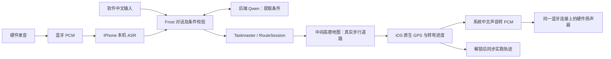

# Frost 对话跑步路线与锁屏导航

更新：2026-08-28。以下区分已实现、已验证与尚未实机验收；不代表已安装或已发布 TestFlight。

## 当前实现

软件在 Frost 对话中说「帮我规划下杭州西湖白堤的跑步路线」，按缺失字段追问距离/时间/目的地、路线形状、偏好。可以直接点快捷答案，也可以说「三公里、环线、风景好、少路口」一次补齐。条件齐后通过同一 Taskmaster 创建 RouteSession，自动切换中间 Earth 行动地图，不再打开另一个表单。

硬件使用已有 Agent_link 蓝牙录音、本机 ASR 和同一 Frost 入口。只有真实 badge_voice 输入来源可以启用快捷默认值：未说距离采用 3 公里、未说形状采用环线、未说偏好采用风景好和少路口。Qwen 返回值不能授予权限或设置自动执行。语音请求同样打开中间地图；iOS 前台、蓝牙已连接、路线合格时尝试启动原生导航。首次系统权限仍由用户允许。距离偏差超过 20% 或环线降级时停止自动启动，需在手机确认。

## 路线与地图

- 真实调用 AMap PlaceSearch / Walking。转弯来自步行步骤；中间路段连接处的转向只根据实际道路几何计算。模型不生成道路坐标。
- 多个完整候选按距离、过街指令和转弯数比较，必要时增加一次距离校准。往返的回程单独请求高德，不把去程数组倒序当作回程证据。
- 近零面积、重复走原路的伪环线被拒绝；找不到合格环线时明确提供往返或显示失败。高德地点名称明确标注暂停开放等状态时不选为起点/途经点。
- 景观偏好使用公园/滨水 POI 辅助选线；没有可用 POI 时明确未满足。高德结果不证明实时开放、人流、坡度、照明或治安，少路口也不等于完整红绿灯统计。
- 绿色是规划路线，橙色是真实 GPS 轨迹。收起面板不卸载路线、不停止导航。视野给底部面板留空间，避免路线被遮住。
- AMap 坐标和运行时地图/CoreLocation 坐标只在边界转换一次。起终点对齐实际道路。已有正在导航的路线不能被新任务静默覆盖。

## 锁屏与蓝牙边界

导航由 FrostRunNavigation / FrostRouteProgress 和现有 FrostBadgePlugin 持有，不依赖 WebView 定时器。打包声明 bluetooth-central、location、audio；用户在前台启动定位后，原生 CoreLocation 继续接收位置。关闭页面、锁屏、暂停导航、结束跑步都没有主动断开 BLE 的操作。只有用户明确断开设备才调用断开流程。

导航播报独占自己的原生音频生产者；聊天页隐藏时的取消/停止指令不能停止导航音频。蓝牙控制写入串行，导航 PCM 结束需同时拿到 GATT 完成与硬件协议 ACK。跑步中聊天控制写入超时也不主动断连；没有 GATT 完成的超时会阻挡后续写入，避免误认旧回执，不靠强制断连处理。暂停/取消会停止导航生产者并请求清空自己的硬件扬声器队列。

意外断连会显示错误并尝试重连原设备，GPS 继续记录；不把断连期间的旧提示积压后重放。BLE 回执只证明传输层确认，不证明人耳听见，日志明确写 heard_by_user=unverified。

系统关闭蓝牙、硬件断电/离开距离、用户强杀 App、系统终止进程等情况不能承诺绝不掉线。本版没有进程被杀后的导航恢复，也没有锁屏冷启动一条新路线。网页版仅前台定位，进入后台会明确暂停。不能用浏览器测试代替 iOS 锁屏验收。

手机 GPS 用于计算位置与转弯，通过 BLE 给硬件发送播报；未假设现有硬件有独立 GPS，也没有新增未经固件支持的 GPS 数据协议。

## 本次验证证据

| 验证 | 结果 |
| --- | --- |
| 全量 Vitest | 224 个文件通过、3 个跳过；2,725 项通过、16 项跳过 |
| TypeScript | npm run typecheck 通过 |
| 原生实际 iPhoneOS SDK 类型检查 | FrostBadgePlugin、FrostBirdSession、FrostBirdProtocol 及两份新导航源码通过；存在原有并发警告，不等于完整 App 归档 |
| 原生路线回放 | GPS 精度/过期/跳点、环线、往返、去重、偏航、到达通过 |
| 当前主应用独立 Web 构建 | /tmp/frost-route-web-final-BFjPmu；不写共享 dist-ios、不复用旧 App |
| 构建资源核验 | Frost Skills、线稿技能画布、bird-skill-pet-birds-v3 源码及实际 Web 包通过 |
| 浏览器真实多轮 | 地点 → 3 公里 → 环线 → 风景好/少路口 → 自动进入中间地图；没有伪造定位 |
| 最终真实后端 | 页面 Trace：Qwen · qwen3.7-max + 本地校验；RouteSession run-route:mtcq9ix2:b1a236ed-8090-4474-9723-26885366d1fb |
| 最终真实高德 | 白堤目标 3.00 km、规划 3.75 km、实跑 0.00 km；显示距离限制，需要确认，不伪称已跑或精确满足 3 km |
| 面板收起 | DOM 验证保留两层规划 polyline，截图人工目视确认 |
| iPhone / 实板 / 锁屏 | 未验收；devicectl 显示已配对 iPhone 的连接不可用，未安装新版、未刷固件、未上传 TestFlight |

截图与页面文字保存在同目录 evidence/run-route-20260828/。此前曾遇到地点查询失败，已改为区分网络/服务错误和地点无结果，并通过重试获得真实路线。长模型请求失败时显示本地条件提取；最终成功 Trace 才记为 Qwen 通过。

## 真机验收步骤（尚未执行）

1. 连接并解锁测试 iPhone、连接实体硬件。按当前正式源码全量构建，遵守 .ios-build/install.lock；归档使用项目统一 archive.mjs 和已核对未使用的构建号。安装前运行 provenance、技能画布、Frost Skills、App 图标及 Bird release 检查；不卸载清用户数据。
2. 保持手机前台，在软件完成一次追问，确认中间地图显示真实线路、距离、起点。再用硬件实体键录入「帮我规划附近的跑步路线」，分别记录 BLE 收音、本机 ASR 文本、Qwen Trace、AMap 会话。不能用软件注入文本冒充实板语音成功。
3. 允许定位，在实际起点附近启动导航。记录设备连接标识、原生导航状态、GPS 时间戳；屏幕亮着时路线必须可见。
4. 锁屏 5–10 分钟，实际沿路经过至少两个转弯。分别记录原生后台 GPS 更新、连接事件、PCM/EOT ACK 和实体扬声器可听见的播报。除用户主动操作/真实故障外不能出现主动断连；若断连，记录原因和恢复时间。
5. 解锁：同一个 RouteSession 的规划线与实跑线、距离、下一转向应恢复。切换 Tab/收起面板不能停止原生导航。暂停、结束只停 GPS/导航输出，硬件蓝牙保持连接。
6. 测试离开蓝牙范围/恢复、GPS 漂移、权限拒绝、重复录音、模型/高德故障。没有可靠位置不播报猜测转向；不得反复自动重算消耗配额。

生产服务器的两个 Qwen provider 新增了 run-route-intent 的独立路由和 512 token 输出限制；本轮只验证本机服务，没有远程部署。正式发布时与当前 App 源码一起审查部署。

## 参考

借鉴高德官方示例的地点查询与路线展示流程，未引入第三方完整导航 App 或直接复制大段项目代码。

- 高德官方 GitHub 示例：https://github.com/amap-demo/web-route-base-on-geolocation-and-placesearch
- 高德 JS 步行规划：https://lbs.amap.com/demo/javascript-api-v2/example/walking-route/plan-route-according-to-name
- 高德路线/步骤说明：https://lbs.amap.com/api/webservice/guide/api/direction
- Apple 后台定位：https://developer.apple.com/documentation/corelocation/handling-location-updates-in-the-background
- Apple Core Bluetooth 后台规则：https://developer.apple.com/library/archive/documentation/NetworkingInternetWeb/Conceptual/CoreBluetooth_concepts/CoreBluetoothBackgroundProcessingForIOSApps/PerformingTasksWhileYourAppIsInTheBackground.html
