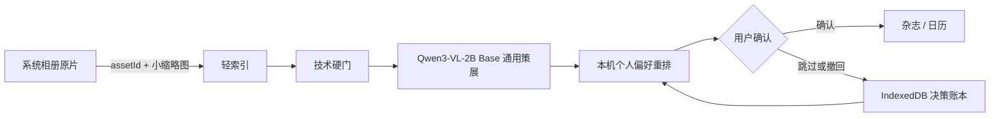

# Pocket Earth Photos Tab 五轮迭代与验收报告

## 最终产品定义

Photos 不是“AI 替用户判断照片好坏并清理相册”，而是完全在手机上的个人照片雷达：只引用系统相册、压缩需要决定的问题、给出可追溯理由，并把最终决定留给用户。

原片始终在系统相册。Pocket Earth 长期保存的是系统 `assetId`、文件元数据、派生标签、量化向量和用户决策事件；日常分析只读小缩略图。只有用户明确确认的照片才进入现有杂志与日历。

## 第一轮：视觉层级

- 将原来大面积纯黑的 `PHOTO CURATION PIPELINE` 改为浅奶油绿证据台。
- 去除该区域叠加阴影，保留 Pocket Earth 的黑色描边和像素字体。
- RunTrace 改为内容流底部的折叠条，不再绝对定位遮挡候选照片。
- 保持“杂志 / 日历”原有视觉不动。

证据：`aesthetic-curator-ui-2026-08-12/01-photo-curation-pipeline-light.png`、`photos-final-2026-08-12/02-curation-pipeline-and-groups.png`。

## 第二轮：从空页面到可决策工作台

- “照片整理”细分为“待你决定 / 偏好学习 / 找照片”。
- 非连拍照片也生成最多 4 张安全候选，避免真实相册没有连拍时首屏空白。
- 每张候选都可直接“确认发布”；不确认就不进入结果层。
- 所有删除类动作保持建议态，必须回系统相册确认。

证据：`02-single-candidate-confirmation.png`、`photos-final-2026-08-12/03-burst-human-decision.png`。

## 第三轮：模型诚实性与可插拔偏好

- 冻结 Qwen3-VL-2B Base、Prompt、Adapter、Feature Schema 版本。
- 用户每次 A/B 选择立即写入 IndexedDB；事件与 LoRA 解耦，更换 Adapter 后可在手机端重放历史选择并重算轻量偏好权重。
- v3 冻结盲集 174 对 / 348 行换位评测：Base 64.94%，Markdown 60.34%，LoRA 68.68%。
- LoRA 成对双向正确率从 Base 42.53% 提到 52.30%，A 位置选择率收敛到 49.71%；稳定性增益成立。
- LoRA 对 Markdown +8.33pp 且显著；对最强 Base 仅 +3.74pp，95% CI 下界为 0、McNemar `p=0.098`，未越过预注册发布线。
- 因此当前生产路由仍为 `技术门 → Qwen Base → 个人偏好`；UI 分开显示“稳定性通过 / 准确率未过”，LoRA 只保留手动 A/B 研究入口。

证据：`03-aesthetic-release-gate.png`、`04-preference-ledger-after-choice.png`，以及训练目录中的 `FULL-EVALUATION-REPORT.md`。

## 第四轮：真照片轻路由与结果闭环

- 构建 APK 外置的 32 张比赛任务包；每张 JPEG 同时写入 EXIF `DateTimeOriginal`、演示相机身份，23 张写入 GPS。演示时间覆盖 2020–2026 七个年份，既能验证最近连拍，也能在新手机上直接演示历史杂志/日历。任务包可先导入新手机，APK 本身不含这些原片。
- Web 预览把 32 个真实 `File` 对象送入与手机相同的轻索引、技术分析和全局分组链；浏览器只保留本次 blob，刷新后明确显示占位而非伪造原片。
- 修复两个由真包暴露的问题：浏览器文件修改时间不得覆盖 `DateTimeOriginal`；分析得到的 EXIF 时间、GPS 与尺寸必须立即回写轻索引，供跨批次聚类和日历使用。
- 增加“可信 GPS 但相机型号被导入流程剥离”的实拍先验，同时保证文档质量门先于 GPS，避免带位置的票据误入地球。
- 任务包最终实跑：EXIF 时间 `32/32`、GPS `23/32`、连拍 `3` 组、疑似重复 `10` 张、技术问题建议 `7` 张、文档 `4` 张、可落地球代表 `9` 张。4 个预设压力样本（模糊、低对比、欠曝、强反光）全部进入技术建议区；额外真实技术风险保留，不为贴合预设数字而隐藏。
- Android 使用 `@capgo/capacitor-photo-library` 读取系统相册资产；APK 不内置演示原片。
- 搜索层合并时间、标签、GPS、OCR 和端侧 embedding；索引升级不改照片和确认记录。
- 只有用户确认发布的照片进入杂志与日历；任务包导入后默认仍为 `0` 张确认，不用演示样本替用户代签。

证据：`photos-final-2026-08-12/00-task-pack-overview.png`、`01-photo-task-pack-real-run.png`、`02-curation-pipeline-and-groups.png`、`03-burst-human-decision.png`，以及任务包内的 `manifest.json / expected-results.json / verification.json`。

## 第五轮：比赛技术栈与证据链

- Qwen：Qwen3-VL-2B 是照片理解、票据路由和通用策展基座；审美 LoRA 未通过门禁时自动留在 Base。
- MNN：Android APK 包含真实 MNN LLM、JNI 桥和 CPU target 2/3 切换，不用网页结果冒充手机推理。
- SME2：只有 `hardwareSme2 + target=3 + MNN dispatch effective` 同时成立才显示生效；最终性能以真机 A/B 账本为准。
- 端侧证据：模型/APK 哈希、RunTrace、IndexedDB 账本、原始样本、P50/P95、温度/内存和导出协议互相闭合。

冻结 APK：`deliverables/pocket-earth-photos-final-20260812.apk`

- APK SHA256：`1b9791848092facb027661db4745cf9c8cbc1a81f49bfeac4463a020e8b6a7aa`
- JNI SHA256：`b2ee2db39c54342a9140e475d722030f2fb91bc7b2bb3b31e5649ccf41655346`
- MNN SHA256：`bbb09db8036d6c1f380af00f94d8a13939848ceceefcdd704ab2dd14c0cc7d44`
- APK 合同验证：14/14 JNI exports（含双图视觉 A/B）、MNN LLM、CPU target 2/3、SME2/KleidiAI、arm64-only、16KiB 对齐、签名通过、无模型权重和演示原片。

## 自动化验收

- Vitest：98 个文件、1566 项测试通过。
- TypeScript typecheck：通过。
- Vite production build：通过。
- Android debug build：通过。
- APK contract verification：通过。
- 生产构建负向检查：APK 与 `dist` 均不包含 `PE_TASK_*`、任务包绝对路径或 32 张演示原片。
- PAI choice-v3 训练 Job `dlc1okrnd6lt4oyy` 与正式盲测/回归 Job `dlc1fgdzwqqp4qjt` 均 Succeeded；正式评测 853 秒、0 重试、0 重启。
- 云端 6 份汇总 JSON 本地独立复算逐字节一致，12/12 原始评测文件 SHA256 匹配；质量门判定为研究候选。

最终截图：`photos-final-2026-08-12/05-v3-frozen-blind-gate.png` 展示冻结盲测与未晋级门；`06-pai-v3-full-eval-succeeded.png` 展示 PAI 正式评测作业成功。完整指标、统计检验与独立复算路径见 `training/aesthetic-curator/runs/choice-v3-hard-20260811T192203Z/FULL-EVALUATION-REPORT.md`。

## 现场演示顺序

1. 授权新手机相册，展示“原片未复制”的轻索引说明。
2. “待你决定”中确认一张候选，事件数立即增加。
3. “偏好学习”选择一次，展示 IndexedDB 不可变账本和 LoRA 质量门。
4. “找照片”输入时间或自然语言，确认结果仍来自本机资产。
5. 打开杂志和日历，证明只有确认照片进入结果层。
6. 打开真机验收账本，展示 MNN Runtime、SME2 target 2/3、飞行模式推理和 A/B 原始样本。

## 未伪装的边界

- Web 只验证交互、轻索引和本地账本，不签发手机 MNN/SME2 性能证据。
- 当前审美 LoRA 是有效研究候选，但未进入生产 APK。
- 真机 SME2 是否有效以及性能增益，必须在目标手机完成固定样本 A/B 才能下结论。

## 本轮冻结产物

- 外置照片任务包：`deliverables/pocket-earth-competition-photo-task-pack.zip`
  - SHA256：`5af13e351051351015a9ecc067769f4da168a85831e9be25a1f80ca35e314bb6`
- Android APK：`deliverables/pocket-earth-photos-final-20260812.apk`
  - SHA256：`1b9791848092facb027661db4745cf9c8cbc1a81f49bfeac4463a020e8b6a7aa`
- PPT 证据图：`docs/evidence/photos/photos-final-2026-08-12/`
