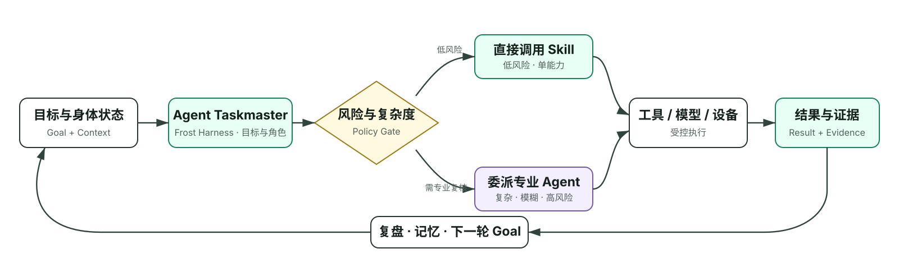
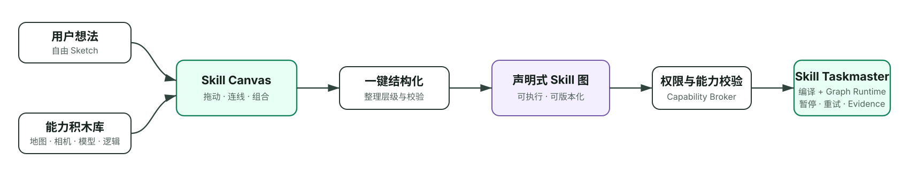

# Pocket Buddy · 2026-08-24 产品说明基线

> 历史资料：从 Git 提交 `eaffa7ffc43c758af066e7a26004ad731fadac11` 恢复的原 README。保留当时的产品与“双 Taskmaster”设计，正文仅调整相对链接以适应本文件位置。文中“当前”“已接入”均指当时，不作为 2026-08-28 的完成声明；最新实现见 [当前 README](../../README.md) 和 [架构](../../ARCHITECTURE.md)。

> 跑一段路，识别一路自然，种下一棵由真实行动长成的树。

Pocket Buddy 是以运动、恢复、营养和真实世界观察为主线的私人 Agent。用户只面对长期陪伴的角色 **Frost**；后台由两层 Taskmaster 协同，把目标和用户创造的 Skill 变成可执行、可中断、可恢复、可验证的行动。

它不是“健身 App 加一个聊天框”，也不是把地图、瑜伽、营养和自然识别堆进菜单。同样安装 Pocket Buddy，不同用户可以装备不同 Skill、连接不同数据源，或在 **Skill Canvas** 中像搭积木一样创造工作流。个性化的不只是训练计划，而是每个人真正拥有的 **Agent 能力组合**。

产品以运动健康为核心，自然时刻作为真实行动中的轻量陪伴：识动物、识植物、识鸟和虚拟种树都必须绑定路线、时间或运动证据；低置信度允许返回 `unknown`，虚拟树不等同于现实植树承诺。

本仓库是供团队协作的代码快照，只保留当前产品需要的运动健康链路；不包含内部原始文档、真实 API 密钥、模型权重、APK 或早期非核心演示模块。

## 两个 Taskmaster：产品技术核心

| 核心 | 管什么 | 关键能力 |
| --- | --- | --- |
| **Agent Taskmaster / Frost Harness** | 目标与角色，即“谁来做” | 主 Agent 维持 Goal，调度专业子 Agent，处理追问、等待、委派、中断、恢复和停止 |
| **Skill Taskmaster / Graph Runtime** | 步骤与执行，即“怎么做” | 把用户在 Skill Canvas 组合的能力积木结构化、校验并编译为 Skill Graph，可靠处理依赖、分支、暂停、重试、取消、Signal 和 Evidence |

这不是两个名称相近的重复模块。Agent Taskmaster 让 Frost 能持续工作并协调多个 Agent；Skill Taskmaster 则让普通用户画出来的 Skill 不停留在 Demo 或流程图，而能被编译成真正运行的多步骤任务。

健康事实和设备副作用由独立的 **Health Fact & Effect Boundary** 幂等提交。它是双层 Taskmaster 下方的安全边界，不作为第三种 Taskmaster 对外叙述。

## 完整产品文档

[下载《Pocket Buddy 终极产品文档 v1.0》](../../docs/product/Pocket_Buddy_终极产品文档_v1.0.docx)

这份 13 页团队基线统一了运动健康闭环、识动物/识植物/识鸟与虚拟种树、三类 Skill、Skill Canvas、Agent Taskmaster、Skill Taskmaster、健康事实边界、当前实现与后续路线图。

## 一次完整体验

1. Frost 汇总餐食、睡眠、疲劳、疼痛、天气、目标和可用时间，形成当天 Context。
2. 用户装备现成 Skill，或在 Canvas 组合自己的“城市跑步观察”工作流。
3. Her Motion 用连续帧与置信度门控完成热身和动作确认。
4. Action Map 记录 GPS、阶段 Signal 和实际轨迹，必要时按规则重规划。
5. 途中拍摄动物、植物或鸟类；模型返回候选、置信度和 `unknown`，不强行猜测。
6. 运动完成后生成证据绑定的虚拟树、路线牌和自然路标。
7. Frost 用 `evidence_ids` 生成复盘，写入记忆并决定下一步。

## 产品闭环



- **Agent Taskmaster 管目标与角色**：接收 Goal 与 Context，调度专业 Agent，决定继续、等待、追问、委派、完成或安全停止。
- **Skill Taskmaster 编译并跑图**：把 Canvas 组合的能力积木变成可执行 Skill Graph，处理依赖、分支、暂停、重试、取消和 Signal。
- **Tool Runtime 执行能力**：在权限、审批和停止规则内调用地图、摄像头、模型、健康数据或设备。
- **Health Fact & Effect Boundary 交事实**：健康事实和设备副作用只能通过幂等 Effect 与 Health Event 提交。
- 结果、Signal 与 Evidence 回到 Frost，形成下一轮 Goal，并写入可追溯 Session Log 和长期记忆。

- **Frost**：用户唯一面对的长期角色，也是 Agent Taskmaster 的主 Agent。
- **Agent Taskmaster / Harness**：Frost 的目标级运行控制面，负责循环、专业 Agent 调度、权限、日志、中断、等待、恢复和目标续行。
- **Skill Taskmaster**：声明式 Skill Graph 的执行内核，让用户在 Canvas 组合出的不同流程可以被可靠跑通。
- **Health Fact & Effect Boundary**：负责健康事实、Signal、Effect 与幂等提交，模型不能绕过它直接改写事实。
- **专业 Agent**：处理需要持续判断或领域复核的任务，例如训练决策、恢复建议和营养分析。
- **Skill**：可发现、装载、卸载和调用的能力单元，声明输入、输出、权限与证据要求。
- **Tool / Model / Device**：真正执行地图、摄像头、健康数据查询或模型推理的底层能力。

简单任务不必经过完整多 Agent 流程；复杂或高风险任务才升级给专业 Agent。这样既保留响应速度，也让重要决策可复核。

## Agent Taskmaster：Model + Frost Harness

Qwen 等模型只负责提出候选下一步，真正让 Frost 可以持续行动、接受中途指令、等待设备、刷新恢复并安全停止的是轻量 Harness。Frost 不保存或展示模型隐藏思维链，只记录结构化决策、工具调用、结果和证据。

每个用户目标是一个 **Turn**；一次“模型决策 + 工具执行 + 结果观察”是一个 **Step**。一个 Turn 可以连续运行多个 Step，直到完成、等待用户、等待外部 Signal、取消或触发安全停止。

| Harness 组件 | 负责什么 | 当前仓库状态 |
| --- | --- | --- |
| **Session Log** | 只追加记录消息、决策、Tool、Signal、审批与状态，作为回放和恢复的事实源 | 内存与 IndexedDB 实现已接入 |
| **Inbox** | 区分 `followup`、`steer`、`inject` 与 `cancel`；用户中途指令优先进入下一 Step | 已接入单 Driver 循环 |
| **Agent Loop** | 执行 Decision → Tool → Observation → 再决策，并限制 Step、Tool Call 与截止时间 | 多 Step 链路已接入 |
| **Tool Runtime** | 校验输入与一次性审批凭据，处理超时、取消、结果校验和冻结 | 基础执行管线已接入；统一 Permission / Guard 管线仍在完善 |
| **Goal Driver** | 只在空闲、已持久化、有预算且没有竞争输入时自动续行 | 持久 Goal、版本抢占与轮次预算已接入 |
| **Health Fact & Effect Boundary** | 提交 Task、Signal、Effect 和 Health Event，确保事实与副作用幂等 | 继续作为健康事实的唯一可靠执行边界 |
| **Recovery / Projection** | 从日志恢复状态，并让 UI 展示当前 Goal、等待原因、证据与下一动作 | 已支持中断会话的保守恢复；完整自动恢复和行动 UI 仍在验证 |
| **专业 Agent / Job** | 隔离长任务和专业上下文，只返回 Proposal、证据、风险与警告 | Provider 接口方向，尚非当前 MVP 依赖 |

模型只能从严格的下一动作合同中选择：加载 Skill、调用 Tool、启动 Task、询问用户、等待外部事件、带证据完成或安全停止。所有模型输出都是 Candidate，必须经过 Runtime 校验；专业 Agent 同样只能提交 Proposal，不能直接控制设备或写入健康事实。

## 当前核心体验

### Frost 运动健康管家

Frost 作为 Agent Taskmaster 的主 Agent，通过混合 Skill 路由和 Harness 统一接收目标，管理确认门、执行记录、本地长期记忆与专业 Agent 交接。用户看到的是一个连续的人格，内部能力可以独立演进。

### Action Map

基于高德 JSAPI 的跑步与行动地图，支持路线生成、GPS 实际轨迹和偏航重规划。路径规划逻辑输出标准化 `RouteSession`，地图渲染、定位权限与后台 GPS 由宿主中间 Tab 承担。

### Her Motion

私有摄像头动作会话，用于热身、动作观察与连续帧确认。当前仓库提供本地摄像头兜底运行时；完整姿态模型可作为独立运行时挂载。低置信度时应保持克制，不强行给出动作结论。

### 营养与健康数据

提供餐食照片、包装食品、中国食品范围、恢复餐入口，以及 Running Coach、healthsync、MediaPipe、Section 11、OpenFoodFacts、Garmin 和 health-coach 的 Frost 协议适配。外部数据源按需连接，不把第三方项目整体耦合进宿主。

### Nature Moment

运动途中可以记录动物、植物和鸟类照片或短声音，标准输出包含候选、置信度、时间地点与证据。低置信度保存为 `unknown`；植物识别不直接推断可食、药用或毒性，动物与鸟类敏感位置默认模糊。完成运动后可以生成绑定 `source_event_ids` 的虚拟树和路线记忆，但不宣称完成现实植树。

### Qwen 语义基座

仓库包含 Qwen3-4B 的服务器验证脚本、llama.cpp 兼容服务说明和端侧 MNN 路由契约。不同 Skill 可以共用语义基座，但通过统一输入输出契约保持边界，模型本身不等于 Skill。

## Skill 体系：运行形态与创作方式分开

“原生、声明式、Web 沙箱”描述的是 **Skill 如何交付和运行**；“能力积木、Skill Canvas”描述的是 **用户如何创作 Skill**。它们不是同一个维度。

### 三种运行形态

| 类型 | 适合的能力 | 运行方式 | 当前阶段 |
| --- | --- | --- | --- |
| **原生专属 Skill** | 摄像头、GPS、地图、持续动画、端侧模型 | 由可信宿主或原生模块执行 | 核心链路已接入 |
| **声明式 Skill** | 由能力积木组成的多步骤、分支、数据处理和 Agent 协作流程 | 运行时读取 Skill 图，解析输入、输出、权限、积木节点和 UI schema | Canvas、编译器、能力锁、浏览器运行时和服务端同步已接入 |
| **Web 沙箱 Skill** | 第三方开发者提供的复杂交互工具 | 在隔离 WebView 中运行，只能通过授权能力桥访问宿主 | 规划能力，尚非当前 MVP 依赖 |

高频、强设备协同的能力可以原生化；可组合流程保存为声明式 Skill；只有需要运行第三方复杂代码时，才进入更严格的 Web 沙箱。一个 Canvas Skill 也可以通过权限桥调用原生能力积木，因此创作方式不等于运行容器。

### Skill Canvas 创作链路

**创作链路：** 用户想法 / 自由 Sketch → 在 Skill Canvas 组合能力积木 → 一键结构化 → 生成声明式 Skill 图 → 权限与能力校验 → Skill Taskmaster 执行并由通用 UI Renderer 展示。



- **能力积木库**：地图、定位、拍照、健康数据、模型调用、条件判断、记忆和结果展示等最小可复用模块。
- **Skill Canvas**：用户可以自由拖动、连接和组合积木，先像 Sketch 或思维导图一样表达意图，不必先决定严格层级。
- **结构化引擎**：把可能杂乱的草图一键整理成清晰层级，补齐输入输出，检查断线、循环、权限与错误分支。
- **声明式 Skill 图**：Canvas 最终生成的机器可执行产物，可以保存、版本化、装载、卸载和分享。
- **Skill Taskmaster / Graph Runtime**：按图的依赖顺序调度积木，传递数据，处理分支、暂停、重试、取消、Signal 与错误；涉及健康事实或设备副作用时再交给 Health Fact & Effect Boundary。
- **通用 Renderer**：根据 Skill 图自动组合拍照、文本、选择、地图和结果卡片；需要强交互时再交给原生页面或 Web 沙箱。

所有 Skill 最终应共享一套基础契约：

- 身份与版本
- 输入、输出与错误状态
- 所需权限与最小数据范围
- 可调用工具和模型
- 展示方式与运行生命周期
- 证据来源、审计记录与停止规则

## 当前实现与下一步

### 仓库中已有

- Frost Session Log、Inbox、Agent Loop、Tool Runtime、Goal Driver 与 Qwen 决策适配
- Agent Taskmaster / Frost Harness 基线、Skill Router、确认门、任务交接、Effect Ledger 和执行 Trace
- Skill Canvas、能力合同目录、图结构修复与校验、编译产物锁定、浏览器运行时和服务端 Skill API 同步
- 原生 Skill 注册协议、权限声明与设备能力检查
- Action Map、跑步路线会话和 GPS 轨迹逻辑
- Her Motion 私有会话与本地摄像头兜底
- 运动、恢复、食品与健康数据 Skill 的协议适配和测试链路
- Qwen3-4B 服务器部署脚本、端侧模型适配与回归测试

### 正在验证

- 真实设备上的健康数据连接器与最小权限流程
- Qwen 服务端对全部健康 Skill 的稳定路由；端侧 MNN 仅保留为可选兼容层，不是当前 Demo 前提
- Her Motion 完整姿态运行时与宿主 App 的标准化交接
- 识动物、识植物、识鸟和证据型虚拟种树重新接回 Action Map 与统一事件协议
- App 刷新或进程中断后的 Goal、外部 Signal、待审批动作与已提交 Effect 恢复
- Frost 行动 UI：当前 Goal、Step、Skill、Tool、等待原因、停止按钮和 evidence IDs

### 产品方向

- **能力积木标准化**：先把地图、GPS、相机、模型、健康数据和逻辑控制做成边界稳定的基础节点。
- **Skill Canvas / Sketch-to-Skill**：支持自由画布与拖拽连线，并把用户草图一键结构化、校验和编译为声明式 Skill 图。
- **Skill Taskmaster / Graph Runtime**：复用现有状态机、Signal、幂等与 Effect 语义，增加动态 Action Graph，让画布生成的不同 Skill 都能被同一执行内核可靠运行。
- **通用 UI Renderer**：根据生成的 Skill 图自动组合拍照、文本、选择、地图和结果卡片等界面。
- **Capability Broker**：统一处理授权、最小数据披露、令牌有效期和审计，而不是让第三方 Skill 直接读取宿主数据。
- **Web 沙箱运行时**：为开发者 Skill 提供独立存储、受控网络与能力桥。
- **专业 Agent 与 Job Provider**：长同步和专业复核进入隔离上下文，只返回可验证 Proposal，不获得宿主副作用权限。

这些方向是下一阶段设计目标，不代表当前仓库已经具备完整的第三方 Skill 市场。

## 健康、安全与隐私原则

- Pocket Buddy 提供运动健康辅助，不替代医生、诊断或紧急服务。
- 疼痛、异常症状或高风险状态优先触发停止规则，而不是继续追求训练完成度。
- 健康建议应保留数据来源、推理依据和不确定性；没有证据时不编造事实。
- Skill 默认只获得完成当前任务所需的最小权限，敏感能力由用户明确确认。
- 本地数据、第三方连接器数据和 Skill 私有存储应保持边界；“卸载能力”和“删除个人数据”是两个独立动作。

## 本地运行

需要 Node.js 18.17 或更高版本。

```bash
cp .env.example .env.local
npm ci
npm run dev -- --host 127.0.0.1 --port 5174
```

打开 `http://127.0.0.1:5174/`。

### 地图与 API Key 配置

从 GitHub 拉取的仓库 **不会包含真实的高德 API Key**，这是正常且必要的安全边界。仓库只提供 `.env.example` 字段模板；每位协作者先在本机创建一份不受 Git 追踪的配置：

```bash
cp .env.example .env.local
```

推荐协作者自行申请高德“Web 端 JS API”Key 和安全密钥。团队联调阶段也可以临时使用项目负责人私下提供的测试 Key，但它只能保存在各自电脑的 `.env.local`：

```dotenv
VITE_AMAP_KEY=your_amap_web_jsapi_key_here
VITE_AMAP_SECURITY_JSCODE=your_amap_security_jscode_here
```

协作规则：

- `.env.local` 已被 `.gitignore` 排除；提交前仍应运行 `git status`，确认它没有进入暂存区。
- 真实 Key 不得写入源码、README、Issue、Pull Request、截图或 Git 提交，即使仓库设置为 Private 也不例外。
- 共用测试 Key 应通过私下渠道发送，并设置域名白名单、调用额度和最小使用范围；长期开发推荐每人使用自己的开发 Key。
- 如果 Key 被误提交，应立即在高德控制台撤销并重新生成；只删除文件或提交记录不能证明旧 Key 已经安全。

生产环境使用独立的生产 Key。高德 Web JS Key 最终会随前端请求被浏览器看到，因此安全性依赖域名限制和额度控制；安全密钥不应打入生产前端包，建议通过 `VITE_AMAP_SERVICE_HOST` 接入服务端安全代理，并在部署平台的 Secret/环境变量中管理生产配置。

### Qwen 与健康连接器

DashScope Key 只能配置在服务端，不得使用 `VITE_` 前缀。CPU 服务器上的 Qwen3-4B/llama.cpp 验证见 [`deploy/qwen3-4b-server`](../../deploy/qwen3-4b-server/README.md)。脚本会按需下载约 2.7 GB 的 GGUF 权重，权重不在仓库、项目包或 APK 中。

可选健康连接器：

```bash
npm run health:install-connectors
npm run health:verify-connectors
```

`HEALTH_SKILL_LOCAL_BRIDGE` 在公网服务上必须默认关闭，除非已经加入身份验证、限流和审计。

## 目录说明

```text
src/app/                  产品界面、地图、Her Motion 与 Skill 页面
frost-agent/              Frost 运行时、双层 Taskmaster、路由、记忆与健康 Skill（详见 frost-agent/README.md）
server/                   服务端 Qwen 与健康连接器桥接
scripts/health/           健康连接器安装和 Qwen Skill 链路验证
deploy/qwen3-4b-server/   Qwen3-4B 服务器部署与检查脚本
```

## 提交前验证

```bash
npm run typecheck
npm test
npm run build
```

协作时请保持提交单一、可解释：不要提交 `.env.local`、真实凭据、模型权重、构建产物、APK、私人文档或当前产品未使用的旧功能。

本仓库尚未添加开源许可证。在正式引入新的外部代码、模型或资产前，请先确认上游许可证与再分发条件。
