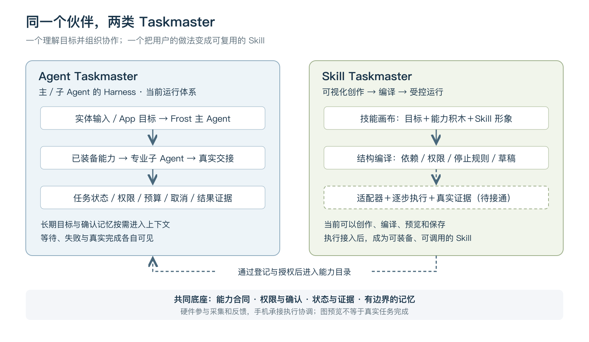
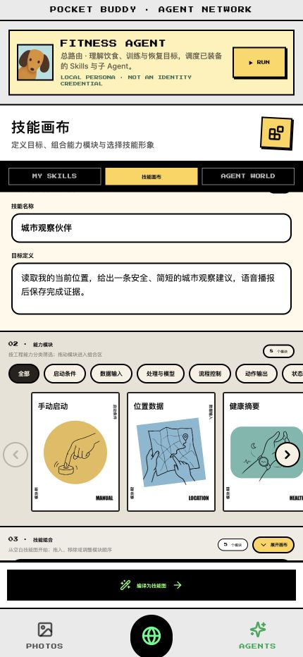
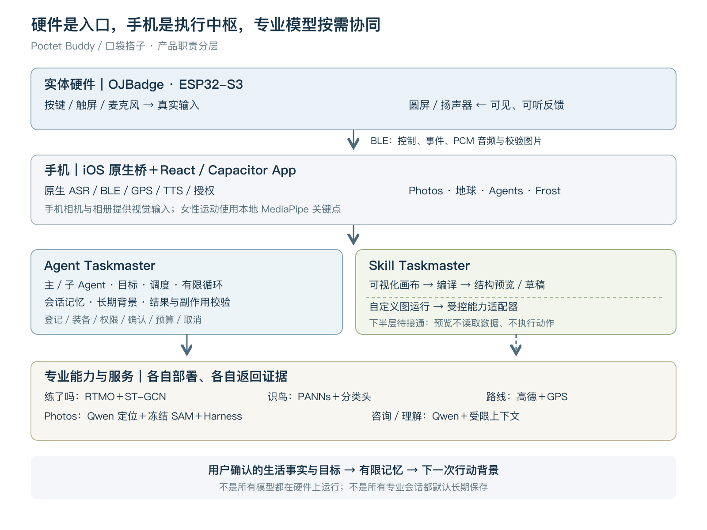

# Poctet Buddy｜口袋搭子

## 硬件赛道产品文档

以双 Taskmaster 驱动、可加载与可视化创作 Skills 的随身健康生活与运动伙伴

版本：1.0 · 研究日期：2026-08-28 · 面向：硬件赛道评审、产品与技术团队

> 一台随身硬件，一个长期伙伴，一组由你选择、持续扩展的健康生活能力。

本文统一使用用户指定的英文名 **Poctet Buddy**，中文名 **口袋搭子**。源码、服务域名和实际页面截图仍可能出现 Pocket Buddy、Pocket Earth、Frost 等既有名称；它们是工程沿革或角色名称，不是本文另设的产品品牌。本次只编写产品文档，不修改现有 App 品牌资源。

### 阅读说明与研究边界

本文以“谷歌大赛”正式工作区当前源码、实际 iOS 归档、可核对的训练产物及发布记录为依据。核对对象为本地最新记录的 **0.1.0（2026082832）**：安装回执记录已覆盖安装、回读版本并启动，未上传 TestFlight。本轮直接读取其 App 内 Web 资源，在隔离的本机浏览器来源查看界面，并重新通过识鸟、技能画布与 Frost Skills 包内检查。浏览器截图是“实际归档资源的页面呈现”，不是本轮重新操作 iPhone、蓝牙或硬件的照片。[S01–S03]

文中“当前实现”指源码与现有产物能够支持的能力；“已有验证”注明测试条件；“产品方向”与“建议”不代表已经上线。模型训练指标来自保存的实验记录，本轮未重训模型。个人画像、商业模式和阶段目标是基于产品形态提出的设计判断，不冒充用户调研或市场统计。

---

## 01 产品定义：把健康行动装进口袋

### 1.1 一句话定位

**Poctet Buddy／口袋搭子是一款以可随身携带的电子吧唧为交互核心、以双 Taskmaster 为软件组织方式、以可加载及可视化创作的 Skill 为能力体系的个性化健康生活与运动陪伴平台。**

用户面对的是一个熟悉的长期伙伴 Frost：可以对着实体硬件说话、查看圆屏反馈、听取行动提示；需要看动作、拍一餐、查看地图或管理记录时，再由配套 App 承接。训练、饮食、路线、自然观察和健康咨询各自由适合的专业能力完成，结果回到同一套有边界的个人记录与交互体验中。

### 1.2 产品由四部分共同构成

- **随身硬件：**提供真实的按键、触屏、麦克风、扬声器和圆形显示屏，是用户在日常环境中的轻交互入口。
- **手机 App：**承担摄像头、相册、地图、定位、健康授权、复杂结果展示、Skill 管理和原生蓝牙桥接。
- **双 Taskmaster：**Agent Taskmaster 是主／子 Agent 的 Harness，组织目标、调度、记忆和执行边界；Skill Taskmaster 面向用户创作，把可视化积木转成结构化任务，其可靠运行链路是平台的重点建设方向。
- **专业 Skills 与模型服务：**把“练动作”“看懂一餐”“规划跑步”“听声识鸟”等需求拆成可以独立演进的能力。

因此，平台的完整价值单位不是一段聊天，也不是一个硬件表情，而是：**用户提出目标 → 获取必要事实 → 调用合适 Skill → 在真实世界行动 → 得到可核对的结果 → 为下一次行动提供背景。**

### 1.3 同一款产品，为什么会用成不同的样子

可以用一个非算法公式说明：

**个人搭子体验 = 同款硬件 × 已装备 Skills × 自己定义的流程 × 用户目标与偏好 × 已授权且确认的记忆。**

有人把它用成居家运动搭子：主要装备练了吗、女性运动与饮食能力；有人把它用成户外搭子：主要使用跑步路线、户外窗口与识鸟；有人更看重日常生活管理：使用 Photos、今天记忆、健康咨询和轻活动建议。

差异不只是首页排序或换一个头像，而是可调用能力、需要的权限、得到的反馈和日常行动路径不同。用户既可以随着目标改变加载、停用或更换现有能力，也可以在技能画布中组合能力积木、定义简单 Skill。随着自定义图执行链路接通，个人定义的流程将成为另一层差异化，不需要为每个场景购买新的硬件。

**这里的个性化主要来自能力配置与经过用户确认的记忆，并不意味着系统已经为每个人在线训练一套专属模型。**更广泛的第三方 Skill 市场与用户自定义流程自动执行，是后续平台方向。

### 1.4 硬件赛道的核心命题

口袋搭子要验证的是：**一件可被携带、可被触摸、能听见和回应的实体伙伴，能否让 AI 从“需要主动打开的工具”变成日常健康行动的入口。**

模型准确率、App 页面和角色设计都重要，但硬件赛道应重点展示实体采集、双向传输、现场反馈、软硬件状态一致及失败恢复。实体麦克风录下鸟叫、圆屏收到候选鸟图、训练声音从吧唧发出，这些才是硬件参与产品闭环的具体证据。

## 02 产品定位、目标用户与需求

### 2.1 定位边界

产品主线是 **日常健康生活＋适度运动＋户外行动陪伴**。服务目标是降低开始和坚持的操作门槛，提高记录的连续性，让建议更贴合当下场景；不是医疗诊断设备，也不是已经验证能改善某项疾病或保证减重效果的系统。

运动与营养提供主要实用价值，自然观察提供出门的兴趣和即时反馈，角色与硬件形态提供情感连接。三者应围绕同一条生活主线组织，而不是在评审面前平铺所有历史功能。

### 2.2 优先用户

| 用户分组 | 核心需求 | 优先能力组合 |
| --- | --- | --- |
| 想开始或恢复运动的城市成年人 | 不知道从哪里开始；需要动作反馈与低负担记录 | 练了吗＋Photos＋今天记忆 |
| 关注温和运动与身体感受的成年女性 | 希望有安静、可控、不过度催促的动作陪伴 | 女性运动＋健康咨询＋饮食记录 |
| 喜欢散步、轻跑与城市自然的人 | 想获得合适路线与沿途发现，减少频繁操作手机 | 跑步规划＋识鸟＋户外窗口 |
| 喜欢陪伴型硬件、希望建立生活习惯的人 | 需要一个持续存在且能力可以变化的伙伴 | Frost＋个人选择的 Skills |

以上是建议优先验证的人群，不是已确认的用户规模。产后用户是女性运动中的特殊子群，必须在符合个体恢复条件、遵循专业意见的前提下使用；不能由视觉模型判断是否具备运动资格。儿童独立健康决策、专业竞技训练和需要医疗监护的人群，不宜作为首发承诺对象。

### 2.3 解决的具体问题

**信息分散：**饮食在相册，运动在训练页，路线在地图，健康问题在另一个聊天框。口袋搭子通过共享的健康事实摘要与同一伙伴入口，减少重复描述背景。

**行动入口复杂：**用户正在做动作或在户外时，拿起手机、切页面、读长回答的成本较高。硬件提供短语音、可见状态和少量明确操作，复杂确认仍留在手机完成。

**通用建议缺少个人上下文：**同一句“今天怎么运动”，对于刚训练完、睡眠未知或明确表示不适的用户，不应得到同样的执行流程。系统使用已授权、可追溯的事实，同时保留未知项。

**单功能硬件容易失去新鲜感：**随着用户需求改变，Skill 组合可以变化；硬件保留熟悉的交互，软件扩展能力。长期留存效果仍需真实用户验证。

### 2.4 用户不应承担的学习成本

普通用户不需要理解模型型号、Taskmaster 或数据协议。前台应优先回答四个问题：“我现在能做什么？”“需要允许什么？”“它正在等什么？”“这件事真的完成了吗？”模型、连接器和训练证据在详情页或技术文档展开。

## 03 硬件产品：随身存在的行动入口

### 3.1 当前实物基础

现有硬件工程基于 **OJBadge／B 板电子吧唧**，固件目录为 `hardware/ojbadge-agent-link/`，当前源码版本标记为 `0.2.23-reply-volume`。产品以圆屏显示、实体输入和音频往返为主要交互；不把历史 T5 硬件的外设配置算到当前 B 板上。[S04]

| 硬件部分 | 已核对配置 | 在产品中的作用 |
| --- | --- | --- |
| 计算与存储 | ESP32-S3；设备记录为 16 MiB Flash、8 MiB PSRAM | 固件、采音、协议、显示和缓存 |
| 圆形屏幕 | GC9A01，240×240 TFT；LVGL | Frost、Skill 头像、录音与处理状态、候选鸟图 |
| 触摸 | CST816 系列 | 可见界面交互；识鸟模式下的物理长按采音 |
| 音频 | 板载麦克风；ES8311 音频编解码与扬声器链路 | 录指令／鸟声，播放教练提示和回答 |
| 按键 | SW2／GPIO0 的实体说话输入 | 明确开始与结束一次录音 |
| 电量 | BQ27220 | 读取真实电量、电压及相关状态 |
| 通信 | BLE；命令、事件、音频与图片传输 | 连接 iPhone 原生桥接层 |

这些是工程与既有设备记录所支持的配置。整机重量、续航、充电时长、防水等级、最终外壳尺寸和量产成本尚无足够证据，本文不提供虚构参数。挂绳、夹持、佩戴方式和可换外壳可以作为工业设计方向，不宣称已完成量产设计。

### 3.2 硬件承担什么，不承担什么

吧唧负责“听、说、显示、触摸与状态反馈”；手机负责“看、定位、授权与执行协调”；模型服务负责适合云端的视觉、音频和语言推理。

**当前不是脱离手机即可独立联网运行全部模型的设备。**B 板没有在本产品中承担手机相机、手机 GPS 或健康数据源的角色，也不能据此宣传心率、血氧、心电等硬件检测功能。手机步数来自已授权的手机健康能力，不是吧唧自己测得的生理数据。

### 3.3 三条核心实体交互

**通用语音入口。**用户按住实体说话键约 600 ms，真实开始录音后显示对应状态，松手结束。音频以 16 kHz、单声道 PCM16 经 BLE 到手机；手机本机 ASR 转成文字，进入同一个 Frost 会话。自动发送需要满足本次连接的用户设置和前台条件，不把普通触摸当成授权。

**训练陪伴。**手机固定在能够看清全身的位置，由训练 Skill 处理动作；吧唧承担短提示、教练声音及状态。其价值是让用户做动作时少看屏幕。相机仍在手机，硬件并没有“用自己的麦克风判断所有动作”。

**自然聆听。**进入识鸟模式后，圆屏提示操作；用户长按触屏录鸟声，松手结束，最长 10 秒。手机完成音频完整性校验、窗口选择和识别请求，候选鸟图按需返回圆屏。该链路把物理采集、模型结果与实体反馈连接起来。

### 3.4 硬件工程的实际贡献

- 录音与播放具有独立会话、顺序和长度校验；不完整音频不能直接上传为有效样本。
- 当前音频发送缓冲预留 960,000 字节，以支持 30 秒语音量级；鸟声另有 10 秒采样硬上限。
- 图片使用 begin／chunk／commit、token、偏移与 CRC32；实际解码回执与“命令已收到”分开。
- 240×240 JPEG 采用按需传输和有限缓存，避免在微控制器内长期保存所有解码图。
- 手机按内置清单核对素材 SHA-256；鸟声服务不能随意指示硬件下载未知图片地址。
- 断连、取消、超时和旧会话迟到结果有明确处理，避免旧鸟图、旧语音覆盖新任务。[S04、S05]

这些细节体现硬件赛道的技术深度：**受约束的内存、无线传输、异步模型与可见反馈之间，要形成可靠的状态协作。**

### 3.5 锁屏与后台的准确表述

识鸟已有原生后台协调实现；已开始的跑步导航也有原生 GPS 与播报处理。但系统权限、后台期限、断网与进程终止都会影响可用性。当前“锁屏后新发起路线规划”尚未实现，健康咨询要求前台，两种训练页面离开或进入后台会停止采集。

因此，对外可以展示已经取得证据的具体锁屏场景，但不能统一承诺“手机黑屏后所有 Skills 都可持续运行”。Apple 对蓝牙和定位的后台执行也有明确约束；应按具体系统状态验证。[S05、S12；Apple 后台规则见 E06]

## 04 配套 App 的实际形态

### 4.1 三个主入口与一个统一伙伴

当前 App 采用 React／Vite 主应用与 Capacitor 原生外壳。底部为 **Photos、地球、Agents** 三个入口；内部状态和部分代码仍使用 skills 命名。Agents 顶部的 **Fitness Agent 总路由**打开 Frost 对话；电子吧唧连接面板位于 Frost 页面。[S02]

| 界面 | 用户看到什么 | 产品职责 |
| --- | --- | --- |
| Photos | 拍一餐、相册选择、餐食核对、今天记忆／长期信息 | 把观察转为用户确认的饮食记录 |
| 地球／Earth | 行动地图、树、自然时刻、路线与实际轨迹 | 把运动和自然发现放回真实地点 |
| Agents | Fitness Agent、核心能力、更多 Skills、技能画布 | 管理自己的能力组合 |
| Frost | 对话、硬件状态、能力入口、Trace 与记忆入口 | 持续的伙伴身份与目标入口 |
| 训练子页面 | 练了吗与女性运动的独立交互 | 承接高交互、相机和领域反馈 |

当前 Agents 视觉上把跑步路线、女性运动、练了吗作为三项核心卡片；健康咨询与识鸟在更多能力区，Photos 是独立底部入口。**本文提出的“六大核心 Skill”是统一的产品叙事，不意味着六者现在都排在同一行菜单。**

### 4.2 本轮查看的实际画面

### 4.3 视觉与交互策略

主界面使用高对比线条、卡片、鲜明状态标签与动物头像，强调“能力可以被装备”的可感知性。Frost 是长期角色，专业 Skill 可以拥有自己的形象；硬件圆屏也能随当前能力切换。用户应感受到伙伴在换一种工作方式，而不是被交给互不相关的 App。

女性运动子页面采用更安静的视觉语言；练了吗强调训练动作和即时反馈。保留子应用的场景差异，同时通过统一返回、授权、声音和完成回传维持平台一致性。

桌面组件与灵动岛延续伙伴的可见性，但它们是配套存在感设计，不替代实体吧唧的硬件创新。当前代码中残留的 `QWEN4B·MNN` 等目录标签，也不能单独证明全部能力已在 iPhone 上离线运行；以实际模型路径和服务记录为准。

## 05 六大核心 Skill

### 5.1 练了吗：有视觉反馈的运动搭子

**用户价值。**面向居家训练、动作入门和碎片化运动，帮助用户看见动作、理解反馈并保存一次真实完成的训练。

**体验流程。**用户从硬件或 App 进入 → 选择动作 → 同意画面分析并授权相机，或选择预录视频 → 查看关键点与反馈 → 从硬件听取教练提示 → 结束并回传真实训练结果。当前选择页提供 10 个动作，包括深蹲、弓步蹲、俯卧撑、肩推、划船、二头弯举、仰卧起坐、肱三头屈伸、侧平举与开合跳。

**技术链路。**手机压缩画面 → 已部署模型服务 → RTMO-s 估计人体关键点 → ST-GCN 在自动识别模式下判断动作类别 → 动作阶段、计数与纠错规则 → 结果及声音回到手机／硬件。预录视频在本地解码，发送抽取的画面，不直接上传原视频和原音轨。[S06–S08]

**必须分清的能力层次。**11 类 ST-GCN 包含 10 类动作及 other；当前 App 默认是用户选定动作后分析，不是每次都自动识别任意动作。当前引擎为六类动作编写了专项阶段／纠错分支，其余四类主要是通用提示，不能宣传所有 10 类都有同等成熟的自动计数与动作纠错。训练摘要中更早的“四类纠错”已不是当前源码范围，也不能照搬。

**硬件贡献。**手机“看动作”，吧唧“说提示”；声音通过当前会话的受控通道输出，录音、离页或停止可打断旧提示。手机是否收到结果、BLE 是否传完与真人是否听清，应分别验收。

**安全与质量。**无人体、关键点不足、网络失败和不完整分析不能生成虚构训练成绩。已有公开视频测试暴露过跪姿俯卧撑漏计等问题，详见训练与验收章节；识别类别准确率不能等同于计数正确率。

### 5.2 女性运动／Her Motion：安静、克制的动作陪伴

**用户价值。**围绕瑜伽、普拉提和温和恢复，提供更少催促、更重视身体感受的动作空间。产品侧重点是“可控地开始、看见外部动作、随时停止”，不是让用户与标准体型或训练强度竞争。

当前动作目录共 **39 项：15 项瑜伽、12 项普拉提、12 项产后恢复**。用户选择动作后，可以进入相机陪伴或预录视频分析。手机中已有本地 MediaPipe 姿态资源与 WASM，画面关键点由本地视觉运行时处理。[S09]

**训练资产。**历史独立模型包中，Yoga-82／EfficientNet-B0 的 82 类体式分类具有实际权重和完整评测记录；同时保存了普拉提、产后旋转和骨架集成的 TorchScript 产物。各项证据成熟度不同，不能把“39 项动作目录”写成“39 个已完成独立验证的自训练模型”。

**当前手机版的边界。**随包部署的是本地关键点能力；独立 Yoga-82 分类服务及上述动作权重没有因为页面被打包就自动接入手机版。当前嵌入模式不向旧桌面分类端点传帧，也不应把关键点可见视为体式已被专项模型确认。

**硬件贡献。**用户可以用实体入口进入女性运动，由硬件接收简短动作提示。相机与系统授权在手机上完成；动作反馈经当前页面／会话校验后输出，避免不同训练之间串音。

**不能识别的事情。**疼痛、呼吸质量、盆底收缩、腹直肌间距、伤口恢复和医学禁忌，不能从这些外部关键点直接判断。产后运动是否适合开始应依据用户状况和专业意见，而非模型置信度。

### 5.3 跑步规划：从一句需求走到真实道路

**用户价值。**把“我想去哪里、跑多远、有什么偏好”转成可查看、可启动的实际路线，再区分计划与真正走过的轨迹。

**输入。**起点、目的地、目标距离或时长、环线／单程／往返、风景与路口等偏好。支持多轮补充，例如“去西湖，三公里”后说“改成四公里”，保留已有起终点与偏好。[S12、S13]

**实现。**对话解析与 Qwen 结构化候选 → 本地字段及原句证据校验 → Taskmaster 创建 RouteSession → 高德道路查询 → 地图展示 → 用户授权并开始导航 → 原生位置更新、进度与播报。模型不直接画一条看起来像道路的线；路线折线必须来自真实地图结果。

目的地和里程可以同时生效。当前实现通过候选途经点、分段道路查询与实际长度反馈进行有限校准；容差为 `max(100 米, 目标距离 × 5%)`。不达标显示差异并要求确认，不为了凑里程伪造道路。

**已有道路验证。**同一起点“杭州龙翔桥”、目的地“西湖”，3／4／5 公里目标分别取得 3.089／3.981／5.017 公里的真实高德结果。这是浏览器规划证据，实跑距离均为 0，不是已经完成三次跑步。

**硬件贡献。**实体语音作为输入，短转向与状态作为输出；真实硬件来源可以请求便捷启动，但首次权限、定位可靠性、已有导航和里程校验仍由宿主决定。锁屏后新发起规划当前不可承诺。

### 5.4 识别鸟叫：让出门多一个发现的理由

**用户价值。**在跑步、散步或休息时，把听见的自然声音转为一个可见的发现，增强户外活动的趣味与记忆点。

**体验流程。**唤起识鸟 → 圆屏提示 → 物理长按触屏录鸟声 → 松手／达到 10 秒上限 → 手机校验 PCM → 选择较强的连续约 3 秒窗口 → 请求自建 HearNature 服务 → 校验候选 → 从 OSS 获取固定清单内的鸟图 → BLE 传回圆屏。[S05]

**识别模型。**PANNs CNN14 的预训练声音表征＋自行训练的逻辑回归分类头。模型训练资产的 21 类由 **12 鸟、5 虫、4 蛙**组成；当前吧唧展示白名单是 12 种鸟，不是 21 张鸟卡，也不是调用 Qwen 或第三方 BirdNET API。

**输出。**候选物种、置信度、匹配状态及对应图像。服务失败、置信信息不合法、未知或不在鸟图白名单内时，不应继续展示旧鸟图冒充本次结果。鸟图是角色化的宠物风视觉反馈，不是野外摄影证据。

**自然与健康的关系。**识鸟不直接诊断健康，也不证明运动效果；它为用户创造愿意出门和停下观察的动机。发现可以进入自然时刻／路线回忆的产品闭环，但不能把一条声音候选自动升级为科学物种调查结论。

### 5.5 健康咨询：在行动前获得有边界的解释

**用户价值。**提供健康信息理解、问题整理和就医准备，帮助用户表达担忧，而不是通过一句模型回复完成诊断。

**当前链路。**健康咨询页的私有短会话 → 对既有 67 条疾病 Skill 参考内容进行本地文本检索 → 最多展示三条可见来源 → Qwen 基于本次问题与当前咨询上下文作答。既有记录验证过连续两轮真实云端回答；没有新建向量数据库，也不能将该示例库称为临床知识库。[S14]

**硬件贡献。**在当前咨询页内，硬件录音经 iPhone 本机 ASR 转为文本，回答经 TTS 与 BLE 回到硬件。打开页面本身不自动发送问题。健康咨询要求 App 前台，退出、隐藏或闲置超时后结束；迟到回复不能继续播报。

**隐私边界。**当前咨询不自动读取全量健康账本，不写入 Frost 持久聊天或健康记忆；模型端只收到本次流程获准使用的内容。不能因此保证第三方模型供应商也完全不留存，供应商侧策略仍需单独审计。

该 Skill 目前不是自行训练的医疗大模型。系统应明确 AI 身份，不给出确定诊断或处方剂量；一般健康咨询与紧急医疗服务有不同边界。

### 5.6 Photos 食物识别：看懂一餐，再由用户确认

**用户价值。**通过照片减少饮食记录负担，同时把“看见食物”和“确实吃过”分开。用户可以拍照、从相册选择，也可以不上传照片而手动填写。[S15、S16]

**真实分析流程。**主动选图并同意云端处理 → Qwen 输出食物候选、区域框、正提示点与营养范围 → 冻结的 SAM 2.1 生成真实像素掩膜 → Harness 校验结构、面积、重复、掩膜分数和数量 → UI 显示结果或待复核 → 用户确认菜品、份量、时间与实际食用 → 写入本机健康事实。

**Harness 是什么。**它是包在模型外面的受控执行与质量检查流程，不是一种分割模型。Qwen 负责描述和定位，SAM 负责像素边界，Harness 决定结果能否进入候选展示、是否需要用户复核。当前没有启用所有实验性重试或二次裁剪语义复核，不应把研究代码里的可选分支都说成现网已运行。

**营养含义。**热量和宏量营养是粗略估计，不是通过分割掩膜自动称重。图片通常不能确定油量、烹饪方式、食材重量或用户实际吃掉的比例。确认／修改／撤回能力与模型本身同样重要。

**硬件贡献。**拍摄和核对使用手机；确认后的有限摘要可以在授权后同步到吧唧，并成为后续 Frost 建议的背景。实体设备不需要显示完整照片或敏感饮食详情，适合以简短结果和下一步提示参与闭环。

**训练贡献与现网区分。**已完成 Qwen 食物定位方向的微调实验；SAM 使用冻结预训练权重。当前只读健康检查返回 `qwen3-vl-plus`＋`sam2.1_hiera_base_plus`，不是已部署自训练 Qwen。详细训练记录见第 10 章。

## 06 双 Taskmaster：平台的执行与创作核心

### 6.1 核心定义：一个组织 Agent，一个组织能力积木

**口袋搭子的核心不只是“主 Agent 调用几个工具”，而是两类相互衔接的 Taskmaster。**它们共同回答两个问题：用户把目标告诉伙伴后，系统怎样可靠推进；用户想定制自己的能力时，怎样把想法变成可检查、可复用的多步骤任务。

**Agent Taskmaster：主／子 Agent 的 Harness。**“Harness”在这里指围绕 Agent 的运行与约束系统：会话、目标、工具、专业子 Agent、上下文隔离、长期记忆、权限、预算、等待、取消、结果验证与恢复。主 Agent 理解用户并选择合适的专业子 Agent，Harness 保证调用受控、结果有据、记忆不越界。

**Skill Taskmaster：可视化 Skill 的编译与执行系统。**用户在技能画布组合“开始、读数据、判断、检查、输出、记住”等能力积木；系统将其编译为有依赖、权限和停止规则的任务图，并以逐步执行、证据回传和状态管理为可靠运行目标。用户不必先学会写程序，就能设计属于自己的简单 Skill。

| 对比项 | Agent Taskmaster | Skill Taskmaster |
| --- | --- | --- |
| 主要输入 | 用户的自然语言目标与获准上下文 | 用户组合的能力积木与目标定义 |
| 调度对象 | 主 Agent、专业子 Agent、已装备 Skills | 图中的数据、模型、规则、输出与记录节点 |
| 核心价值 | 让伙伴知道该找谁，并持续、受控地推进 | 让用户的做法变成可复用的多步骤 Skill |
| 记忆责任 | 选择必要背景，验证结果，更新获准事实 | 声明读取与写入节点，绑定运行证据 |
| 当前阶段 | 已有受限调度、记忆及部分真实能力闭环 | 画布、结构编译与草稿已实现；自定义图执行待接通 |

这两类名称是本文依照用户明确的产品定义建立的架构表达。当前源码中，相关实现分布在 `runtime`、`subagents`、`taskmaster`、健康记忆与 `skill-canvas`，并非恰好两个同名类。旧工程文档把“Canvas 非执行”与 Taskmaster 严格分开；本文保留其实现事实，同时把“Skill Taskmaster”明确为画布背后的完整产品能力，而不把现有结构预览改称真实执行。[S18、S20]

### 6.2 Agent Taskmaster 的完整职责

**理解目标与维持主会话。**Frost 是用户长期面对的主 Agent；来自 App 文字和实体硬件 ASR 的输入进入同一入口，不为每个硬件页面另造一份人格与记忆。

**调度专业子 Agent。**根据目标，从已登记、已装备的能力中选择专业子 Agent。子 Agent 拿到自己的任务和必要上下文，不获得其他专业会话、完整健康账本或任意设备权限。

**管理短期与长期记忆。**短期状态记录本次目标、追问、运行步骤与等待对象；长期层保存用户确认的目标、偏好及有来源的生活事实。每次调度只构造需要的摘要，不把全部历史复制给每个模型。健康咨询保留独立的短会话边界。

**管理真实执行。**权限、确认、调用预算、超时、停止与幂等写入由宿主控制。子 Agent 交接成功只表示下一步已经准备好；相机、GPS、BLE 和模型服务仍必须各自返回实际证据。

**让过程可解释、可恢复。**运行日志记录所调用的能力、等待原因与结果来源。已完成的报告可被复用；恢复会话不能擅自重放记餐、录音、定位或付费模型调用。当前仍有页面型能力未统一自动完成回调，成熟度应按链路分别描述。

### 6.3 Skill 是可装配的能力合同

一个完整 Skill 需要说明：身份与版本、输入输出、可调用工具或模型、所需权限、数据范围、运行状态、错误与停止方式、结果证据和展示方式。模型只是一项底层资源；同一模型可以服务多个 Skill，一个 Skill 也可以组合多个模型、规则与设备能力。[S17]

例如“识鸟 Skill”不只是一份分类器，还包括物理录音、音频格式校验、服务调用、未知处理、白名单映射、图片校验和圆屏反馈；“Photos Skill”也不只是一句视觉提示词，而是从主动选图到用户确认记餐的完整合同。

### 6.4 当前可用的加载机制

源码具备 Skill manifest 校验、安装状态、装备／停用、版本选择、必需资源校验以及可用时的前一版本回退。按 URL 安装的协议路径包含签名验证，必需资源未核验不能直接标记已装备。实际 Agents 页面可以看到“加载到 Skills”和装备状态。[S17]

这些机制为“按需配置产品”提供基础，但 **加载成功不代表外部账号已连接、权限已授予或模型已能运行**。第三方连接器还需要各自配置；部分页面型能力的自动完成回传并未统一，不能承诺任意 Skill 都能无人值守完成任务。

### 6.5 双 Taskmaster 如何协作

Agent Taskmaster 面向“现在帮我做什么”，Skill Taskmaster 面向“以后按我定义的方式做”。前者处理临场目标与专业协作，后者将用户反复需要的简单流程固化为一个可命名、可保存、可检查的能力。

完整产品闭环是：用户创作 → Skill Taskmaster 编译、校验并接入运行 → 保存为可装备 Skill → Agent Taskmaster 在合适目标下调用 → 由具体适配器执行 → 获准结果回到记忆。当前已打通的既有 Skills 继续通过现有登记体系运行；画布草稿不能自动越过注册、授权和执行接入这几个门槛。

两者应共享版本、权限、Evidence 和完成事实协议；不需要让两套系统各自持有一份互不一致的健康账本，也不能互相递归调用而绕过预算。

## 07 技能画布：让用户视觉化做出自己的 Skill

### 7.1 为什么它是核心，而不是附加编辑页

**技能画布把用户从“选择产品给出的能力”，推进到“定义产品应该怎样帮助自己”。**这是口袋搭子由多功能硬件走向可组合平台的关键一步，也是“同一款产品，不同人用出不同结果”的直接来源。

预置六大 Skill 解决常见需求；画布服务个体差异。用户可以表达“我希望先确认今天的情况，再听一个简短建议”，而不必接受固定页面的唯一顺序。简单 Skill 优先围绕少量、有界、容易理解的步骤，不把用户推入复杂程序开发。

### 7.2 当前画布的实际形态

当前唯一正式入口是 `SkillCanvasPage → SkillCanvasEditor`，采用已确认的线稿卡片视觉。页面依次提供 **定义目标 → 选择能力模块 → 组合与调整 → 选择 Skill 形象 → 编译结构／保存草稿**。模块按工程职责分类，动物头像属于整个 Skill，不代替执行节点。[S18]

### 7.3 用户能组合的八类能力积木

| 积木 | 在任务中的职责 | 需要说明的边界 |
| --- | --- | --- |
| 手动启动 | 明确创建一次用户要求的任务 | 不等于后台自动唤醒或持续监听 |
| 位置数据 | 获取带时间与精度的位置 | 使用手机定位，需单独授权 |
| 健康摘要 | 读取可用、已确认的健康事实 | 无数据保持未知，不凭空生成指标 |
| 语义决策 | 将上下文转成候选下一步 | 模型候选不是执行许可 |
| 姿态识别 | 将相机帧转成可复查信号 | 需相机与模型适配器；不是医学评估 |
| 安全门 | 根据停止或风险输入阻断后续动作 | 不代表能自动感知全部健康风险 |
| 语音通知 | 输出已允许的简短反馈 | 必须绑定当前任务与停止状态 |
| 完成与证据 | 绑定结果、运行状态与本机记录 | 仅在获准且有证据时形成真实写入 |

卡片表示可创作的能力合同，并不证明对应运行适配器已经注册；卡片文案出现某类健康指标，也不代表当前硬件能够采集该指标。

### 7.4 示例：自己做一个“出门前小提醒”

用户命名并写下目标：“出门前，结合当前位置和今天已确认的活动记录，给我一个简短提示；不擅自开启导航，有不适时停止。”然后组合：**手动启动 → 位置数据／健康摘要 → 语义决策 → 安全门 → 语音通知 → 完成与证据**。

画布的价值是把隐含的流程摊开：用户能看到用了什么数据、经过什么判断、会产生什么输出，以及哪些步骤应该停止。这里的记录是“这次提示任务的结果”，不能直接写成“用户已经完成运动”。

当前可以创建上述草图、查看整理后的结构与权限声明并保存；真实读取、播报和结果写入需要后续执行适配器。这是产品场景示例，不是本轮已经运行的自动化。

### 7.5 Skill Taskmaster 如何把积木编译成任务

现有编译器先按 **trigger → sense → think → guard → act → remember** 整理阶段，再生成节点依赖和结构化边。输出采用 `pocket-skill-graph/v1`，包含 Skill ID、版本、节点、顺序、依赖、权限、停止规则与编译时间。[S18]

校验类型涵盖名称为空、缺少启动／结果、无效连接、重复连接、循环与不可达节点。当前编辑器会先把卡片整理为顺序骨架，因此不能将其表述成已经支持任意复杂条件分支、循环及通用并发工作流。

**编译的实质是从“用户表达”到“可检查任务合同”。**它比保存一张流程图更进一步：能够明确列出任务需要什么、先后依赖什么、可能产生什么影响。但编译成功仍不意味着模型或传感器已经真正执行。

### 7.6 从任务图到可靠运行的产品设计

Skill Taskmaster 的完整使命是“将用户组合的积木编译并可靠运行成真正的多步骤任务”。可靠并不意味着永不失败，而是每一步都有明确输入、权限、状态、输出与失败处理。

运行层需要按依赖调度节点，绑定具体能力适配器；到达敏感步骤时再检查权限与确认；为模型和外部调用设置预算、超时与可取消边界；验证输出类型、时效和来源；记录证据，避免重复写入或重复播放；对失败、等待用户和完成给出不同状态。安全门不能仅停留在图上的说明文字，必须成为实际执行约束。

**当前建设状态：**创作界面、结构编译、权限声明、预览与本机草稿已经存在；面向当前 Qwen／健康接口的自定义图真实执行尚未接通。缺少适配器时显示不可用，不能恢复旧 Firebase／Gemma 链路充当新版执行，也不能把预览 Trace 当成真实成功证据。

### 7.7 Skill Taskmaster 怎样加强硬件价值

在完整接入后，同一枚吧唧的一个明确操作可以启动用户自己的简短流程；声音和圆屏是用户自定义 Skill 的输出终点。这样，硬件不再只能执行厂商固定的几个命令，而可以在受控范围内表达用户自己的生活习惯。

硬件仍负责可信的物理入口与反馈，不在微控制器内运行整个图引擎。手机承接状态与权限，专业模型按需要参与；这是一条软硬件共同扩展能力的路径。

### 7.8 个性化的四个层次

**能力个性化：**用户装备自己需要的 Skills，Frost 从已登记、已装备的范围内选择。

**背景个性化：**用户确认目标、偏好和限制；今天的真实记录与最近有记录的历史改变建议背景。

**反馈个性化：**用户选择声音、摘要披露、展示与提醒方式；硬件形象可随当前能力变化。

**流程个性化：**未来把多个能力组织成自己的工作流，例如“温和热身 → 规划短路线 → 途中识鸟 → 保存复盘”。当前画布已支持目标定义、能力模块、结构编译、预览与本机草稿；真实自定义图执行尚未接入。

### 7.9 对外最清楚的说法

> 你买到的是同一种随身伙伴，装进去的是自己的生活方式。你可以加载运动、饮食、路线和识鸟能力，也可以在技能画布里拼出自己的简单 Skill。Agent Taskmaster 帮你调度专业能力，Skill Taskmaster 把你的做法组织成可复用任务。硬件保持熟悉，能力随着需求改变。

这一表达既突出硬件，又保留平台的扩展性；不需要把产品称为已经完备的“万能 AI 商店”或独立操作系统。

## 08 跨 Skill 闭环与长期记忆

### 8.1 一天的组合体验

以下是产品使用场景示意，不是本轮实测的一整天，也不是医学训练处方。

1. **记录一餐：**用户在 Photos 查看候选与分割结果，确认确实吃过，写入今日记忆。
2. **理解今天：**Frost 读取本次授权的今天摘要、可用历史与长期目标，标明未记录信息。
3. **选择行动：**用户提出“今天想动一动”，根据目标进入练了吗、女性运动或路线能力；建议不等于已经开始。
4. **执行具体 Skill：**相机、定位或录音获得对应授权，真正的动作分析或导航开始。
5. **产生自然发现：**户外用户可切换识鸟，以实体声音采集与圆屏候选反馈构成轻量奖励。
6. **回收结果：**已接通的完成回调和用户确认形成事件；Frost 用可追溯摘要进行复盘，未完成的任务保持真实状态。

### 8.2 记忆存什么

健康记忆包含已确认餐食、已接通的训练完成结果、手机步数快照、时间和来源，以及用户确认的长期目标、偏好与限制。今日摘要按本地时区组织，并可读取最近 28 天中有记录的摘要。[S19]

原始照片、完整掩膜和所有医疗聊天不应默认进入长期记忆。手机累计步数不能与跑步步数直接重复累加；没有读到步数是“未知”，不是“0 步”。用户撤回错误记录后，后续建议应排除该事实，并保留必要审计。

### 8.3 为什么它是平台闭环

单独看，六个 Skill 各自完成一项任务；连接后，餐食和活动结果可以在用户授权下成为下一次选择的背景。共用的是有限、明确、可追溯的事实，而不是让所有专业模块都读取全部隐私。

健康咨询是一个有意保留的例外：当前私有会话不自动进入这份记忆。长期陪伴不意味着默认永久保存所有内容。

### 8.4 事实与建议分开

“模型建议跑步”“已生成路线”“打开了训练页”“收到硬件 ACK”均不等于运动完成。健康事实与副作用经过独立边界校验和幂等提交，防止重复回调造成重复记餐、重复训练或重复播放。云端建议绑定记忆版本，事实改变后不能把旧建议直接当作新执行授权。

## 09 技术架构：设备—手机—双 Taskmaster—服务

### 9.1 架构总览

### 9.2 设备与原生桥接层

ESP-IDF 固件负责显示、触摸、按键、电量、采音与 BLE 协议。iOS 的 `FrostBadgePlugin` 承担连接和音频桥，`FrostBirdSession` 承担识鸟协调，`FrostRunNavigation` 与路线进度组件承接定位导航。手机本机 ASR 把硬件声音接到统一文本入口；TTS、教练音频和云端语音并非完全相同的输出路径。

原生层应持有不能依赖 WebView 后台计时器的状态；前端显示相机、授权、当前任务与结果。设备连接回执、音频发送结束和扬声器实际排空是不同层级的证据。[S04、S05、S12]

### 9.3 手机应用层

主应用使用 React／TypeScript／Vite，原生能力通过 Capacitor 桥接。练了吗保留 Expo Web 子应用，女性运动保留自己的前端运行时；正式 iOS 构建必须重建主应用和两个子应用，而不是只替换主页面。[S02、S03]

页面交接使用具体 session／frame／task 标识，不能仅凭 iframe load 或 HTTP 200 判断目标能力就绪。离页、后台、取消与重进要防止旧响应重新打开相机或播报声音。

### 9.4 双 Taskmaster 的工程映射

**Agent Taskmaster 的 Harness 运行层。**统一入口 `sendFrostAgentMessage` 接收手机文字与硬件 ASR 文字。Session Log、Inbox、有限 Agent Loop、工具登记和 Goal Driver 处理对话推进、追问、等待、取消和恢复；健康记忆层组织获准的长期背景，并按任务构造有限上下文。

**Agent Taskmaster 的委派与执行边界。**专业子 Agent 具有隔离上下文和固定能力范围，只能准备对应 Skill 交接或提出追问，不获得任意设备控制权、健康账本写权限或无限递归委派权。

**Health Fact & Effect Boundary 管真实写入。**Task、Signal、Effect 与 Health Event 经校验及幂等规则提交。模型产生的是候选动作或解释，宿主决定是否允许执行。

**Skill Taskmaster 的创作与编译层。**`skill-canvas/contracts.ts` 定义图合同，`compiler.ts` 整理并验证结构，`store.ts` 保存本机草稿；`preview.ts` 只提供结构与权限预览。真实图调度、能力适配器、运行证据和向既有 Skill 登记体系的接入，是完整 Skill Taskmaster 还需补齐的部分。旧 `skill-taskmaster` 路径仅为兼容转发，不能根据目录名宣称执行引擎已经上线。

当前文档化预算包括：主 Agent 每轮 12 步／12 次工具调用／5 分钟；单次页面计划最多 3 个子 Agent；子 Agent 每轮 3 次模型决策／2 次工具调用／45 秒。预算是有限执行边界，不是承诺所有任务会自动完成，也不代表系统持续后台工作。[S20]

### 9.5 模型与服务层

| 能力 | 当前计算位置 | 主要技术 |
| --- | --- | --- |
| 语音转写 | iPhone 本机 | 系统 ASR；不自动改用云 ASR |
| Frost 理解与部分建议 | 手机编排＋服务端代理 | Qwen；本地规则与合同校验 |
| 练了吗视觉 | 自建 CPU 服务 | RTMO-s／ONNX Runtime＋ST-GCN／PyTorch |
| 女性运动关键点 | 手机 WebView | MediaPipe 本地模型与 WASM |
| 鸟声分类 | 自建 HearNature CPU 服务 | PANNs CNN14＋训练分类头 |
| Photos | Qwen 视觉 API＋私有 CPU SAM 服务 | 食物定位＋SAM 2.1＋Harness |
| 路线 | App／原生＋高德服务 | 真实道路查询、GPS、进度规则 |
| 语音输出 | 按场景由系统或服务合成，BLE 下发 | 系统 TTS、既有教练音频、MiniMax 已接路径 |

服务端保存模型密钥，不进入 `VITE_` 前端包。Photos 的 SAM 服务只监听服务端本机地址，使用私有令牌、并发与资源限制；前端不能直接任意指定模型服务地址。[S15、S21]

### 9.6 结果协议与可靠性

稳定性来自状态和证据的管理，而不只是选择更大的语言模型。关键对象包括 Skill Manifest、RouteSession、MealCandidate、Task／Signal、Evidence、Effect 与 Health Event。每个对象要能回答“属于谁的哪个任务、来自哪里、是否过期、是否已提交”。

服务忙、超时、低置信、权限拒绝、蓝牙断开和用户取消要分开处理；不能全部变成“成功但没有显示”。成本较高或结果不确定的模型调用不盲目自动重试。Photos 当前还使用请求去重与显式同意，以降低重复处理与意外云端调用。

### 9.7 构建来源也是产品可靠性的一部分

正式发布从当前完整源码重建，使用新 DerivedData，并验证实际 App 内的来源指纹、Web 资源、技能画布、Frost Skills、识鸟清单和小狗图标。识鸟唯一清单为 `native/frost-badge/ios/BirdCatalog.json`，当前鸟图版本为 `bird-skill-pet-birds-v3`，原 T5 场景背景保留为独立资产。[S03]

本轮对 32 号归档重新执行了三项只读检查并通过：识鸟实际包、线稿画布、Frost Skills。没有重建或重新安装 App；其他来源、签名和安装结论引用现有回执，不混写成本轮独立实测。

## 10 四项模型训练：贡献、证据与接入状态

### 10.1 先给结论

项目已有四条可追溯的训练相关技术线：**动作时序分类、瑜伽体式分类、自然声音分类、食物区域定位微调**。训练发生在专业能力层，不是把一个通用大模型包装成所有能力，也不是宣称底层预训练模型全部由项目从零训练。

| Skill | 可以确认的训练内容 | 当前产品接入状态 |
| --- | --- | --- |
| 练了吗 | 用 MM-Fit 姿态序列训练 11 类 ST-GCN | 服务加载真实权重；自动模式使用分类，默认选动作模式主要走姿态＋规则 |
| 女性运动 | Yoga-82 的 82 类 EfficientNet-B0；另有动作权重归档 | 手机版以本地 MediaPipe 为主，独立专项分类服务未随包接入 |
| 识别鸟叫 | 冻结 PANNs 特征上训练逻辑回归头，21 类自然声音 | 当前自建 HearNature 服务链路；硬件呈现 12 鸟白名单 |
| Photos 食物识别 | Qwen3-VL-4B 食物区域定位 SFT 高效微调 | 已训练并导出，独立部署／盲测尚未完成；现网为通用 Qwen-VL＋冻结 SAM |

### 10.2 练了吗：MM-Fit → ST-GCN

**训练目标。**从连续人体关节坐标判断动作类别。空间图卷积学习关节关系，时间卷积学习动作随时间的变化；不把每帧当成互不相关的静态图片。

**数据与预处理。**保存的 MM-Fit 导出记录包含 21 个 subject／workout 编号，不能未经人口统计核对就称为 21 名独立参与者。原始二维姿态形状为 `(2, T, 19)`，其中一列是时间／帧索引；去掉后将 18 关节映射到项目使用的 COCO 风格 17 点布局。按 48 帧窗口、48 帧步长导出 **8,898 个样本**，形状 `(8898, 2, 48, 17)`。[S07]

**模型结构。**项目的 ST-GCN 实现使用 17 个图节点、二维输入、时间卷积核 9、6 个时空卷积块，通道由 32 扩展至 64，最终输出 11 类。类别含 10 类运动与 other。RTMO-s 是姿态提取的预训练模型，不能算作本次从零训练的项目模型。

**可复核训练配置。**保存的训练命令为 CPU、5 epochs、batch size 128；脚本采用 Adam、学习率 0.005、weight decay 1e-4、交叉熵。窗口级分层随机划分 90%／10%，随机种子 118，按验证准确率保存最好权重 `mmfit_pose11cls_stride48_best.pth`。

| Epoch | 训练准确率 | 验证准确率 |
| --- | --- | --- |
| 1 | 45.83% | 47.75% |
| 2 | 70.78% | 73.37% |
| 3 | 83.49% | 84.72% |
| 4 | 88.74% | 86.18% |
| 5 | 89.46% | 93.15% |

**93.15% 应如何解释。**这是上述窗口随机划分下的动作分类验证结果，不是跨新用户、跨机位、实板交互或实时计数准确率。即使窗口不重叠，同一原始会话的样本仍可能分布在训练与验证两侧，因此必须补充按参与者／会话独立划分的测试。

**产品中如何使用。**当前服务加载 RTMO 与 ST-GCN，启动时执行两条真实推理路径的预热。每个用户会话有独立滚动窗口；动作计数与纠错由另一个规则引擎处理。六类专项规则与其余通用提示的成熟度不同。

**已有反例证据。**8 月 27 日的一段公开 MM-Fit 跪姿俯卧撑视频，96／96 帧分析完成，但计数 1 次、原标注 10 次；深蹲的最完整一次只处理了 72／73 帧，不能作为最终计数。这些是有限样本的真实问题，不是整体数据集结论；也不能被 93.15% 分类指标抵消。[S08]

下一阶段应分别评测：动作分类 Macro-F1、计数误差、有效人体覆盖率、纠错误报率、设备与机位泛化、P50／P95 反馈延迟。性能提升要来自独立测试与数据改进，不只调整演示阈值。

### 10.3 女性运动：Yoga-82 → EfficientNet-B0

**训练目标。**通过单张图像区分瑜伽体式，为连续帧确认提供一个分类信号。Yoga-82 是 82 类细粒度瑜伽姿态数据集；它不包含“所有女性健康状态”的标签，也不是产后康复资格评估数据集。[E02]

**实际产物。**已读取独立模型包中的 `best.pt`、`classes.json` 与 `metrics.json`。权重元数据确认架构 `efficientnet_b0`、82 类、seed `20260813`；训练历史包含 20 个 epoch。运行时采用 RGB、短边缩放到 256、中心裁剪 224×224，并使用 ImageNet 均值／标准差归一化。[S10]

**保存的指标。**最佳验证 Macro-F1 **0.8317**；测试集 **3,893 张**，Top-1 accuracy **83.66%**、Macro-F1 **80.90%**。训练总量、原始划分方式、优化器和学习率没有在本轮找到足够完整的训练配置，不补写猜测值，也不声称已证实跨人群独立测试。

| 示例体式 | 保存的测试 F1 | 测试样本数 |
| --- | --- | --- |
| 战士二式 | 91.34% | 66 |
| 树式 | 91.26% | 50 |
| 战士三式 | 95.12% | 40 |
| 桥式 | 86.36% | 46 |
| 婴儿式 | 78.82% | 73 |

**从分类到稳定反馈。**独立运行时设置置信度至少 0.65、Top-1 与 Top-2 差值至少 0.15；在最近 5 帧中至少 3 帧匹配，再确认目标体式。该门控属于确定性工程规则，不是另一次模型训练；高置信度也不能证明医学安全。

**其他训练产物。**归档还保留 straight_leg_raise、inline_lunge、deep_squat、pelvis_rotation、trunk_rotation 及三个 seed 的 skeleton ensemble TorchScript 权重。当前证据足以确认产物存在，但尚不足以统一复述其数据规模、训练配方及独立准确率；因此不把页面中的“85%”标签直接用于总体产品宣传。[S11]

**手机版接入状态。**当前随包部署的是 MediaPipe 关键点模型和 WASM，专项 Yoga-82／动作权重不在这条移动端推理链路中。对外应分成“已完成训练资产”和“当前已接入运行能力”两列。后续接入需要补齐模型版本锁定、移动性能、真实动作评估与隐私授权。

### 10.4 识别鸟叫：PANNs 声音特征 → 自训练分类头

**任务与数据。**归档中有 33 个原始音频文件、21 类自然声音；原始切片记录为 **749 段**，变调增强后 **2,213 段**。这些增强片段不是 2,213 条独立野外录音。21 类分为 12 鸟、5 虫、4 蛙；训练资料中的物种名称与类别仍需要进一步数据治理。[S22]

**预处理与表征。**音频统一为 32 kHz 单声道；按 3 秒窗口、1.5 秒步长切片，过滤低能量片段。PANNs CNN14 使用 AudioSet 预训练权重提取 **2,048 维 embedding**，再做原音及 ±2 半音变调增强。PANNs 的通用音频表征来自上游工作，本项目训练的是面向目标自然声音集合的分类器。[E03]

**训练与选择。**比较逻辑回归、SVM 等方案，最终保存的分类器为 StandardScaler＋LogisticRegression，`C=1.0`、`max_iter=3000`。仓库也保留网络后段微调实验，不应把实验存在说成当前服务已经部署端到端微调版。

**评估方式。**以原始音频文件留一交叉验证，避免同文件切片同时进入训练与测试。保存的文件级 Top-1 约 **40–43%**，Top-3 约 **50%**。这是当前更有参考意义的泛化证据；选定标准样本或训练分布内表现不能替代它。

**硬件适配。**B 板采集 16 kHz PCM，手机挑选约 3 秒窗口并生成 WAV；服务再按模型需要处理采样率。板载麦克风、风噪、手持摩擦及播放重录会带来数据分布变化，必须用真实设备录音补充训练和测试。

**输出限制。**训练配置中的 unknown threshold 为 0.35，但该阈值不是可靠的未知物种检测保证。当前手机还要核对 matched、合法置信信息与 12 鸟白名单。提高阈值不能从根本上解决小样本模型的高置信错误。

**后续重点。**补充不同个体、地点、日期、设备和噪声条件的独立录音；先按原始录音划分，再增强；增加非鸟声负样本、开放集拒识与校准评测。目标是提高真实随身设备上的可用性，而不是只提高标准声音回放的通过率。

### 10.5 Photos：训练定位能力，冻结分割基座

**训练目标。**让视觉语言模型输出规范、可被 SAM 使用的食物区域描述：场景、预期数量、归一化框与正提示点。该训练重点是 food grounding，不是直接从照片学习精确热量，也不是训练 SAM 自动称重。[S23]

**数据工程。**使用 DFoodTJ-Seg 整理食物区域样本。保存的审计如下，训练集中单区域与多区域图各 150 张；分组与图像哈希检查均通过。审计的唯一分组数与唯一 dHash64 数均为 550，但这不是对所有视觉近重复的数学保证。

| 划分 | 图像数 | 区域实例数 | 用途 |
| --- | --- | --- | --- |
| Smoke | 100 | 254 | 小规模训练／流程检查 |
| Train | 300 | 744 | 正式微调输入 |
| Val | 50 | 117 | 独立预留验证资料 |
| Blind | 100 | 197 | 独立预留盲测资料 |

**真实训练记录。**基座为 **Qwen3-VL-4B-Instruct**；2026-08-21 在百炼完成 SFT 高效微调。Smoke 使用 100 张、1 epoch；正式任务使用 300 张、2 epochs，batch size 8、学习率 1e-4，平台 validation split 为 10%，共 68 steps。正式模型已导出到 `checkpoint68`。[S23]

**指标。**正式训练末尾 train loss **0.6024**、eval loss **0.9573**、平台 eval_acc **0.8252**。平台内部 10% 验证与本地另存的 50 张 Val 是不同概念；该 eval_acc 的任务口径未充分披露，不能把它解释为“食物识别准确率 82.52%”或掩膜 IoU。

**SAM 的角色。**使用 `sam2.1_hiera_base_plus` 冻结权重，不声称完成了自训练 SAM。模型按 Qwen／标注给出的框和点预测真实掩膜。保存的 prompted-SAM smoke 评测为 **20 张、51 个实例**，mean mask IoU **0.8870**、median IoU **0.9350**、IoU≥0.5 的实例召回 **96.08%**。该结果属于提示条件下的 SAM 子链路，不能直接称为“自训练 Qwen＋SAM 完整盲测准确率”。[S24；SAM 上游 E04]

**Harness 检查。**当前线上配置最多 12 个候选；过滤极小／极大区域和高度重复框，SAM score 低于 0.80 的区域进入待复核。数量不符返回 needs_review。SAM score 是模型分数，不是本次真实准确率；即使返回 ok，记餐仍需用户确认。

**训练完成但尚未部署的部分。**保存记录显示，自训练 Qwen 已完成导出，但独立推理评测受部署配额限制，未获得完整调优模型盲测结果。8 月 28 日现网配置及本轮只读健康检查均为 **qwen3-vl-plus＋冻结 SAM 2.1**；不能把现网结果归功于尚未部署的调优权重。[S15、S23]

**真实服务样本。**已有一次真实 Qwen＋SAM 公开沙拉图请求产生 9 个候选、5 个通过并返回 needs_review，总约 37.5 秒，其中 SAM 约 16.5 秒。该记录证明真实掩膜链路工作，也显示当前 CPU 部署有明显时延；单次样本不是 SLA 或整体质量指标。

### 10.6 四条模型线的共同方法论

项目的可持续技术路线是：选择合适的预训练能力 → 建立领域数据与任务合同 → 训练必要的分类头或适配层 → 使用独立数据验证 → 针对设备场景做约束与门控 → 进入真实产品链路。

后续每个模型版本都应记录数据来源与许可、去重与划分、训练配置、基座版本、权重哈希、评测脚本、失败样本和线上调用版本。**训练完成、离线评测通过、服务部署成功、手机可调用、硬件端到端验收，是五个不同的里程碑。**

## 11 隐私、安全与可信体验

### 11.1 分层授权

麦克风、相机、相册、定位、健康读取、云端分析、长期保存和硬件摘要展示应分别处理。加载一个 Skill 不是授予全部权限；第一次硬件语音也不能替代手机系统的相机或健康授权。

默认遵循最小披露：训练服务只拿完成本次分析必要的画面；云端建议使用有限摘要；健康咨询不自动拿全量账本；圆屏不默认展示敏感细节。来源代码中的“不保存画面”描述的是已核对服务路径，供应商、代理与运维日志仍应单独审计。

### 11.2 物理采集要可感知

用户应明确知道何时开始录音、何时停止、数据去了哪里。物理按键／触屏长按、录音状态、释放停止、硬上限与断连取消共同构成可信交互。不把一句“是”或一次普通触摸当作所有敏感操作的通用授权。

### 11.3 健康与模型不确定性

产品解释生活与动作信息，不替代诊断、治疗、专业康复评估或紧急服务。疼痛和异常状态应阻止继续催促训练；但不能说模型能够自动发现所有风险。营养是估算，姿态是外部可见信号，物种是候选，来源与未知项必须可见。

### 11.4 可撤回、可停止、可理解

餐食可修正或撤回，训练和语音可停止，失联可见，缺配置明确不可用。停用 Skill 与删除个人记录是不同操作；当前系统不能因为权限不足就静默切换到另一条会上传数据的路径。

建议后续统一提供权限面板、数据保留说明、导出与删除入口、模型版本信息和外部服务状态。这些是产品完善方向，不宣称全部已经上线。

## 12 产品差异与持续价值

### 12.1 五个相互支撑的差异点

**实体入口。**用户可以触摸和携带的硬件，真实参与采集与输出，而不是仅作为 App 的展示屏附件。

**能力可选择。**同样硬件容纳不同 Skill 组合，支持用户目标变化；个性化的单位从“一条计划”扩展到“实际拥有的能力集合”。

**流程可创作。**双 Taskmaster 将“伙伴帮我调度”与“我自己定义做法”连接起来。技能画布把平台的组合能力开放给用户，是自定义简单 Skill 的产品入口，不只是研发团队内部的流程工具。

**领域模型与工程合同。**动作、姿态、声音与食物各有适合的模型路径，规则、权限和证据把模型输出连接到可控的产品行为。

**共享但有限的背景。**用户确认的饮食、活动与目标形成连续上下文；敏感领域仍可以保留私有、短暂的会话边界。

### 12.2 与常见产品类别的关系

口袋搭子更重视“发起行动与陪伴反馈”，专业运动手表更擅长持续传感与运动指标；两者有互补空间。相比纯运动 App，口袋搭子增加实体交互与可扩展能力入口；相比通用对话设备，增加相机、地图、专业模型及真实结果回传。

这是定位上的比较，不是针对具体品牌的性能测试。现阶段不应使用“全面替代手表”“比教练更准确”或“健康效果优于其他产品”等未经验证的表述。

### 12.3 真正需要积累的资产

长期价值来自经过授权的连续使用体验、稳定的 Skill 合同、真实设备条件下的模型数据、失败案例与可靠性，以及硬件与角色的交互一致性。单一头像或一次大模型 API 调用很容易复制；稳定完成跨设备任务并让用户愿意长期携带，才需要持续验证。

## 13 验收体系与产品指标

### 13.1 五层证据不能混用

| 层级 | 证明什么 | 不能据此推导什么 |
| --- | --- | --- |
| 源码与单元测试 | 路由、合同、取消与状态逻辑 | 模型准确或硬件实际可用 |
| 实际构建包 | 当前资源、版本与来源一致 | 手机已经安装或现场已成功 |
| 安装／启动回执 | 某设备装了某包且启动 | 蓝牙、收音、声音可听见 |
| 服务与模型推理 | 真实输入得到真实输出 | 新环境泛化、临床或长期效果 |
| 真机／实物场景 | 指定条件下完成现场链路 | 所有系统状态和用户都适用 |

32 号发布记录包含全量 2,808 项测试通过、16 项跳过及安装回读等信息；这是已有记录，不是本轮重跑全部测试。本轮重新检查的是实际包内三项资源门禁、浏览器页面和三个只读服务健康接口。[S01、S13]

### 13.2 硬件赛道的首要验收

- 一次真实按键录音从开始、结束、传输、ASR 到 Frost 的阶段证据完整。
- 一次真实鸟声录制从实体触屏到服务候选、图像校验、板端解码与可见结果完整。
- 一次训练提示从模型结果到硬件扬声器实际可听，停止后不串入下一会话。
- 正常、低电量、失联、超时和服务不可用均有可理解的提示。
- 在所声明的锁屏／后台场景中独立验收，不用前台成功替代。
- 不卸载 App 来制造“干净演示”，保留用户数据并检查来源一致的包。

### 13.3 建议跟踪的指标

**产品指标：**首次完成真实任务比例、首次硬件反馈成功率、周活跃携带天数、每周确认健康事件数、跨 Skill 使用率、Skill 停用原因和中途放弃率。

**硬件指标：**录音到回复／回图的 P50 与 P95 时延，完整音频传输率，重连成功率，扬声器可听率，连续运行稳定性，真实混合使用续航。续航必须测量，不能按芯片参数估算后当成整机承诺。

**模型指标：**按用户／原始会话划分的分类质量、动作计数误差、提示误报与拒识率；食物区域定位与掩膜质量、用户改正率；鸟声开放集错误率与不同设备泛化。必须标明样本数、数据来源和测试条件。

**信任指标：**权限拒绝后的可用性、错误记录撤回成功率、停止后的迟到输出、重复写入事件数，以及用户能否准确区分示例、预测和事实。

**Taskmaster 与画布指标：**主／子 Agent 交接成功率、任务真实完成率、上下文越界与重复副作用事件；用户首次独立创作成功率、编译问题可理解程度、从草稿到可运行 Skill 的转化率。只有真实执行接通后，才统计自定义图的节点成功率、取消响应和端到端完成率，不能用预览次数代替。

## 14 产品路线图与商业化假设

### 14.1 第一阶段：做稳现有硬件闭环

重点是固件、当前 App、六项核心能力与发布来源的一致性。优先补齐实板录音、iPhone ASR、两类训练声音、识鸟回图及前后台状态验收；明确处理现有动作计数与鸟声泛化问题。统一 App 中遗留品牌和过时模型标签，但需另行实施，本文未修改代码。

### 14.2 第二阶段：补齐模型与产品之间的断点

把已训练的 Yoga-82 和食物定位模型分别完成合规部署、独立评测与移动接入，先证明效果提升，再替换现有服务。建立按设备、用户、场景划分的评测与模型卡；改善 CPU 视觉链路时延，研究质量、成本与隐私之间的取舍。

跑步方面优先验证已启动导航的真实户外体验；如果要支持锁屏新建任务，应设计原生持有的任务和合适的后端道路服务，不通过删除前台限制假装完成。

### 14.3 第三阶段：补齐 Skill Taskmaster 的可靠执行闭环

让 Skill Taskmaster 编译出的图经过权限与资源校验后进入真实受控执行，再登记为 Agent Taskmaster 可以调用的能力。优先支持用户能理解的简单顺序任务，逐步补齐节点适配器、真实状态、Evidence、失败恢复和停止；随后定义第三方 Skill 的审核、版本、撤销、兼容性及数据隔离。先支持有限、可信的能力组合，再扩大生态，不让第三方代码直接控制麦克风、账本或网络。

### 14.4 商业化方式：待验证而非已建立收入

可以验证“硬件＋基础能力”作为产品入口，专业训练内容、额外模型用量或特定能力包作为可选服务；配件与角色外观可作为补充，而非掩盖核心可靠性。与运动社群、户外活动及内容提供者合作也可探索，但不宣称已有签约或付费用户。

当前不宜定死售价、订阅价格或毛利。成本核算至少包括硬件 BOM、结构与装配、质检、物流售后、云端推理、对象存储、连接服务和模型数据维护。训练成本低不等于大规模在线服务便宜；Photos 的 CPU 时延也提示需要评估峰值容量。

女性运动归档标注研究／非商业使用范围；数据集、模型、素材与第三方代码必须逐项确认许可，完成商业授权审查后再作收费和再分发决策。

## 15 硬件赛道展示与产品讲述

### 15.1 推荐演示顺序

**先让评委看见实体参与，再解释平台。**建议在不超过数分钟的现场演示中，将主要时间用于已验证的实体收音、短反馈与圆屏结果；模型训练与平台架构用简洁图示补充。

1. 展示当前吧唧、Frost 圆屏与 App 连接状态，说明它是随身健康生活伙伴。
2. 用真实实体输入唤起一个已经验收的 Skill，明确哪个环节由手机完成。
3. 展示一次硬件输出：训练短提示或识鸟回图。标准录音播放测试必须标明“标准样本”，不能伪装野外实录。
4. 打开 App，说明 Photos、训练和路线如何组成一天；示例餐食保持示例标签，不写入真实记忆。
5. 重点展示双 Taskmaster：一侧是 Frost 主 Agent 调度专业子 Agent，另一侧是用户在画布组合简单 Skill、查看编译后的步骤与权限。明确当前可保存草稿，实际图执行仍待接通。
6. 用训练证据矩阵收尾：哪些训练已完成，哪些已经服务化，哪些仍在接入与评测。

现场断网或服务失败时，应保留真实错误，并切换到标注清楚的历史实测录像或报告；不使用隐藏的假结果替代在线推理。

### 15.2 30 秒产品介绍

> Poctet Buddy，口袋搭子，是一款能力可以随你改变的健康生活硬件。对着吧唧说出目标，Agent Taskmaster 就组织主／子 Agent、已装备 Skills 和获准记忆，帮你推进运动、饮食或户外任务。你还可以在技能画布里拼出自己的简单 Skill，由 Skill Taskmaster 编译，并逐步接入可靠执行。同样的硬件，不同的能力与流程，让每个人拥有自己的生活搭子。

### 15.3 评审追问的简洁回答

**为什么是硬件赛道？**因为实体设备直接负责物理采集和反馈，产品要解决受限内存、无线音频／图片传输、手机协同与模型结果之间的真实闭环，而不只是展示一个聊天页面。

**是否必须带手机？**当前主要能力依赖配套手机；吧唧是轻交互硬件，手机是摄像头、定位、授权及服务连接中枢。

**是不是每个用户都训练一个模型？**目前不是。个性化主要来自 Skill 组合、授权数据、目标与确认后的记忆；领域模型按任务训练和部署。

**两个 Taskmaster 有什么区别？**Agent Taskmaster 是主／子 Agent 的 Harness，组织调度、记忆与受控执行；Skill Taskmaster 把用户在画布组合的能力积木编译成任务，完整使命是可靠运行这些多步骤 Skill。前者让伙伴会协作，后者让用户会创造自己的能力。

**能不能随便安装任何能力？**现有登记和加载机制支持受控能力扩展；外部账号、模型与权限分别配置，完整第三方市场和自定义图真实执行仍是方向。

**是不是自训练 SAM 或医疗模型？**不是。Photos 训练重点是 Qwen 食物定位，SAM 保持冻结；健康咨询当前使用通用 Qwen 与有限检索，不宣传自训练医疗大模型。

### 15.4 最终产品主张

**把健康生活的入口变轻，把执行交给 Taskmaster，把能力选择与流程创作留给用户。**

口袋搭子的愿景是让用户带走一件硬件，逐渐拥有一套适合自己的健康生活能力；现阶段的重点，是把这种愿景建立在真实的模型、真实的设备交互和可核对的产品边界上。

## 附录 A 事实核对与公开表述边界

| 容易混淆的说法 | 本文采用的准确表述 |
| --- | --- |
| 21 种鸟识别 | 21 类自然声音，12 鸟＋5 虫＋4 蛙；吧唧呈现 12 鸟 |
| 练了吗准确率 93.15% | 特定窗口随机划分下的动作分类验证准确率 |
| 10 动作全部成熟纠错计数 | 10 动作目录；当前六类专项规则，其余通用反馈 |
| 女性运动 39 个自训练模型 | 39 个动作目录；训练资产和实际接入分别说明 |
| 女性运动模型已在手机完整运行 | 手机已接本地关键点；独立专项模型未全部接入 |
| Photos 已部署自训练模型 | 定位微调已导出；现网 Qwen-VL 通用模型＋冻结 SAM |
| SAM 分数／IoU 是营养准确率 | 分割质量与热量估算是不同任务 |
| Harness 本身就是训练模型 | Harness 是约束、校验与执行流程 |
| 个性化就是每人一套新模型 | 当前主要是能力组合、授权与记忆个性化 |
| 画布图编好就能自动跑 | 当前可编译、预览、存草稿；真实图执行未接入 |
| 32 号已经在 TestFlight 发布 | 本机回执记录已安装启动；未上传 TestFlight |
| 一次 ACK 证明硬件成功 | 接收、执行、显示、可听见分别取证 |

## 附录 B 源码、训练与验证依据

### 本项目来源

以下编号供团队复查；源码相对路径均以“谷歌大赛”正式工作区为根。历史文档与实际源码冲突时，以当前入口及本轮注明的实际产物为准。

- **S01｜32 号版本与安装边界：**`.ios-build/latest-archive.json`、`.ios-build/latest.json`；当前记录指向 `/Volumes/PocketBuddy-iOS-Dev/Current/Releases/2026082832-kWl5Eb/`，只用于核对产物，不作为旧包替代构建的入口。
- **S02｜主界面与当前页面：**`src/app/App.tsx`、`src/app/components/PlazaTab.tsx`、`FoodPhotosTab.tsx`、`FrostBuddyPage.tsx`；本轮查看 32 号 App 的 `public/` 中实际资源。
- **S03｜发布与包内一致性：**`docs/development/CURRENT-SOURCE-BUILD.md`、`scripts/ios/archive.mjs`、`scripts/hardware/check-bird-release.mjs`、`scripts/ios/verify-skill-canvas.mjs`、`scripts/ios/verify-frost-skills.mjs`。
- **S04｜当前硬件：**`hardware/ojbadge-agent-link/CMakeLists.txt`、`boards/ojbadge/ojbadge.cc`、`ojbadge_audio.cc`、`README-OJBADGE.md`。README 包含历史版本段落，当前版本按源码与后续记录核对。
- **S05｜识鸟链路：**`native/frost-badge/ios/FrostBirdSession.swift`、`FrostBirdProtocol.swift`、`BirdCatalog.json`；`docs/technical/BIRD-LISTENER-B-BOARD-2026-08-28.md`、`BIRD-AUDIO-LINK-FIX-2026-08-28.md`、`BIRD-FAILURE-DIAGNOSTICS-2026-08-28.md`。
- **S06｜练了吗服务：**`lianlema-portable/app_project/coach_runtime.py`、`coach_service.py`、`src/fitness_infer.py`、`src/live_coach.py`。
- **S07｜练了吗训练：**同目录 `docs/mmfit-retrain-summary-2026-05-29.md`、`src/mmfit_dataset.py`、`src/train.py`、`src/model.py`。
- **S08｜练了吗真实视频反例：**`docs/technical/LIANLEMA-VIDEO-ANALYSIS-2026-08-27.md`，区分有限样本、真实服务、浏览器和手机验收。
- **S09｜女性运动手机版：**`vendor/her-motion/README.md`、`src/App.tsx`、`src/exercises.ts`、`src/frostBridge.ts`；`docs/technical/HER-MOTION-MOBILE-HARDWARE-2026-08-27.md`。
- **S10｜Yoga-82 训练产物：**归档根目录 R1 中 `models/yoga/best.pt`、`classes.json`、`metrics.json`、`yoga_model/runtime/classifier.py`、`efficientnet_b0_runtime.py`、`config/runtime_gate.json`。
- **S11｜其他女性运动资产：**R1 中 `models/movement/` 及 `另一台电脑启动说明.md`。本轮仅确认产物及说明，不将其推导成完整训练数据审计。
- **S12｜跑步与原生导航：**`docs/development/FROST-RUN-ROUTE-2026-08-28.md`、`native/frost-badge/ios/FrostRunNavigation.swift`、`FrostRouteProgress.swift`。
- **S13｜目的地＋距离：**`docs/development/FROST-DESTINATION-DISTANCE-2026-08-28.md` 及 `docs/development/evidence/destination-distance-20260828/`。
- **S14｜健康咨询：**`docs/development/HEALTH-CONSULTATION-RELEASE-2026-08-28.md`，以及当前咨询页面／运行时与 `agents/hospital_agent_example/` 参考目录。
- **S15｜Photos 现网部署：**`docs/development/PHOTOS-HARNESS-DEPLOY-2026-08-28.md`、`deploy/pocketbuddy/PHOTOS-HARNESS.md`；本轮只读健康接口再次返回 qwen3-vl-plus 与固定 SAM 权重指纹。
- **S16｜Photos 真正执行逻辑：**`server/photo-harness.mjs`、`server/photo-harness/food_harness.py`、`worker.py`、`providers.py`。
- **S17｜Skill 生命周期：**`src/app/lib/skill/registry.ts`、`protocol.ts`、`types.ts`、`assets.ts`、`builtins.ts`。
- **S18｜画布边界：**`docs/development/SKILL-CANVAS-RETIREMENT-2026-08-28.md`、`frost-agent/skill-canvas/`、`src/app/components/SkillCanvasPage.tsx`、`SkillCanvasEditor.tsx`。
- **S19｜健康事实与记忆：**`src/app/lib/frostHealthMemory.ts`、`HealthMemoryPanel.tsx`、`server/health-memory.mjs`、`frost-agent/taskmaster/`。
- **S20｜Agent 执行架构：**`ARCHITECTURE.md`、`frost-agent/ARCHITECTURE.md`、`runtime/`、`subagents/`、`taskmaster/subagentDelegation.ts`。
- **S21｜模型与服务代理：**`server/qwen-health-provider.mjs`、`qwen-provider.mjs`、`minimax-voice.mjs`、`server.mjs` 与 `deploy/pocketbuddy/`。
- **S22｜声音训练：**归档根目录 R2 中 `README.md`、`extract_embeddings.py`、`augment_embeddings.py`、`train_classifier.py`、`train_final.py`、`model/classes.json`。旧 T5 设备验证见 R3；其结果不代替 B 板实测。
- **S23｜Photos 训练：**R4 中 `reports/training_execution_metrics_v11.json`、`reports/grounding_dataset_audit.json`、`data/manifests/m3_sam_train.json`。
- **S24｜SAM 子链路评测：**R4 中 `reports/prompted_sam_smoke_20/report.json`；20 图／51 实例，不是完整调优模型端到端盲测。

### 外部归档根目录

- **R1：**`/Volumes/Extreme SSD/桌面旧文件归档_2026-08-23/小有可为/模型/HerMotion-Final-Portable/`
- **R2：**`/Volumes/Extreme SSD/桌面旧文件归档_2026-08-23/小有可为/bird_audio/`
- **R3：**本机历史归档中的 `上街去/硬件开发/firmware/t5e1-city-buddy/reports/T5_XIHU_E2E_2026-08-24.md`
- **R4：**`/Volumes/Extreme SSD/PocketEarthTraining/`

这些资料仅用于只读研究训练来源。本轮没有把旧工程、训练权重或历史构建拷回正式工作区，也没有恢复已经退役的运行入口。

### 本轮新增核对

2026-08-28 本轮执行了 32 号包识鸟、线稿画布、Frost Skills 三项检查，均通过。只读请求了 HearNature `/health`、Photos `/api/photos-harness/health`、练了吗 `/lianlema/api/health`：分别返回 21 类声音服务、Qwen-VL＋固定 SAM、RTMO＋ST-GCN CPU 服务就绪。健康接口不包含本轮真实识别请求，不作为新的模型准确率证据。

查看了主地图、Agents、Frost、硬件连接面板、Photos、健康记忆、线稿画布，以及两个已打包训练子应用。另在隔离浏览器来源中装入画布自带示例并编译，核对五步任务结构及“保存草稿、不执行”边界，未保存该草稿。未批准相机／麦克风／位置授权，未提交咨询、照片或训练画面，未录入测试健康事实。

### 上游技术参考

- **E01｜MM-Fit 作者项目：**同步视频、姿态及穿戴传感数据的来源说明。[MM-Fit](https://mmfit.github.io/)
- **E02｜Yoga-82 原始论文：**82 类细粒度瑜伽体式识别任务。[Verma 等，Yoga-82](https://arxiv.org/abs/2004.10362)
- **E03｜PANNs 作者代码：**AudioSet 预训练声音网络与特征使用方式。[PANNs](https://github.com/qiuqiangkong/audioset_tagging_cnn)
- **E04｜SAM 2 官方代码与权重：**SAM 2.1 模型与提示式分割能力。[Meta SAM 2](https://github.com/facebookresearch/sam2)
- **E05｜Google MediaPipe：**本地姿态关键点能力与 33 点定义，不作为本项目自训练证明。[MediaPipe PoseLandmark](https://ai.google.dev/edge/api/mediapipe/python/mp/tasks/vision/PoseLandmark)
- **E06｜Apple 后台执行：**蓝牙与定位后台运行具有系统约束。[Core Bluetooth](https://developer.apple.com/library/archive/documentation/NetworkingInternetWeb/Conceptual/CoreBluetooth_concepts/CoreBluetoothBackgroundProcessingForIOSApps/PerformingTasksWhileYourAppIsInTheBackground.html)；[后台定位](https://developer.apple.com/documentation/corelocation/handling-location-updates-in-the-background)

上游资料用于解释技术背景，不代表这些机构为本产品背书；上游指标不能算作本项目训练指标。赛事具体条款、评分权重与商业许可须以主办方和权利方的正式要求另行核对。
