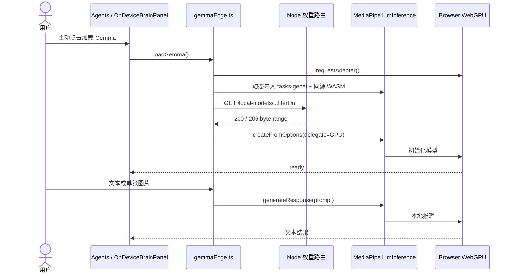

# Gemma 3n E2B · Browser Edge Inference Technical Note

> 本文只描述仓库已经实现并可核验的端侧路径。目标是回答三个问题：模型从哪里来、推理在哪里发生、什么数据会离开设备。


## 1. 结论

Pocket Earth 将 Google Gemma 3n E2B IT 作为第二推理平面，用于高频、隐私敏感和弱网任务。生产服务器负责同源分发模型权重和固定版本 WASM，浏览器负责创建 MediaPipe `LlmInference` + WebGPU 运行时并执行生成。

因此：

- **权重在服务器上**不等于**推理在服务器上**；
- 首次使用需要下载约 3.04 GB 模型，但业务输入不发往 `/api/edge`；
- Gemma 未加载、浏览器无 WebGPU 或推理失败时，返回可识别空值并使用确定性规则，不把隐私内容静默升级到云端；
- 非隐私复杂任务才由 FROST Router 交给 Gemini，公开展签图片上云前仍需用户逐次授权。

## 2. 已落地技术栈

| 层 | 实现 | 当前配置 |
|---|---|---|
| 模型 | Google Gemma 3n E2B IT | int4 Web，`.litertlm` |
| Web 运行时 | `@mediapipe/tasks-genai` | 锁定安装版本 `0.10.29` |
| 推理 API | `LlmInference.createFromOptions` | `maxTokens=1024`、`maxNumImages=1` |
| 加速 | WebGPU | `delegate: 'GPU'` |
| WASM | `FilesetResolver.forGenAiTasks` | 同源 `/mediapipe/wasm`，进入 Git 与 `dist` |
| 权重来源 | 项目固定 URL或用户本机文件 | `modelAssetPath` / `modelAssetBuffer` |
| 能力契约 | `EdgeModel` | `chat / classify / rank / vision` |
| 状态机 | `idle → loading → ready / error` | UI 显示进度、来源、模型 ID 与错误 |

Google 官方 Web 指南确认：MediaPipe LLM Inference 使用 `@mediapipe/tasks-genai`、要求 WebGPU，Gemma 3n Web 模型支持图文多模态输入，并通过 `maxNumImages` 开启视觉能力。本实现与该接口形状一致。

## 3. 加载与推理时序



生产 Node 服务没有接收业务输入的 `/api/edge` 路由。它只暴露固定文件名的模型下载路由，拒绝目录遍历，并实现 `HEAD`、完整 `GET`、单段 Range、`416` 与不可变缓存头。

## 4. 模型制品与供应链证据

| 字段 | 核验值 |
|---|---|
| Hugging Face 仓库 | `google/gemma-3n-E2B-it-litert-lm` |
| 文件 | `gemma-3n-E2B-it-int4-Web.litertlm` |
| 字节数 | `3,038,117,888` |
| SHA-256 | `b6c8e1081ec80730f14473a5ece941b48da5d8e2a80c97c2963da153f3eff3d2` |
| 本地路径 | `.local-models/gemma-3n-E2B-it-int4-Web.litertlm` |
| 生产 URL | `/local-models/gemma-3n-E2B-it-int4-Web.litertlm` |
| Git / dist | 权重均不进入；只提交说明、代码和固定版本 WASM |

模型仓库是 gated repository。开发者必须登录 Hugging Face、接受 Google Gemma 使用条款，再下载 Web 兼容权重；仓库不重新分发模型文件。

## 5. 数据边界

| 数据 | 默认位置 | 何时可联网 |
|---|---|---|
| Gemma 权重 | 生产服务器 → 浏览器缓存/内存 | 用户主动加载模型时下载 |
| 文本分类、排序、短对话 | 浏览器 | 不需要云推理请求 |
| 展签原图 | 浏览器内的 Gemma vision | 仅用户对本次公开展签明确选择云识别后，才进入 Gemini 视觉接口 |
| Gemma 输出 | 浏览器内存 | 结构化结果可继续进入本地校验与 UI |
| 私人地球 | localStorage / IndexedDB | 不由部署服务集中存储 |

Google MediaPipe 的上游隐私说明指出：MediaPipe Tasks 在设备上处理输入，不把图片、视频或文本输入发送到 Google 服务器；同时可能发送性能和使用指标。端侧因此不应被宣传为“绝对零网络”，更准确的表述是“业务输入与推理留在设备，模型和运行时需要交付，遥测遵循上游隐私说明”。

## 6. FROST 的安全升级规则

Router 顺序固定为：

```text
明确规则
  → Gemma 端侧预分类
  → 隐私文本护栏
  → Gemini Flash-Lite 长尾路由
  → 本地规则兜底
```

关键不变式：

1. Gemma 未就绪不会被标记为端侧命中；
2. 明显隐私文本命中后强制本地处理；
3. 图片云识别必须是本次文件、本次用途的显式同意；
4. 端侧和云端都只生成草稿，最终空间写入仍需用户确认。

## 7. 故障模式

| 故障 | 可观察状态 | 安全行为 |
|---|---|---|
| 无 WebGPU | `webgpu_unsupported` | UI 明示不支持，使用规则或手填 |
| 模型缺失 / 404 | `error` | 提示安装项目模型或选择本机 `.litertlm` |
| 模型加载失败 | `error` | 释放运行时，不伪造 ready |
| 输出不是声明标签 | 返回空标签 | Router 继续受控兜底 |
| 排序 JSON 长度错误 | 返回空数组 | 不把不完整分数写入业务层 |
| 视觉推理失败 | 返回空字符串 | 不自动上传原图到云端 |

## 8. 代码证据

| 声明 | 文件 |
|---|---|
| WebGPU 检测、模型加载、GPU delegate、视觉输入 | `frost-agent/edge/gemmaEdge.ts` |
| 未加载/异常安全空值 | `frost-agent/edge/contract.ts` |
| Agents 端侧面板 | `src/app/components/OnDeviceBrainPanel.tsx` |
| Router 隐私云升级护栏 | `frost-agent/harness/router.ts` |
| 图片授权闸 | `src/app/lib/privacy/cloudUploadBoundary.ts` |
| 视觉脱敏收口 | `src/app/lib/skills/visionRead.ts` |
| 开发模型路由 | `vite.config.ts` |
| 生产模型路由与 Range | `server.mjs` |
| 固定 WASM | `public/mediapipe/wasm/` |
| 单元测试 | `frost-agent/edge/gemmaEdge.test.ts` |

## 9. 生产核验

```bash
# 应用与端侧模型安装状态
curl -s https://pocketearth-google.throughtheglass.art/healthz

# 权重元数据
curl -I \
  https://pocketearth-google.throughtheglass.art/local-models/gemma-3n-E2B-it-int4-Web.litertlm

# 分段读取必须返回 206 Partial Content
curl -sS -D - -H 'Range: bytes=0-1023' -o /dev/null \
  https://pocketearth-google.throughtheglass.art/local-models/gemma-3n-E2B-it-int4-Web.litertlm
```

`edgeModelInstalled=true` 只证明生产目录中存在权重。真正的端侧推理还需要在支持 WebGPU 的浏览器中打开 Agents 面板，主动加载到 `ready`，并观察一次端侧生成与 RunTrace。

## 10. 已知限制与迁移边界

- 3.04 GB 首次下载和显存占用较高，不适合所有设备；
- WebGPU 能力、浏览器实现与设备 GPU 决定是否可运行；
- MediaPipe LLM Inference Web 已是 maintenance-only，Google 建议新项目迁移到 LiteRT-LM JavaScript；
- 业务层只依赖 `EdgeModel`，所以未来可在不重写领域 Agent 的情况下替换运行时；
- 当前只启用一张图片，尚未开放音频输入；
- 本项目不声称 Gemma 输出天然可信，所有结构化字段仍经过受控词表、坐标校验与人类确认。

## 11. Google 官方资料

- [Gemma 3n model overview](https://ai.google.dev/gemma/docs/gemma-3n)
- [Google Gemma 3n E2B LiteRT-LM model card](https://huggingface.co/google/gemma-3n-E2B-it-litert-lm)
- [MediaPipe LLM Inference for Web](https://developers.google.com/edge/mediapipe/solutions/genai/llm_inference/web_js)
- [LiteRT-LM](https://developers.google.com/edge/litert-lm)
- [MediaPipe repository and privacy notice](https://github.com/google-ai-edge/mediapipe#privacy-notice)
