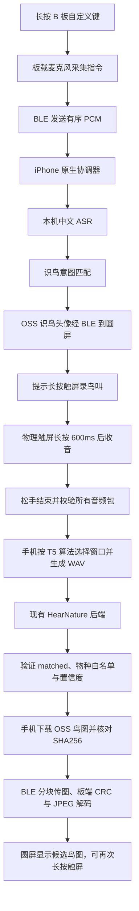

# B 板识鸟：实现与验收记录

更新：2026-08-28。**B 板固件与 OSS 实传已验证；`2026082805` 已由统一安装任务确认覆盖安装，但 iOS 拒绝启动，手机黑屏完整闭环尚未验收。** SSD 开发卷掉线后已恢复可读。当前等待手机实际系统弹窗以定位签名或描述文件信任问题；没有开始本轮 BLE 连接、真人录音或锁屏测试。此前的 `unavailable` 记录不代表当前手机连接状态。

### 上午续验（10:10）

- 手机、BLE、串口及刷写由统一安装任务单独操作，本识鸟任务未并发占用设备。
- GET-only 预检：HearNature `/health` 返回 HTTP 200；13 张鸟类 JPEG 的长度、SHA256、CRC32 与 JPEG 首尾标记全部匹配清单。没有发送识别 POST，也没有采集音频；此结果不能证明手机闭环。
- 复核发现健康摘要可能覆盖识鸟提示、原生识鸟传图后前端可能误用板端旧头像缓存。两项已由共享文件负责人完成最小修复，并报告相关 6 文件、123 测试及类型检查通过；本任务完成只读复核。最终安装包需包含这两项修复。
- 原生退出流程补齐忙碌状态：清理命令未完成前不再提前报空闲。独立回归从实际 Swift 文件抽取 `stop / launch / disconnected`，旧源码复现失败、新源码通过清理顺序、离线、断连及失败分支；假传输和系统生命周期替身不代表 iPhone 实测。源码 SHA256 为 `f3fabbce1905eacbb1f22ba2b88b44aa0b466e8d53cbf06aa0f9c386557b65a4`，测试为 `native/frost-badge/tests/test_bird_session_lifecycle.py`。
- 统一安装复核还发现冻结 `2026082804` 的训练子应用缺少最新 `workout-completed` 集成。因此 `2026082804` 仅是此前识鸟构建的冻结候选，不作为所有当前功能均已整合的证明，也不直接盲装。
- 后续统一安装任务确认 `2026082805` 已覆盖安装，包含上述原生退出修复，Xcode 构建、严格签名及 HealthKit 校验通过；GitHub 分支 `codex/0828-ios-integrated`、提交 `6fdb0037` 已核实。iOS 启动仍被系统安全检查拒绝，等待实际弹窗；构建、签名和安装成功均不能替代运行及锁屏验收。

上午线上预检证据：[phone-resume-preflight.json](../design/bird-skill-20260828/phone-resume-preflight.json)。此前的固件、BLE 和构建证据保持原样；仍须取得真实锁屏、实体按键和触屏收音的结果后才能确认完成。

## 1. 已交付的代码与实物状态

| 项目 | 状态及证据边界 |
| --- | --- |
| Agents → 识鸟 Skill | 已加入独立 NATURE & HARDWARE 分组，浏览器实际打开验证；不是手机实测 |
| 识鸟小动物头像 | 已生成、上传 OSS；图像工具未返回具体模型版本，不将其标记为已验证的 image2 |
| 十二鸟美术 | 从 T5 原始鸟类包提取首帧，保留原图身份；不是重画十二个鸟种 |
| B 板固件 | 实板 `0.2.15-ojbadge-birds`，2,314,784 bytes；9 块独立读回逐字节相等 |
| 分区与 OTA | 当前 v14 完整应用槽先备份；只写 `0x10000` 应用；分区表、OTA 选择保持不变 |
| OSS → BLE → B 板 | 新增 13 张图片及原有 16 张头像全部校验通过；每张均有匹配 CRC 的解码回执及串口应用记录 |
| 麦克风边界 | 不按实体按键/触屏时，切换识鸟模式、发送旧远端录音命令均未产生音频 |
| 自建识别服务 | 两批共 17 次标准样本请求；最终十二种各有正确结果，第一批有 5 次 HTTP 错误；不是一次性 12/12，也不是野外准确率 |
| 自动化 | 151 项相关前端测试通过；Swift 原生协议测试、C++ 协议测试通过；TypeScript 检查通过 |
| iPhone 应用 | `2026082804` 真机目标构建、代码签名验证通过；完整 `.app` 已独立冻结，**未安装** |
| 手机黑屏 ASR、物理触屏收音、返回鸟图 | **待真机验收**；不能用构建成功、标准样本或 Mac BLE 测试替代 |
| 圆屏肉眼颜色、文字布局 | 有 LCD 首帧、96/96 所需字形检查及图像解码证据；未获得新的实拍确认 |

机器可读证据在 [verification.json](../design/bird-skill-20260828/verification.json)。页面截图在 [skill-page-browser.png](../design/bird-skill-20260828/skill-page-browser.png)，此图是浏览器截图，不是开发板照片。

> 后续素材修正：已补回 T5 原背景，发布为 `t5-scenes-v2`。原背景提取、OSS 发布及新版验收边界见 [T5 背景记录](BIRD-T5-BACKGROUNDS-2026-08-28.md)。本页的早期 v1 图片字节数与回执不代表新版实板通过。

## 2. 研究结论：复用的是哪条 T5 链路

原项目：`/Users/zhangcheng/Documents/上街去/硬件开发/firmware/t5e1-city-buddy`。

- 音频与服务协议：`src/voice/voice_interaction.c`。
- 十二鸟映射及美术：`sd-card/streetgo/motions/bird-manifest.json` 及所引用鸟类包。
- 既有评测：`reports/T5_XIHU_E2E_2026-08-24.md`。

后端是 `https://hearnature.throughtheglass.art/hardware/recognize`，自建 **PANNs CNN14 + 逻辑回归分类头**，健康检查返回 21 种杭州常见鸟；不是 Qwen 或外部 BirdNET API。本次不更换模型、不修改 HearNature 服务，也不切换 PocketBuddy 主站 ECS 的 `current`。

与 T5 一致：16 kHz、单声道 PCM16，至少 2.5 秒；以 250 ms 步长比较绝对幅值总和，取最响连续 3 秒，并检查尾部窗口；不足 3 秒但至少 2.5 秒则保留原长度。包装为 WAV，再发送 JSON `format / deviceId / audioBase64`。返回 `matched / species_id / confidence`。

旧评测记录约 33 个原始音频文件、21 类，严格文件级 Top-1 约 40–43%。该数据不足以保证真实环境效果；室内扬声器经板载麦克风重录也可能产生高置信度错误。因此界面明确显示“疑似/候选”，不把置信度写成准确率。`matched=false`、非十二种白名单或无效置信度均不展示猜测鸟图。

新 iPhone 代码使用系统 HTTPS 校验，不继承旧 T5 的 `tls_no_verify` 选项。

## 3. 执行链路



黑屏链路完整放在 `FrostBirdSession.swift`；不依赖 WKWebView 的计时器或 JS 在后台继续运行。开启后，从每次物理录音的第一包开始由原生层接管，避免录音中途锁屏丢失交接。非识鸟的前台指令带着本机转写结果交还现有 Frost 语音入口，不重复 ASR；其他技能不新增后台执行承诺。

## 4. 手机与板端边界

### iPhone

首次连接、语音识别授权、开启“黑屏识鸟”必须在前台完成。必须支持本机中文 ASR，不自动回退云 ASR。用户开启后仅在物理录音事件到来时处理；手机不主动打开板载麦克风。

使用 `bluetooth-central` 后台模式和有限的 `beginBackgroundTask`，不播放静音保活、不增加手机麦克风常驻。完成后结束后台任务；系统期限到达则取消网络、ASR 与待回执，不自动重传原音。连接断开取消会话，重新连接后需要重新唤起；尚未实现进程被终止后的状态恢复。

Apple 明确指出蓝牙后台模式不是无限运行许可，后台任务也有到期回调；因此不保证手动强退、系统终止进程、断网或失联后仍能完成。参见 [Core Bluetooth 后台执行说明](https://developer.apple.com/library/archive/documentation/NetworkingInternetWeb/Conceptual/CoreBluetooth_concepts/CoreBluetoothBackgroundProcessingForIOSApps/PerformingTasksWhileYourAppIsInTheBackground.html) 和 [beginBackgroundTask 文档](https://developer.apple.com/documentation/uikit/uiapplication/beginbackgroundtask(withname:expirationhandler:))。

录音仅在内存处理，不写入手机文件、不上传 OSS；只有完整的物理鸟叫录音会发给已有 HearNature。此处不对未重新审计的服务器存储策略作新保证。

### B 板

探测到实际硬件为 ESP32-S3、16 MiB Flash、8 MiB PSRAM。现有应用槽仅 **3 MiB**。v15 比 v14 只增加 2,032 bytes，当前余量 830,944 bytes；没有把 13 张图片写入固件。

- 原有索引 `0..16` 不变；0 为唯一驻留 Frost，17 为识鸟头像，18..29 为十二种鸟。
- 复用 `avatar_jpeg_v1`：begin / chunk / commit，token、偏移、CRC32；240×240 baseline JPEG，单图上限 64 KiB。
- 需要 GATT 写入完成、命令确认、对应图像执行回执全部到齐才推进；commit 必须得到实际解码回执。
- 只有一个远端图片缓存，像素缓冲与 JPEG 位于 PSRAM，不保存十三份像素副本。
- 新 `bird_mode_v1`：0 退出、1 可录、2 处理中、3 结果、4 可重试；此命令不能启动麦克风。
- 物理自定义键沿用 600 ms 长按；触屏长按只在已进入识鸟且非处理中接受，一次最长 10 秒。松手终止；按住不自动重录；重连/切换模式时已按住的手指不作为新授权。
- 音频控制事件：原语音保留 custom kind 3，鸟叫使用 kind 6；PCM 包按会话和序号校验。结尾元数据先到时等待音频尾包，丢包/断连/长度异常不上传。
- 板端处理状态 40 秒无结果会显示超时，并允许重新物理录音，避免手机挂起时一直卡住。该超时分支已实现，尚未单独做 40 秒实物计时验收。
- 中文字库补充“鹟”，启动查询识鸟及录音所需字形 96/96 成功。

## 5. 美术与十二种鸟

新图集根路径：[OSS 鸟类资源目录中的头像](https://last-night-on-earth.oss-cn-hangzhou.aliyuncs.com/pocket-earth/bird-skill/20260828-v1/frost.bird-listener.jpg)。13 张 JPEG 共 100,271 bytes；连同 WebP 共 26 个对象、240,721 bytes。资源版本路径固定，手机代码内置 URL、长度、SHA256、CRC32 清单，不采纳识别接口任意返回的外部图片 URL。

| 板端索引 | 鸟名 | species_id |
| --- | --- | --- |
| 18 | 白头鹎 | pycnonotus-sinensis |
| 19 | 大杜鹃 | cuculus-canorus |
| 20 | 红嘴蓝鹊 | urocissa-erythroryncha |
| 21 | 麻雀 | passer-montanus |
| 22 | 普通夜鹰 | caprimulgus-indicus |
| 23 | 强脚树莺 | horornis-fortipes |
| 24 | 鹊鸲 | copsychus-saularis |
| 25 | 乌鸫 | turdus-mandarinus |
| 26 | 喜鹊 | pica-serica |
| 27 | 珠颈斑鸠 | spilopelia-chinensis |
| 28 | 棕背伯劳 | lanius-schach |
| 29 | 棕脸鹟莺 | abroscopus-albogularis |

生成与转换程序：`scripts/hardware/build-bird-assets.mjs`；提取 T5 LZ4 帧后核对原帧 CRC，再编码 JPEG/WebP。Web 与 Swift 使用内容相同的 `birdCatalog.json` / `BirdCatalog.json`。

头像设计简述（非逐字提示词记录）：延续现有探路鸟的简洁角色语言，森林青绿与奶油白两种角色颜色，纯杏桃色背景；圆润小鸟倾头、翅膀贴近脸侧倾听，主体偏右下，脸保留在 240px 圆形安全区；无字、无耳机、无额外角色。原始生成 PNG 保存在 `public/assets/bird-skill/20260828/mascot-original.png`；只发布 JPEG/WebP。十二种鸟不经过生成模型改画。

## 6. 测试复现与构建

前端相关测试：

```sh
npm test -- src/app/lib/skill src/app/lib/birdListener.test.ts src/app/lib/frostBadge.test.ts src/app/lib/frostCompanionVoice.test.ts src/app/components/PlazaTab.my-agent.test.ts
npm run typecheck
```

原生纯协议测试：编译 `native/frost-badge/ios/FrostBirdProtocol.swift` 与 `native/frost-badge/tests/BirdProtocolTests.swift`。覆盖指令意图、否定与退出、WAV、最响窗口、CRC、音频尾包、乱序与断连。C++ 现有 host 测试覆盖 30 个索引边界、图片事务与重放、物理长按和重连授权门控、拥塞与 MTU。

实际 BLE 测试脚本 `hardware/ojbadge-agent-link/tests/ble_smoke.py`：`--bird-oss` 验证新图；`--avatar-oss` 验证原有 16 图；`--mic-gate --touch-seconds 0` 验证远端请求不能单独收音。使用开发机已有 Bleak 环境与正常 TLS 证书校验；每次只有一个客户端连接。

`scripts/hardware/verify-bird-service.py --live` 只发送公开标准音频。`--window-tool` 必须指向由实际 Swift 预处理源码编译的测试二进制。遇 429 停止，不自动重试；`--species` 为明确选择的后续测试。第一次 5 个 HTTP 错误没有保存状态码，不推断为已确认的 429。第二次仅重测那 5 种，均成功。

固件使用独立 `hardware/ojbadge-agent-link/build-birds-20260828`，不覆盖其他任务的共享 `build`。手机使用 `scripts/ios/prepare.mjs --web-only` 更新已有 SSD 共享资源，然后 Xcode 真机目标签名构建。未卸载或擦除旧手机应用。当前编译仍有原有 AVAudioPCMBuffer/闭包 Sendable 警告，不宣称 Swift 6 零警告。

## 7. 冻结产物与回退

固件 SHA256：`857b02ac52ff2da865b97129b58b38bf30329abc82cd0e06e333cfca7da4693e`。

本轮私有证据、备份与刷写脚本：`/Users/zhangcheng/.local/share/pocketbuddy-esp/bird-skill-20260828/`。`rollback/app-slot-0.bin` 是从当前实板读出的 v14 完整 3 MiB 应用槽；同时保存分区表和 OTA 数据。原厂 16 MiB 恢复备份也在写前重新校验。需要回退时先重新确认设备身份、下载模式、当前分区与备份哈希，仅恢复该应用槽，不能直接全片擦除。

已签名待安装应用：`/Volumes/PocketBuddy-iOS-Dev/Artifacts/bird-skill-20260828/PocketBuddy-2026082804.app`，Bundle ID 沿用 `art.throughtheglass.pocketbuddy`。包内仍有原有 16 套头像、照片、健康和 Frost 功能。`2026082802`、`2026082803` 是较早候选，不作为当前安装包。

## 8. 仍需完成的真实验收

1. iPhone 接入并信任电脑，安装上述应用；打开 Agents → 识鸟，连接 B 板，授权本机中文识别，开启黑屏识鸟。
2. 手机锁屏，等待至少一分钟；长按 B 板自定义键，说“帮我识别下鸟叫”，松手。确认手机未亮屏、原生 ASR 成功、识鸟头像与提示出现在圆屏。
3. 提示出现后长按触屏，面对鸟叫音源记录约六秒再松手。核对 kind 6、零丢包、服务端请求和结果、OSS 下载及板端解码均属于同一次操作。
4. 再次录音与“退出识鸟”；在录音中途锁屏再试一次；测试短录音、无网、未知鸟种、断连，确认没有重复上传或旧结果覆盖。
5. 取得实际圆屏照片或用户目视确认。标准音频经扬声器重录仅能证明声音路径，仍不是野外泛化评测。

完成这些步骤以前，本任务不能标记为“全程手机黑屏完整跑通”。T5 本板未刷写，PocketBuddy 主站及 HearNature 服务未由本轮重部署。
