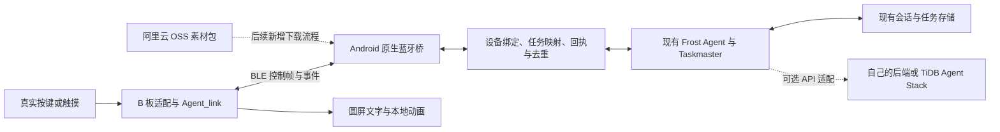

# OJBadge × Frost：官方资料研究与改造准备

核对日期：2026-08-27。范围：主办方 B 板 OJBadge、Agent_link、现有「谷歌大赛」App、可选 TiDB Agent Stack。T5 改造暂不进入本轮。

**本文保留资料研究阶段的结论。后续已完成工具链安装、B 板适配和首次烧录；最新实测状态见[烧录验证记录](OJBADGE-FLASH-VALIDATION-2026-08-27.md)。** 研究阶段仅新增本准备文档，未改业务代码、安装 ESP-IDF、连接云端账号或烧录硬件。下文的「拟实现」「待真机验证」应结合后续验证记录阅读，不能把方案当作完成结果。

## 1. 先确定五件事

1. **可以沿用我们的 App 和 Frost Agent。** 赛道宣讲允许自研移动/桌面/CLI App，交付说明允许自定义 SDK、链路及替代 Agent 方案。赛前说明另有统一接入 ROROLEE 的措辞，存在口径差异；正式参赛前向主办方确认自有 App 方案符合最终规则，不据此提前放弃现有 App。[赛道宣讲](https://tidb-ai-hardware-hacktho-ect1jik.gamma.site/)、[交付说明](https://tidb-sumbit-artifacts-hxy4mrq.gamma.site/)
2. **B 板不是选中型号就能直接烧录。** 官方明确写了 OJBadge 暂无适配；需要补 GC9A01 显示、CST816D 触摸等板级代码和构建注册。A/D 板固件不能原样刷到 B 板。[赛前说明](https://tidb-pre-match-intro-dct7ede.gamma.site/)
3. **Agent_link 是设备端通信 SDK 和参考固件。** 它不等于手机端 Agent，也不替我们完成手机的蓝牙桥、Frost 任务映射或云端服务。ROROLEE 是官方客户端；我们拟实现对应客户端职责。[Agent_link](https://github.com/DeotalandDev/Agent_link/tree/3c93ecfcdc473c952a0e85d9797c2663e9ba7d87)
4. **TiDB Agent Stack 是可选的托管 Agent 服务。** 现有 Frost 不能仅凭账号就整套上传运行；可通过 API 接入一个托管 Agent，或用 Tool/MCP 对接自己的服务。第一版保留现有 Frost 的任务执行权，避免两套 Agent 重复执行。[Stack 介绍](https://tidb-agent-stack-intro-avsk9wk.gamma.site/)、[开发指南](https://github.com/mem9-ai/agent-stack-dev-guide/tree/bed43b919b41486ef6fd8c5ae0f5f3144f28de6f)
5. **吧唧展示同一个 Frost 的状态和反馈。** 不另建一套电子宠物的记忆、养成数值或任务系统；先实现输入、短文字、少量本地动画。语音、OSS 素材更新和锁屏后台使用单独验收。

## 2. 已读取的资料与版本

六份网页已重新打开并读取正文；三个仓库检查了 HEAD，重点阅读 README、板级接口、通信实现、API 契约和示例桥接代码，未声称审计了每一行源码。当前网页较前次读取无变化；下午开工时再检查仓库是否更新，采用固定提交构建。

| 资料 | 已提取的关键内容 |
| --- | --- |
| [赛前说明 / 套件](https://tidb-pre-match-intro-dct7ede.gamma.site/) | B 板规格、引脚、无现成适配、ESP-IDF 环境、官方连接方式 |
| [赛道宣讲](https://tidb-ai-hardware-hacktho-ect1jik.gamma.site/) | 自研 App 路径、Physical AI 要求、现场禁止焊接 |
| [挑战场景](https://tidb-scenario-challenge-52ota9p.gamma.site/) | 个性化硬件伙伴、持续任务等方向；应选可用真实输入证明的场景 |
| [Stack 介绍](https://tidb-agent-stack-intro-avsk9wk.gamma.site/) | Agent / Project / Session / Turn、工具、记忆、平台边界 |
| [Stack 开发说明](https://tidb-agent-stack-develop-50arovb.gamma.site/) | 鉴权、流式协议、成功判定、开发 Skill 的用法 |
| [交付物](https://tidb-sumbit-artifacts-hxy4mrq.gamma.site/) | 三分钟真机视频、一页架构、可复现代码、Agent 或替代方案说明 |
| [Agent_link 固定提交](https://github.com/DeotalandDev/Agent_link/tree/3c93ecfcdc473c952a0e85d9797c2663e9ba7d87) | `3c93ecfcdc473c952a0e85d9797c2663e9ba7d87`；2026-08-27 00:21 UTC |
| [agent-stack-dev-guide 固定提交](https://github.com/mem9-ai/agent-stack-dev-guide/tree/bed43b919b41486ef6fd8c5ae0f5f3144f28de6f) | `bed43b919b41486ef6fd8c5ae0f5f3144f28de6f`；2026-08-27 00:02 UTC |
| [esp32-agent-lcd 固定提交](https://github.com/you06/esp32-agent-lcd/tree/ef2562e33ada3f7ee67ed87c4d9e651069bf3134) | `ef2562e33ada3f7ee67ed87c4d9e651069bf3134`；2026-08-26 19:27 UTC |

公开源码阅读快照位于 `/tmp/pocketbuddy-ojbadge-research-20260827/`，仅为临时研究缓存，不是可直接编译的完整克隆。长期依据使用上表固定提交链接。板卡外部参考文章 `arduino.me/a/3350` 本次未取得有效正文，不能视为已拿到厂家原理图或 BSP。

## 3. B 板硬件与资源预算

### 3.1 确认的型号范围

| 项目 | 资料标注 / 依据 |
| --- | --- |
| 主控 | ESP32-S3R8；不是此前讨论的涂鸦 T5 |
| 屏幕 | 1.28 英寸圆形 **TFT**，240×240；GC9A01 显示、CST816D 触摸，不是 1.75 英寸 AMOLED |
| 存储 | 外置 W25Q128，标称 16MB Flash；S3R8 配有 8MB Octal PSRAM |
| 输入 | SW1/SW2 两个按键、触摸、GMI6027P 麦克风 |
| 声音 | ES8311 Codec、AW8010 功放、1609 喇叭 |
| 供电 | 3.7V / 300mAh 电池、LGS4056 充电、BQ27220 电量计、Type-C |
| 体积 | 45.8×45.8×12.3mm |

B 板资料没有列出摄像头、GPS、IMU、SD 卡槽、振动马达或 RGB 灯，不能继承别的板子的能力声明。位置或相机数据如来自手机，应在产品和日志中标明来源。[B 板规格](https://tidb-pre-match-intro-dct7ede.gamma.site/)、[ESP32-S3 数据手册，型号表](https://documentation.espressif.com/esp32_s3_datasheet_en.pdf)

### 3.2 待核实后才能写入驱动的引脚表

以下是赛前说明中的映射，**尚未对照收到的实物、板卡版本和原理图**。

| 功能 | 文档引脚 | 需要确认 |
| --- | --- | --- |
| LCD SPI | MOSI 10、SCLK 12、CS 13、DC 14、RST 11、BL 16 | 初始化序列、背光极性、颜色顺序、旋转方向 |
| 触摸 | INT 38、SDA 43、SCL 44、RST 46 | I²C 地址、复位/中断极性、坐标方向 |
| 电量计 | SDA 43、SCL 44 | 与触摸共用总线；避免各自重复安装总线驱动 |
| ES8311 | SDA 6、SCL 7、MCLK 45、SCLK 39、DOUT 40、LRCK 41、DIN 42 | I²S 输入/输出的观察方向、采样格式和启动顺序 |
| USB | DN 19、DP 20 | 实物枚举方式及下载模式操作 |
| SW1/SW2、功放使能 | 现有表未完整提供 | **不猜 GPIO、不直接套用 A/D 的 BOOT 键定义** |

LCD 一行还列出 SDA 6 / SCL 7，与音频控制总线重合。文档没有解释其用途，不能擅自把它当成 GC9A01 的额外 I²C 接口。SW1/SW2 未明确时，可先评估已列出引脚的触摸输入，不为找按键而盲试 GPIO。[引脚来源](https://tidb-pre-match-intro-dct7ede.gamma.site/)

### 3.3 Flash、PSRAM 与动画

- Flash 断电保留固件、配置、字体和素材；PSRAM 是运行用临时空间，断电丢失。8MB PSRAM 不是素材的永久仓库。
- 240×240 的 RGB565 一帧是 `240 × 240 × 2 = 115,200` 字节，即 **112.5KiB**；双缓冲约 225KiB；30 张未压缩全屏帧约 3.30MiB。还需要为解码、BLE、音频及任务栈留空间。
- 适合少量压缩帧、局部精灵、程序绘制的呼吸/眨眼等动画。帧率、解码格式和播放时长必须在真机上测，不能用容量推算承诺视频能力。
- 当前 SDK 分区表给两份 OTA 固件各 3MiB，`storage` 从 `0x610000` 开始、大小 `0x9f0000`，即约 **9.94MiB**。这是参考分区，不等于 B 板已挂载、已格式化或有同样多的可用素材空间。[分区表](https://github.com/DeotalandDev/Agent_link/blob/3c93ecfcdc473c952a0e85d9797c2663e9ba7d87/partitions.csv)
- 当前 S3 配置启用 Octal PSRAM，同时允许找不到 PSRAM 时继续启动；因此“能开机”不能证明识别了 8MB PSRAM。首次启动必须检查检测日志和可分配内存。[S3 配置](https://github.com/DeotalandDev/Agent_link/blob/3c93ecfcdc473c952a0e85d9797c2663e9ba7d87/sdkconfig.defaults.esp32s3)

**第一版素材随固件提供，状态指令触发本地动画。** 后续 OSS 存放素材包，手机或新增的设备下载器负责拉取、校验和更新；OSS 本身不把动画主动推到硬件。保留当前包和可回退包，不把全部资源一次塞入 Flash，不通过 BLE 持续传全屏帧。

## 4. Agent_link：已有能力与实际缺口

### 4.1 能力核对

| 能力 | 固定提交中的情况 | 对我们的影响 |
| --- | --- | --- |
| BLE 广播、GATT、控制帧 | 有实现 | 可复用设备端；手机端仍需实现 |
| I/O manifest、通用输出调用 | 有实现 | App 可发现能力，再调用对应输出 |
| `screen0` 短文字输出 | 有路由；需 B 板实现 `ShowText` | 可作为最短下行验证 |
| `agent_link_push_event` | **已实现**；自定义事件为 `0x64`，丢包不自动重发 | README 的“尚未接通”描述滞后；按实现设计事件回执 |
| `agent_link_report_selected_agent` | 仍是 TODO | 不能靠此接口完成 Frost 绑定 |
| 语音 GATT / L2CAP 路径 | 有设备端代码 | B 的音频驱动、手机采集/播放/ASR/TTS仍要接通 |
| `agent_link_send_image` | **硬件向手机上传**静态图像 | 不能当作手机向吧唧下载头像 |
| `on_show_image` | 声明存在，但未找到实际下行调用；`Board` 也无对应方法 | 第一版另加轻量动画状态输出，不许宣称图片下发已支持 |
| Wi-Fi 配网 | STA、SoftAP 和配网页面有实现 | 配网成功不等于业务链路可用 |
| Wi-Fi 业务传输 | 控制/流式发送返回 `ESP_ERR_NOT_SUPPORTED`；`is_ready` 为 false | 不能仅设置 WIFI/BOTH 就直连自己的云端；BOTH 当前回落 BLE |
| 绑定和安全 | 配置启用 BLE bonding / Secure Connections，但控制特征未显式强制加密/认证访问 | 仍需核实配对流程、设备归属和用户授权，不能用广播名充当身份 |

依据：[核心实现](https://github.com/DeotalandDev/Agent_link/blob/3c93ecfcdc473c952a0e85d9797c2663e9ba7d87/components/agent_link/src/agent_link.cpp)、[BLE 实现](https://github.com/DeotalandDev/Agent_link/blob/3c93ecfcdc473c952a0e85d9797c2663e9ba7d87/components/agent_link/src/transport_ble.cpp)、[Wi-Fi 实现](https://github.com/DeotalandDev/Agent_link/blob/3c93ecfcdc473c952a0e85d9797c2663e9ba7d87/components/agent_link/src/transport_wifi.cpp)、[Board 接口](https://github.com/DeotalandDev/Agent_link/blob/3c93ecfcdc473c952a0e85d9797c2663e9ba7d87/main/board.h)

仓库 README 引用的部分 `docs/` 协议文档在该提交的文件树中不存在；不能依赖这些断链补全协议。Agent_link 使用 MIT 许可，后续复制或修改需保留许可和版权声明。[许可](https://github.com/DeotalandDev/Agent_link/blob/3c93ecfcdc473c952a0e85d9797c2663e9ba7d87/LICENSE)

### 4.2 手机桥第一版需要实现的协议子集

| 项目 | 源码定义 |
| --- | --- |
| 广播识别 UUID | `AB883C83-3FCC-4A0F-A951-E18D0C944DA4`；不是控制 service UUID |
| 控制 service | `0xFFC0` |
| 命令 characteristic | `0xFFC1`：Write + Notify；写命令、收响应 |
| 事件 characteristic | `0xFFC4`：Notify；收 manifest 和硬件事件 |
| 帧结构 | version 1 字节、type 1 字节、command 1 字节、sequence 1 字节、payload 长度 LE16、payload |
| 消息类型 | Command `0x01`、Response `0x02`、Event `0x03`；高位 encryption 标记不代表 SDK 已提供应用层加密 |
| 查询能力 | 命令 `0x34`；能力分片事件 `0x18`，载荷为 `[chunk_idx][last][JSON片段]` |
| 调用输出 | 命令 `0x33`；载荷为 `[id_len][id的UTF-8字节][args]` |
| 文本输出 | 输出 id 为 `screen0`；内部缓冲最多保留 255 字节，不是 255 个汉字 |
| 自定义事件 | `0x64`；具体业务载荷由我们定义 |
| 后续音频/图像 | 语音通知 `FFA0/FFA1`；音频 CoC PSM `0x0081`；静态图像**上行** CoC PSM `0x0082` |

协议依据：[protocol.h](https://github.com/DeotalandDev/Agent_link/blob/3c93ecfcdc473c952a0e85d9797c2663e9ba7d87/components/agent_link/src/protocol.h)、[控制与 manifest 路由](https://github.com/DeotalandDev/Agent_link/blob/3c93ecfcdc473c952a0e85d9797c2663e9ba7d87/components/agent_link/src/agent_link.cpp)、[GATT/CoC](https://github.com/DeotalandDev/Agent_link/blob/3c93ecfcdc473c952a0e85d9797c2663e9ba7d87/components/agent_link/src/transport_ble.cpp)

接入顺序拟定为：扫描并由用户确认设备 → 连接和服务发现 → 协商 MTU → 订阅命令响应及事件 → 组装 manifest → 必要时 `0x34` 重取 → 验证 `screen0` → 验证自定义事件。所有 GATT 操作按队列串行，处理系统回调、超时、断开和重连。

**小 MTU 风险（静态源码发现，未真机复现）：** `SendManifest` 在 MTU ≤ 27 时采用 150 字节片段预算；默认 MTU 23 时，Notify 的值最多容纳 20 字节，扣掉 6 字节帧头和 2 字节分片头仅剩 12 字节。现有回退值可能造成超长发送。下午应补正确预算与 23/185/247 等边界测试；不能只请求较大 MTU 就假定协商必定成功。[源码位置](https://github.com/DeotalandDev/Agent_link/blob/3c93ecfcdc473c952a0e85d9797c2663e9ba7d87/components/agent_link/src/agent_link.cpp#L252)

另外，普通自定义命令并不自动享有 manifest 的分片机制；短文字也要同时受实际 MTU 和 UTF-8 字符边界约束。`0x33` 响应仅说明路由层调用了回调，**不证明动画完成，更不证明 Frost 的任务完成**。渲染耗时工作应放到队列，另行返回业务完成/失败事件。

### 4.3 B 板固件的拟改动范围

- 新增 `boards/ojbadge/` 下的 `config.h`、`config.json`、板级 `.cc`，实现 `Board` 并注册 `DECLARE_BOARD`。`config.json` 是元数据，不能只改它就期待引脚生效。
- 注册 `main/Kconfig.projbuild`、`main/CMakeLists.txt`；检查根 `CMakeLists.txt` 的 S3/RTC 板级配置表及 `main/idf_component.yml` 驱动依赖。不能照抄 D 板的外部 32kHz 晶振假设。
- 先实现 GC9A01 显示、CST816D 触摸和真实能力位；按需复用 `boards/common/` 的 ES8311、BQ27220 驱动，但须校验引脚、总线和供电时序。
- 拟新增 `avatar_state` 输出，接收状态编号并本地渲染；这是**我们的协议扩展**，不是官方现成功能。I/O 描述符需有足够生命周期，回调不能阻塞 BLE 任务。
- 电量、音频、素材下载分别补验收；不要把驱动实例化或 `ESP_OK` 日志当成外设已工作。

实现入口依据：[板级开发说明](https://github.com/DeotalandDev/Agent_link/blob/3c93ecfcdc473c952a0e85d9797c2663e9ba7d87/boards/README.md)、[根构建配置](https://github.com/DeotalandDev/Agent_link/blob/3c93ecfcdc473c952a0e85d9797c2663e9ba7d87/CMakeLists.txt)

## 5. 现有 Frost App 怎么接

### 5.1 已有代码与缺项

项目是 React / TypeScript / Vite + Capacitor Android，依赖声明为 Capacitor 8.5 系列。目前未发现 BLE 依赖、Android 蓝牙权限或原生 BLE 桥；相关 UI 的“显示在 DEVICE”仍是占位，不代表已接设备。

| 现有入口 | 结论 / 拟用途 |
| --- | --- |
| [PocketBuddyForge.tsx](/Users/zhangcheng/Desktop/谷歌大赛/src/app/components/PocketBuddyForge.tsx:1559) | `deviceBound={false}` 和空回调；后续接真实绑定状态及下发操作 |
| [frostAgentRuntime.ts](/Users/zhangcheng/Desktop/谷歌大赛/src/app/lib/frostAgentRuntime.ts:75) | 已创建 FrostAgentLoop、模型适配器、工具、Taskmaster 和 IndexedDB 日志；复用，不另起人格 |
| [Frost 输入入口](/Users/zhangcheng/Desktop/谷歌大赛/src/app/lib/frostAgentRuntime.ts:116) | `sendFrostAgentMessage`；硬件请求可在校验后转为同一 Agent 的输入 |
| [任务结果入口](/Users/zhangcheng/Desktop/谷歌大赛/src/app/lib/frostHealthTaskmaster.ts:59) | `submitTaskSignal`；完成后会续接同一 Frost Loop，但需先确认事件对应正确任务和动作 |
| [设备事件转换](/Users/zhangcheng/Desktop/谷歌大赛/frost-agent/taskmaster/deviceGateway.ts:55) | `replayDeviceEvents` 校验/去重并写事件；它本身不是已部署的网络接口，也不自动唤醒 Agent |
| [已有形象状态](/Users/zhangcheng/Desktop/谷歌大赛/frost-agent/buddy/poses.ts) | 有 sleep/idle/busy/attention/celebrate/dizzy/heart 定义，可作轻量视觉参考；不等于已有完整宠物系统 |
| [AndroidManifest.xml](/Users/zhangcheng/Desktop/谷歌大赛/android/app/src/main/AndroidManifest.xml) | 待补 BLE 权限和运行时授权逻辑 |
| [MainActivity.java](/Users/zhangcheng/Desktop/谷歌大赛/android/app/src/main/java/art/throughtheglass/pocketearth/MainActivity.java) | 已有其他插件注册，但无 BLE 插件；拟加原生 GATT 桥 |

第一版按 **Android App 前台运行** 设计。Android 12+ 的扫描、连接权限需要运行时授权；手机作为 central 不因这个方案就必须申请广播权限。旧 Android 的位置权限规则另行适配，不删掉 App 原本位置功能所需权限。[Android 蓝牙权限](https://developer.android.com/develop/connectivity/bluetooth/bt-permissions)

完整语音路径若要复用 CoC，需要原生桥支持；Android 提供 API 29+ 的 `createL2capChannel`，具体手机、SDK 参数和音频格式仍需互测。不能把“Web Bluetooth 能做 GATT”当作完整 CoC 语音已可用。[Android L2CAP API](https://developer.android.com/reference/android/bluetooth/BluetoothDevice#createL2capChannel(int))

### 5.2 拟实现的数据流



图中 BLE 桥、设备任务映射、B 板驱动和下载流程均为待实现。现有会话/目标存储主要在 App 的 IndexedDB，不是已经全部云端化。需要跨手机、重装恢复或 App 关闭后持续执行时，应另做账号同步或服务端任务执行，不能因引入吧唧便默认拥有这些能力。

**同一个 Agent 的约束：** App 保存设备与 Agent 的绑定，以及 `task_id / run_id / action_id / correlation_id` 的映射。硬件只保存足够的显示状态、资源版本和交互标识，不存整个模型或完整私密记忆。BLE 的单字节 sequence 会循环，不能用它代替长期业务 command/event ID。

**事件必须分流：** 点击“问问 Frost”是输入；明确同意某个动作是用户确认；外设实际做完某件事才是完成证据。`submitTaskSignal` 当前会取任务的当前动作并提交 `tool_result`，所以不能把任何触摸直接塞进去，也不能把“确认”伪装成工具已完成。桥接层需校验设备归属、会话、动作关联和期限；用户确认通过现有审批/确认路径，重复或过期事件不再次执行。

第一版演示拟为：触摸吧唧请求一个与当前任务有关的下一步 → Frost 根据已有上下文作判断 → 吧唧显示短提示和 attention 状态 → 用户明确回应 → App 中同一任务推进 → 吧唧显示结果。具体任务选已有、低风险、能真实完成的能力，不能仅靠固定动画模拟智能判断。

## 6. TiDB Agent Stack 的用途与边界

### 6.1 它与另外几个名字的关系

| 名称 | 本方案中的职责 |
| --- | --- |
| Agent_link | ESP32 固件里的设备能力和通信层 |
| ROROLEE | 官方手机客户端；我们的 App 拟承担对应桥接职责 |
| Frost | 我们已有的 Agent 逻辑、工具和任务流程 |
| TiDB Agent Stack | 可选托管 Agent 运行服务，提供会话、执行、工具与相关持久化能力 |
| TiDB / mem9 | 文档涉及的存储及记忆能力；不等于自动同步我们所有本地数据 |
| 阿里云 / OSS | 可继续使用的自有后端和对象存储；与 BLE 层没有强制绑定 |

提供账号是为了使用平台工作区和 Agent API；不是发了一个可任意运行现有 Node/React 应用的通用服务器。官方开发 Skill 仓库主要是操作指南与 OpenAPI 快照，不是平台服务端源码，也不是 B 板 SDK。[Stack 介绍](https://tidb-agent-stack-intro-avsk9wk.gamma.site/)、[Skill 仓库](https://github.com/mem9-ai/agent-stack-dev-guide/tree/bed43b919b41486ef6fd8c5ae0f5f3144f28de6f)

### 6.2 如果后续接入，先验证这个最短流程

介绍页使用临时地址 `https://ventured-agent-stack.tidb.net`；开发说明示例使用 `https://ventured-agent-stack.pingcap.cn`。**必须以账号实际所属环境及主办方最终地址为准**，不要把两者混用。[介绍页](https://tidb-agent-stack-intro-avsk9wk.gamma.site/)、[开发说明](https://tidb-agent-stack-develop-50arovb.gamma.site/)

以下仅为契约核对，未实际请求账号：

| 顺序 | API / 约束 |
| --- | --- |
| 1 | 确认拿到的是哪种身份与权限；普通 Agent/Session 操作采用 User API Key，不把 Workspace API Key 当作万能钥匙 |
| 2 | `GET /api/console/projects` 和 `GET /api/agents`，选择实际可访问的 Project 与 Agent |
| 3 | `POST /api/sessions`，传项目头 `x-agent9-project-id` 与选定的 `agentId`，保存返回的 sessionId |
| 4 | `POST /api/sessions/{id}/turns`，项目头同上；普通文本 body 为 `{"input":{"type":"text","text":"..."}}` |
| 5 | 增量读取 NDJSON；非空行是一条事件，空行是心跳；只有终态 `turn_finished.payload.status = succeeded` 才按成功处理 |
| 6 | 断流先查 `GET /api/sessions/{id}/turns/{turnId}` 或列表，再决定后续操作；不得盲目重复提交 |

API 依据：[OpenAPI 固定快照](https://github.com/mem9-ai/agent-stack-dev-guide/blob/bed43b919b41486ef6fd8c5ae0f5f3144f28de6f/references/openapi.yaml)、[核心流程](https://github.com/mem9-ai/agent-stack-dev-guide/blob/bed43b919b41486ef6fd8c5ae0f5f3144f28de6f/references/core-workflows.md)

需要同时处理的边界：

- 同一 Session 有活动 Turn 时可能返回 409。收到 assistant 文本不等于任务终结；流关闭也不等于成功。契约说明客户端关闭活动连接会请求中断，不能假设请求提交后一定继续在后台跑完。
- 若返回 `clarificationItem`，先让用户澄清，续答关联 `clarificationSourceTurnId`；不能直接把澄清问题当成可执行结果。
- 新建 Agent 的 `POST /api/agents` 在 OpenAPI 中要求 `Idempotency-Key`；更新按对应操作保留 ETag / If-Match。简化网页示例不能替代操作级契约。
- 音频 Turn 是完整音频文件的 multipart 上传，不能直接当作 MCU 的实时 PCM WebSocket；ASR 未配置会返回 501。TTS 需另行确认服务或由手机/自己的服务提供。
- mem9、MCP、Custom Tools、Scheduler 是否可用取决于账号及部署配置；不能承诺账号一开通就全部可用。关键任务状态不能只依赖尽力而为的模型记忆。
- 只允许 Console Session 的操作应在授权界面完成，不能用 UAK/WAK 冒充。平台 Key、OSS AccessKey 均不得写入 MCU 或公开 App 配置；自己的后端保管长期服务凭证。

可靠性依据：[重试与终态规则](https://github.com/mem9-ai/agent-stack-dev-guide/blob/bed43b919b41486ef6fd8c5ae0f5f3144f28de6f/references/reliability.md)、[高级能力流程](https://github.com/mem9-ai/agent-stack-dev-guide/blob/bed43b919b41486ef6fd8c5ae0f5f3144f28de6f/references/advanced-workflows.md)

**建议接法：** 第一版不迁移 Frost；如要展示 Stack 的价值，再给某项明确任务加平台 API 适配，把结果作为现有 Frost 的工具结果，记录关联 ID。若未来决定迁移主运行时，需要单独处理工具、状态存储、审批和会话同步，不在硬件接入时顺便重写。

### 6.3 首次上板后的功能选择复核

2026-08-27 再次核对六份 Gamma 资料、开发指南 API 快照和 Hello World 示例。两个非 Agent_link 仓库的 HEAD 仍为本页第 2 节记录的提交。当前 B 板已完成基础双向 BLE 验证，**以下云端能力均只是资料与源码核对，未登录平台账号、上传数据或开通服务**。

**用户追加的必做需求：B 板麦克风、扬声器、电量计全部需要。** 它们不再属于可选硬件扩展；具体接入与验收边界已记入[固件说明](../../hardware/ojbadge-agent-link/README-OJBADGE.md)。官方音频 Turn、mem9、Scheduler 等云端服务仍按实际需要选用，不把硬件必做误解为必须采用某家 ASR/TTS。

| 官方能力 | 对 Frost 的具体用途 | 可以复用的部分与必要改造 |
| --- | --- | --- |
| Agent / Session / Turn、进度事件 | 某项云端子任务保留上下文；把真实运行阶段显示成忙碌、等待用户、完成 | 可用 HTTP 与 NDJSON 契约；新增平台客户端、会话映射、事件到圆屏状态的转换。现有 Frost 已有事件与会话，不必为显示进度迁移全部运行时 |
| mem9、跨 Session 召回 | 让云端任务记住经用户同意同步的偏好，减少重复说明 | mem9 是可选配置；跨 Session 召回另有开关，默认关闭。须做用户隔离、同步和删除策略；任务完成事实仍由确定性任务存储管理 |
| Skill、MCP、Custom Tool | 让云端任务调用我们允许暴露的查询、规划或报告能力 | 可以复用平台工具机制；现有 TypeScript 函数不会自动变成远程工具，需要服务接口或工具包。保留权限、确认及去重，不让两套执行器重复推进同一个任务 |
| Scheduler | 在指定时间创建云端任务，例如生成当天回顾 | 本快照的 `/api/console/project-schedulers` 与 fire 历史继承 `Agent9Session` 权限，需要控制台登录身份，普通 User API Key 不覆盖。输出落在新建或绑定 Session；手机通知和吧唧送达仍需我们实现 |
| 用户文件、知识库、Artifact | 输入任务材料，生成可保存的回顾、清单或报告；手机展示全文，吧唧显示摘要 | 可参考文件上传、成果发布、版本与下载接口；知识库、Drive 等仍取决于部署。不能把上传文件成功等同于模型已理解图片，也不要求将现有 OSS 素材迁走 |
| 音频 Turn | 将一段录音转成 Agent 输入 | 契约接收完整音频文件，不是实时语音流；ASR 未配置返回 501。B 板音频驱动、录音传输、TTS 和播放需要分别接入 |
| 运行历史、Operation / Trace、用量 | 排查工具失败、展示真实 Agent 判断过程、控制活动额度 | 可以采用平台提供的历史与状态；要和本地 `task_id`、硬件事件关联并脱敏。调用配额和管理权限以实际账号为准 |

来源：[平台介绍](https://tidb-agent-stack-intro-avsk9wk.gamma.site/)、[高级工作流](https://github.com/mem9-ai/agent-stack-dev-guide/blob/bed43b919b41486ef6fd8c5ae0f5f3144f28de6f/references/advanced-workflows.md)、[OpenAPI 契约](https://github.com/mem9-ai/agent-stack-dev-guide/blob/bed43b919b41486ef6fd8c5ae0f5f3144f28de6f/references/openapi.yaml)。Scheduler 权限以具体操作及其继承的默认 `security` 为准，不从示例文字推断可用身份。

**对应现有代码的选择：** `frostAgentRuntime.ts` 已使用 IndexedDB 保存会话和目标，并用 App 内 `setInterval` 驱动到期目标；`frostHealthTaskmaster.ts` 已有 `buildDailyReviewWithTaskmaster`。因此云端调度有补充价值，但必须明确任务由哪一侧执行，不能简单复制一份相同定时器。普通 Turn 的 HTTP 连接中断还可能请求中断执行，不能把平台会话直接等同于永不停止的后台任务。

**数据边界：** 继续遵守 `docs/deploy/OSS-ASSET-POLICY.md`：私人照片、轨迹、笔记和偏好默认保留本机；云端记忆或文件处理先明确授权及范围。Agent Stack 账号不是直接可用的 TiDB SQL 账号，也不是可任意部署整套 React/Node App 的通用云主机。使用其记忆能力不代表 Frost 的全部本地数据已同步。

**推荐顺序：** 保留已通过的显示、触摸和 BLE，逐段补齐电量计、扬声器、麦克风，同时把自有手机 App 与同一个 Frost 接通；再选择一个有价值的云端子任务及其成果输出，按需要增加记忆或 Scheduler。语音和持续后台投递各自独立验收。保留现有阿里云与 OSS，不为使用比赛资源而强制迁移所有服务。

## 7. Hello World 示例能复用什么

当前 `esp32-agent-lcd` 面向 **M5Stack CoreS3**，是 `CoreS3 → USB CDC/JSONL → 电脑上的 Node/TypeScript Bridge → Agent Stack HTTP`，不是 OJBadge + Agent_link BLE 示例。

可参考其 `bridge/src/agent-stack-client.ts` 的文本 Turn 请求、NDJSON 拼接、错误处理和终态判断；不能照搬 M5Unified 屏幕初始化、引脚、PlatformIO 配置或固件镜像。它要求 Node 20+、pnpm 和 PlatformIO，与 B 板的 ESP-IDF 路线分开。示例 `.env` 不会自动加载，实际运行需要明确导出配置；桥接进程和串口监视器不能同时独占同一串口。本轮未编译或运行该示例。[示例 README](https://github.com/you06/esp32-agent-lcd/blob/ef2562e33ada3f7ee67ed87c4d9e651069bf3134/README.md)、[API 客户端](https://github.com/you06/esp32-agent-lcd/blob/ef2562e33ada3f7ee67ed87c4d9e651069bf3134/bridge/src/agent-stack-client.ts)

首次上板后的复核补充：示例解析器虽然识别 `progress` 等事件，但没有把这些中间进度作为 UI 回调输出，当前主要返回最终结论。若用于 Frost 状态动画，需要新增进度回调，不能直接宣称示例已实现实时表情联动。官方 Developer Skill 是开发过程中的指南和 API 契约，不是装到吧唧上的功能；本次仅查阅，没有安装 Skill 或发布工具。

其余资料的用途：挑战场景中「持续任务」和「稳定角色与长期关系」适合本项目，但不能据此另建一套与 Frost 无关的宠物数据。交付说明用于组织三分钟真机闭环、架构图和脱敏 Trace；它允许说明替代 Agent 方案，不过赛前说明仍有统一接入 ROROLEE 的措辞，最终参赛口径需要向主办方确认。[挑战场景](https://tidb-scenario-challenge-52ota9p.gamma.site/)、[交付细则](https://tidb-sumbit-artifacts-hxy4mrq.gamma.site/)。

## 8. 下午的实施顺序与停止条件

不按“几个小时一定完成全部功能”承诺；逐段通过后才增加范围。

| 阶段 | 具体工作 | 通过标准 / 停止条件 |
| --- | --- | --- |
| 0：实物与环境 | 对型号、板卡版本和引脚；建立独立固件目录；安装并激活 ESP-IDF v5.5.4；获取固定提交与依赖 | 工具版本明确、USB 可识别、构建目标为 ESP32-S3；关键供电/复位引脚不明时不盲刷 |
| 1：恢复路径 | 读取芯片与 Flash 信息，记录分区/启动日志；在允许读取的情况下备份原固件，确认恢复办法 | 备份与型号对应且存放安全；首次覆盖前确认目标与备份状态，不执行盲目全片擦除或 eFuse 改写 |
| 2：板级冒烟 | 新 B 板配置；显示测试图/文字，验证触摸，再显示一段本地动画 | 屏幕方向/颜色正常、输入可重复、Flash/PSRAM 识别符合预期；不先叠加云端或音频变量 |
| 3：手机 BLE | 原生桥、权限、连接、MTU、双通知订阅、manifest 重组、小 MTU 修正、短文字及事件往返 | 真机证明手机可控屏，硬件输入可达 App；拒绝仅凭“已连接”判成功 |
| 4：同一 Frost 闭环 | 绑定映射、输入/确认/结果分流、Frost 状态驱动画面 | 从真实输入到真实 Agent 判断再到硬件输出，App 中同一任务得到对应更新 |
| 5：可靠性与交付 | 去重、过期事件、断连、重连、超时、数据脱敏；录制完整流程 | 达到下节验收，记录明确限制，再制作最终视频和架构图 |
| 硬件必做扩展（用户追加） | BQ27220 电量、ES8311 麦克风和扬声器、手机音频桥 | 实测电量与充电状态、真实录音、实际播放和音频传输；每段回归显示、触摸与 BLE |
| 后续按需选择 | OSS 素材包、Wi-Fi 下载、Stack API、锁屏后台运行 | 每项独立验证；不能因为基础闭环完成就把这些都标成已完成 |

本机当前 PATH 未找到 `idf.py`、`esptool`、`cmake`、`ninja`，不能假定烧录环境已经就绪。主办方推荐 v5.5.4；其官方 release 确认存在。后续安装使用含子模块的获取方式，不把 GitHub 自动生成的不完整源码归档当成完整 IDF。[主办方环境要求](https://tidb-pre-match-intro-dct7ede.gamma.site/)、[ESP-IDF v5.5.4 官方 release](https://github.com/espressif/esp-idf/releases/tag/v5.5.4)

**需要准备的实物/资料：** B 板、可传数据的 USB 线、用于现有 App 的 Android 手机；尽量向主办方索取 OJBadge 原理图/厂家 BSP、SW1/SW2 与功放控制定义、出厂固件和下载模式说明。实物接好并明确目标后，可以由本机工具执行构建和烧录；插线、必要的 BOOT/RESET、手机授权等操作仍需人在现场。没有硬件时可以做软件适配和编译，但不能完成真机验收。

## 9. 第一版验收清单

以下均是待办，不代表已经通过。

- [ ] 显示实际型号、固件版本和资源版本；核对 16MB Flash / 8MB PSRAM，不仅看启动成功。
- [ ] App 选择并绑定正确设备；取消权限、关闭蓝牙、连错设备时有明确反馈。
- [ ] 默认小 MTU 和已协商 MTU 下均能重组能力清单；片段缺失或超时能重取，不解析半包 JSON。
- [ ] 至少连续五次完整运行：真实输入 → 同一个 Frost 判断 → 硬件输出 → 对应任务/状态更新；保留关联日志。
- [ ] 重复上报同一事件、连续点击、过期确认，不导致重复执行或误完成另一个动作。
- [ ] BLE 中途断开时不显示虚假成功；重连后从权威状态同步，旧的执行指令不被盲目重放。
- [ ] 网络不可用时表现与当前模型/工具依赖一致；保留本地形象并提示状态，不能用缓存文案冒充新的 Agent 结果。
- [ ] 中文按 UTF-8 边界限长；字体覆盖、圆屏安全区和动画内存经过真机检查。
- [ ] 第一版如只支持 App 前台，界面及演示说明写清楚；锁屏/进后台/进程被系统杀死是独立测试，不能隐去限制。
- [ ] 设备上没有平台长期 Key；日志不输出凭证或完整私密对话；固件备份不进入公开仓库。

## 10. 交付与本轮验证记录

交付应准备：一页项目/团队介绍；不超过三分钟的真机 Demo（至少一段连续完整交互）；一页架构图（标清主办方提供、团队配置和自主开发）；代码及安装、编译、烧录、运行说明；Stack 使用说明，或明确写出 Frost 等替代方案及脱敏 Trace。最终提交入口目前仍标注 WIP，不编造链接或截止时间。[交付细则](https://tidb-sumbit-artifacts-hxy4mrq.gamma.site/)

现场禁止焊接；B 板第一版优先使用板载触摸、屏幕和声音，不依赖临时焊接或现场 3D 打印排队才能演示。[赛道现场说明](https://tidb-ai-hardware-hacktho-ect1jik.gamma.site/)

**本轮实际验证：**

```text
./node_modules/.bin/vitest run \
  frost-agent/runtime/runtime.test.ts \
  frost-agent/taskmaster/taskmaster.test.ts \
  src/app/lib/frostAgentRuntime.test.ts \
  src/app/lib/frostHealthTaskmaster.test.ts

2026-08-27：4 个测试文件通过，35 项测试通过。
```

这些是现有 Frost/Taskmaster 软件单测，不包含 B 板编译、Android BLE、音频、Stack 账号或硬件联调。**下午从阶段 0 开始，目标先到阶段 4 的真实闭环；是否继续语音/云端扩展，由实际验收决定。**
