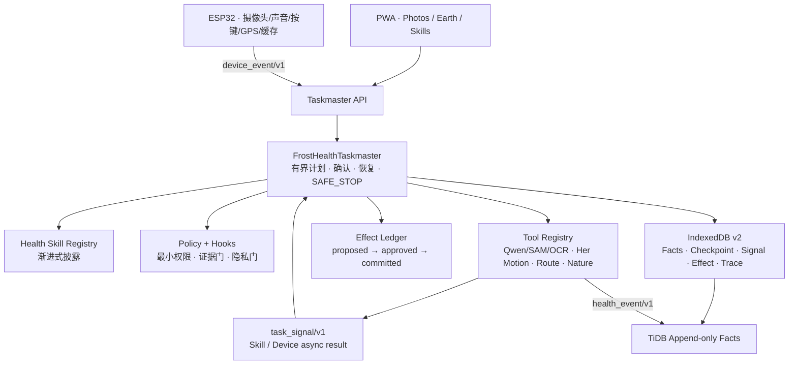

# Frost Health Taskmaster 架构

这套实现把 Frost 定义为一个跨 PWA、ESP32 与服务器存在的健康行动 Agent。Photos、Earth、Skills 和硬件不是四个 Agent，而是同一个 Taskmaster 的感知、行动、能力与随身身体。

## 1. 总体分层



参考 Harness 工程原则后，Frost 采用四个明确边界：

1. **事实与记忆层**：`health_event/v1` 是唯一跨域事实合同；总结必须带 `source_event_ids`。
2. **Skill 与治理层**：常驻上下文只加载 Skill 语义目录；选中后才加载步骤、权限和停止规则。
3. **工具与集成层**：模型、地图、设备、TiDB 都是可替换适配器；工具必须单一职责并声明权限。
4. **Taskmaster 运行层**：任务有步骤/调用/时间上限，可确认、可等待外部结果、可恢复、可审计。

## 2. 关键合同

- `health_event/v1`：餐食、运动、自然、Skill 与设备状态的统一事实。
- `device_event/v1`：ESP32 离线事件；全局 `event_id` 保证重放幂等。
- `frost-health-skill/v1`：Skill 的 What / When / Not For、权限、步骤、停止和完成条件。
- `frost-task/v1`：Taskmaster 检查点，包含下一动作、确认记录、调用预算与证据 ID。
- `task_signal/v1`：外部 Skill / 设备的统一完成、错误和取消信号；`task_id + run_id + action_id + correlation_id` 四重关联。
- `effect_record/v1`：健康记忆、路线、地图发布和通知的幂等副作用账本。

原始事实不覆盖。用户修正或模型重跑必须创建新事件，并用 `supersedes_event_id` 指向旧事件。相同 `event_id` 与相同内容是合法重放；相同 ID 不同内容是冲突。

## 3. Taskmaster 执行语义

```text
接收任务
→ 确定性映射到一个已登记 Skill
→ 安全预检
→ 生成有界工具动作
→ beforeToolUse：权限白名单 / 用户确认
→ 执行工具或进入 waiting_external
→ 外部 Skill 以 task_signal/v1 回传（重复 signal_id 不重做）
→ afterToolUse：严格校验 health_event
→ 追加事实、提交 Effect、再推进 checkpoint
→ beforeTaskComplete：证据门
→ completed / failed / SAFE_STOP
```

状态包括 `created`、`planned`、`waiting_confirmation`、`waiting_external`、`running`、`completed`、`failed`、`safe_stopped`。`signal()` 是异步结果的主通道；`resume(taskId)` 只用于无副作用 Provider 的显式重试。重启后若 checkpoint 落后于已提交 Effect，Taskmaster 从账本恢复，不再次执行该副作用。

这里不保存模型的隐藏思维过程。`TraceSink` 只记录输入边界、工具、策略决定、事件数量、错误和完成状态，因此可调试又不会把隐藏推理当作产品数据。

## 4. 五个 P0 Skills

| Skill | 任务 | 写入事实 | 确认/停止边界 |
|---|---|---|---|
| Photos 饮食记录 | 菜品/食材识别、估份、营养映射 | `meal_confirmed` | 模型结果先候选；用户确认后提交 |
| Her Motion 热身 | 跑前热身与姿态反馈 | `skill_completed` | 摄像头需确认；危险症状 SAFE_STOP |
| 无手机跑步 | ESP32/手机运动事实、路线、私密树 | `run_completed` | 无 GPS 不造路线；公开另设确认门 |
| 自然时刻 | 图片/声音观察与路线关联 | `nature_captured` | 低于 0.7 写 `unknown`；敏感位置模糊 |
| 每日总结 | 证据化回顾和明日轻行动 | summary | 不诊断；数字必须来自事件 |

## 5. ESP32 边界

设备状态机位于 `deviceState.ts`：

```text
BOOT → PAIRING → READY → WORKOUT_RUNNING ↔ PAUSED
WORKOUT_RUNNING/PAUSED → NATURE_CAPTURE → UPLOAD_PENDING → WORKOUT_RUNNING
WORKOUT_RUNNING/PAUSED → SYNC_PENDING → READY
任意活动状态触发危险 → SAFE_STOP
```

ESP32 负责采集、缓存、轻规则和表达；Qwen、SAM、PANNs、姿态大模型不部署在 ESP32。设备没有上报的位置不会被服务器补造。`deviceGateway.ts` 拒绝非法经纬度并把合法事件幂等转换为健康事实。

## 6. 数据与隐私

- PWA：`IndexedDbTaskmasterStore` v2 保存离线事实、任务 checkpoint、Signal、Effect 和 Trace。
- 服务端：`storage/tidb.sql` 给出 TiDB 事实、餐食、路线、自然、Skill、Trace、总结和地图对象表。
- 默认 `visibility=private`；发布路线端点前使用 200–500m 模糊；敏感物种还需延迟或更强模糊。
- 删除公开内容时，服务端实现必须级联清理 `map_objects` 的引用；原始私密健康事实是否删除由用户数据删除流程决定。
- 向量只用于检索，永远不负责权限判断。

## 7. 外部能力接入

`ExternalHealthProviders` 是同步/轮询适配面；独立页面、设备和子 Agent 统一使用 `task_signal/v1`：

- `observeMeal`：国内版 Qwen-VL + SAM + OCR + 营养数据库。
- `guideMotion`：Her Motion 连续帧姿态分类。
- `observeNature`：鸟声/植物/昆虫图像或声音识别。

未注入 Provider 时工具返回 `waiting_external`，不假装调用成功。Her Motion 和 Meal Lens 已经通过 correlation signal 回传；Photos 的确认按钮经过 `meal.observe → meal.commit` 确认门。跑步设备事实、自然观察和每日总结也已有同一运行时适配器。后续服务端可以把相同 Tool 接到自托管 Qwen、PaddleOCR、SAM、TiDB 或比赛现场 ESP32，而 Taskmaster 合同不变。

## 8. 已实现与尚未接通

已实现：合同校验、Skill 注册、最小权限、确认门、安全停止、设备状态机、幂等重放、Task Signal、Effect Ledger、IndexedDB v2 持久 Trace、证据化日总结、传输无关 API、TiDB v2 Schema、单元/集成测试。

仍属于部署/模型适配而非 Taskmaster 内核：真实 TiDB 网络仓库、ESP32 固件上传、自托管视觉模型和地图公开接口。任意 Plaza Skill 也必须实现自己的 Tool/Signal adapter 后才会获得执行能力；仅有 Manifest 不会被伪装成“已接通”。

## 9. 验证

```bash
npx vitest run frost-agent/taskmaster/taskmaster.test.ts
npm run typecheck
```

核心测试覆盖：餐食确认门、外部 Signal 关联与重复回传、Effect 唯一提交、持久 Trace、真实跑步事实、私密种树、危险症状停止、自然低置信 unknown、设备重放幂等、非法 GPS 拒绝、状态机非法迁移与日总结证据追溯。
