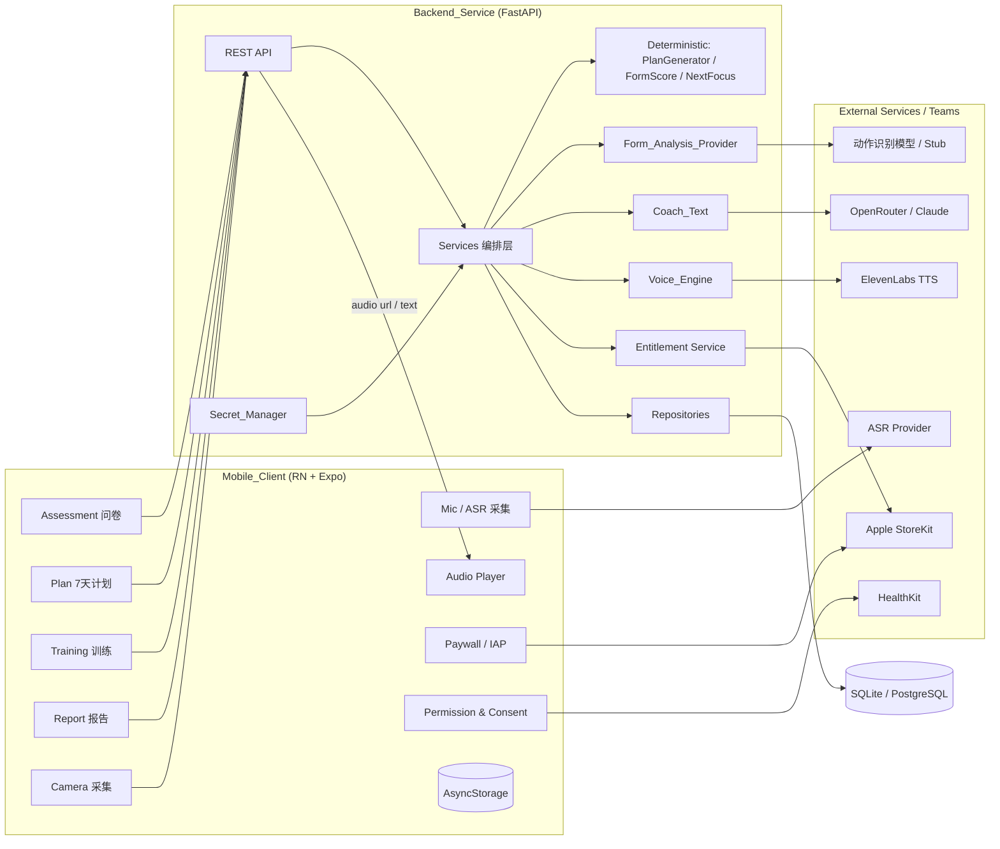

# Design Document

## Overview

"练了吗"是一个三层架构的 AI 健身教练 App：移动客户端（React Native + Expo）负责评估问卷、训练界面、摄像头与语音采集、音频播放、付费墙与分项授权；后端服务（FastAPI + Python）负责业务编排、确定性计算、数据持久化与第三方服务调度；外部能力（动作识别模型、ASR、LLM 文本、TTS、StoreKit、HealthKit）通过明确契约接入。

核心设计原则：

- **确定性与生成式分离**：训练计划、动作分（Form_Score）、下一次重点等是**纯函数确定性计算**，绝不交给 LLM；LLM 只负责"文案表达"（鼓励、纠正润色、报告措辞），且始终有模板兜底。
- **动作判定外置**：动作"是否标准"由 `Form_Analysis_Provider` 契约负责，真实实现由模型团队提供。本系统**不做生物力学判定**，本期用 `Stub_Form_Provider` 打通链路。系统内不允许用自家 LLM 判定动作标准度。
- **能力 Provider 化**：动作分析、ASR、LLM、TTS 都封装为可注入、可替换的 Provider，便于桩实现、测试 mock 与后续替换。
- **凭证集中管理**：所有第三方密钥经 Secret_Manager 读取，绝不进入源码与日志。
- **权限最小化与分项授权**：摄像头/麦克风/HealthKit 分别在功能首次使用时申请；敏感健康信息（伤痛风险）单独明示同意。

设计来源映射：每节末尾通过 `_Requirements: ..._` 标注关联需求编号。

## Architecture

### High-Level Architecture



### Layering

- **Mobile_Client**：UI、设备采集、播放、付费墙、授权管理。语音命令的 ASR 既可设备端也可云端，封装在客户端 Provider 后。
- **Backend_Service**：薄编排层。确定性能力是纯函数模块；生成式能力经 Provider 注入；不内联任何密钥。
- **External**：动作识别模型（本期为 Stub）、ASR、LLM、TTS、StoreKit、HealthKit。
- **Data_Store**：开发 SQLite / 生产 PostgreSQL，经统一 Repository 屏蔽差异。

## Components and Interfaces

### Mobile_Client

| 模块 | 职责 | 关联需求 |
|------|------|----------|
| `screens/Assessment` | 评估问卷（目标/场地/器械/频率/伤痛自评），分项授权与敏感同意前置 | 1, 9 |
| `screens/Plan` | 按天展示 7 天计划 | 2 |
| `screens/Training` | 训练主界面，挂载摄像头采集、语音命令、播放鼓励/纠正，处理训练控制 | 4, 5, 6 |
| `screens/Report` | 展示训练报告（动作分/风险提示/纠正次数/下一次重点） | 7 |
| `paywall/Paywall` | 免费额度耗尽时展示 Pro 权益与 IAP 入口、恢复购买 | 8 |
| `permission/PermissionManager` | 分项申请 camera/mic/healthkit，管理 Sensitive_Consent | 9 |
| `voice/CommandProvider` | ASR 封装，输出受支持 Voice_Command；不可用时回退触控 | 5 |
| `audio/Player` | 播放鼓励音频 URL；失败降级文本 | 6 |
| `iap/StoreKitClient` | StoreKit 购买、凭证获取、恢复购买 | 8 |
| `api/client` | 与后端 REST 通信，统一错误处理与单位换算 | 全部 |
| `store/` | Zustand 管理 user_id、计划、会话状态、Entitlement | 全部 |

### Backend_Service (FastAPI) — REST 接口

| 方法 | 路径 | 描述 | 关联需求 |
|------|------|------|----------|
| POST | `/api/assessments` | 提交评估，创建 user_id，触发计划生成 | 1, 2 |
| GET | `/api/users/{user_id}/plan` | 查询当前 7 天计划 | 2 |
| POST | `/api/sessions` | 开启 Training_Session | 10 |
| POST | `/api/sessions/{sid}/form-analysis` | 提交某动作上下文，经 Form_Analysis_Provider 分析并生成纠正 | 3, 4 |
| POST | `/api/sessions/{sid}/encourage` | 请求鼓励语音 | 6 |
| POST | `/api/sessions/{sid}/voice-command` | 上报已识别命令并返回控制结果（命令识别本身在端侧） | 5 |
| POST | `/api/sessions/{sid}/complete` | 结束会话并生成 Session_Report | 7 |
| GET | `/api/users/{user_id}/sessions` | 训练历史（含报告），时间倒序 | 7, 10 |
| GET | `/api/users/{user_id}/entitlement` | 查询当前权益与剩余免费额度 | 8 |
| POST | `/api/users/{user_id}/entitlement/verify` | 校验 StoreKit 凭证并更新 Entitlement | 8 |

模块组织：

- `deterministic/` — `plan_generator.py`、`form_score.py`、`next_focus.py`，纯函数，无 LLM、无 I/O 副作用。
- `providers/form_analysis/` — `base.py`（契约）、`stub.py`（桩实现）、（未来）`model_client.py`。
- `providers/coach_text/` — LLM 客户端封装 + 模板回退（鼓励、纠正润色、报告文案）。
- `providers/voice/` — Voice_Engine（TTS 调用 + 缓存 + Audio_Store）。
- `services/` — `AssessmentService`、`PlanService`、`TrainingService`、`ReportService`、`EntitlementService`。
- `repositories/` — SQLAlchemy，对 SQLite/PostgreSQL 一致接口。
- `core/secrets.py` — Secret_Manager，读取 `OPENROUTER_API_KEY`、`ELEVENLABS_API_KEY` 等；缺失抛 `MissingSecretError` → 503。
- `core/logging.py` — 日志中间件，对 `*_API_KEY`、`Authorization`、凭证字段掩码。

### Form_Analysis_Provider 契约（核心解耦点）

```python
class FormAnalysisResult(BaseModel):
    is_standard: bool
    confidence: ConfidenceLevel            # low | medium | high
    problem_areas: list[ProblemArea]       # 命中的问题部位/规则标识，可空
    status: Literal["conclusive", "inconclusive"]

class FormAnalysisProvider(Protocol):
    def analyze(self, exercise: SupportedExercise, context: FormContext) -> FormAnalysisResult: ...
```

- `Stub_Form_Provider`：依据可配置策略返回确定性结果（如按预设序列或输入特征），用于打通链路与测试。
- 真实模型实现同一 `analyze` 接口接入；若模型以关键点为输入，则在实现内部校验关键点结构（坐标/置信度/时间戳）。
- 服务层只依赖 `FormAnalysisProvider` 抽象，通过依赖注入选择 stub 或真实实现，切换不改调用方（覆盖需求 3.3）。

### Coach_Text（生成式文案，带模板兜底）

```python
class CoachText:
    def __init__(self, llm: LLMClient | None, templates: TemplateBank): ...
    def encourage(self, state: SessionState) -> str: ...
    def refine_correction(self, problem_areas, base_text: str) -> str: ...
    def report_summary(self, report: SessionReport) -> str: ...
```

- LLM 经 OpenRouter 接入 Claude，仅做"文字表达"。任何 LLM 失败/超时/缺密钥时回退 `TemplateBank`（覆盖需求 12.3）。
- LLM 不参与计划数值、动作分、动作标准度判定。

### Voice_Engine

- `synthesize(text) -> {audio_url, tts_failed}`：先查缓存（按文本哈希），命中复用；未命中调用 ElevenLabs 并写入 Audio_Store（覆盖需求 6.4）。
- 失败时返回 `tts_failed=true` 且 `audio_url=None`，由客户端降级为文本（覆盖需求 6.6）。

### EntitlementService（付费墙）

- 维护每用户 `entitlement`（free/pro）与受限功能计数 `free_quota_used`。
- `check_access(feature)`：pro 直接放行；free 在达到 Free_Quota 后返回需展示 Paywall 的标识（覆盖需求 8.2/8.7）。
- `verify_receipt(receipt)`：校验 StoreKit 凭证，成功置 pro，失败/过期回退 free（覆盖需求 8.4/8.5/8.8）。
- 不依赖应用账户，权益绑定到 user_id + 购买凭证。

### 语音命令（端侧识别）

- ASR 在客户端 `voice/CommandProvider` 内完成（设备端或云端可替换），将自然语音映射为 Voice_Command 枚举。
- 未匹配任何命令时不执行控制动作并提示重试（覆盖需求 5.6）；麦克风未授权时禁用语音并保留触控（覆盖需求 5.2）。
- 端侧执行控制后，通过 `/voice-command` 上报用于会话记录与 `repeat` 重放最近教练内容。

## Data Models

```python
class TrainingGoal(str, Enum):
    FAT_LOSS = "fat_loss"; MUSCLE_GAIN = "muscle_gain"
    ENDURANCE = "endurance"; GENERAL_FITNESS = "general_fitness"

class Venue(str, Enum):
    HOME = "home"; GYM = "gym"; OUTDOOR = "outdoor"

class SupportedExercise(str, Enum):
    SQUAT = "squat"; LUNGE = "lunge"
    OVERHEAD_PRESS = "overhead_press"; PUSH_UP = "push_up"

class ConfidenceLevel(str, Enum):
    LOW = "low"; MEDIUM = "medium"; HIGH = "high"

class VoiceCommand(str, Enum):
    PAUSE = "pause"; RESUME = "resume"; SWITCH = "switch_exercise"
    REDUCE = "reduce_difficulty"; REPEAT = "repeat"; END = "end_session"

class Entitlement(str, Enum):
    FREE = "free"; PRO = "pro"

class InjuryRiskArea(str, Enum):
    SHOULDER = "shoulder"; LOWER_BACK = "lower_back"
    KNEE = "knee"; WRIST = "wrist"; NECK = "neck"

class Assessment(BaseModel):
    user_id: UUID
    goal: TrainingGoal
    venue: Venue
    equipment: list[str]                  # none/dumbbell/barbell/...
    weekly_frequency: int                 # 1 ~ 7
    injury_risk: list[InjuryRiskArea]     # 需 Sensitive_Consent 后才采集
    created_at: datetime

class PlanExercise(BaseModel):
    name: str
    exercise: SupportedExercise | None    # 可纠错动作关联枚举，其余为通用动作
    sets: int
    reps: int | None
    duration_sec: int | None
    rest_sec: int
    difficulty: int                       # 1(易) ~ 5(难)

class PlanDay(BaseModel):
    day_index: int                        # 1 ~ 7
    is_rest_day: bool
    exercises: list[PlanExercise]

class TrainingPlan(BaseModel):
    user_id: UUID
    days: list[PlanDay]                   # 长度 = 7
    created_at: datetime

class ProblemArea(BaseModel):
    area: str                             # 如 knee_valgus / back_rounding
    severity: ConfidenceLevel

class FormAnalysis(BaseModel):
    session_id: UUID
    exercise: SupportedExercise
    is_standard: bool
    confidence: ConfidenceLevel
    problem_areas: list[ProblemArea]
    status: Literal["conclusive", "inconclusive"]
    correction_text: str | None           # is_standard=false & conclusive 时非空
    created_at: datetime

class VoiceCommandEvent(BaseModel):
    session_id: UUID
    command: VoiceCommand
    created_at: datetime

class SetRecord(BaseModel):
    exercise: SupportedExercise | None
    reps: int | None
    difficulty: int

class SessionReport(BaseModel):
    session_id: UUID
    form_score: int                       # 0 ~ 100，确定性计算
    risk_notes: list[str]
    correction_count: int
    next_focus: str
    summary_text: str | None              # Coach_Text 润色，可空

class TrainingSession(BaseModel):
    session_id: UUID
    user_id: UUID
    started_at: datetime
    ended_at: datetime | None
    sets: list[SetRecord]
    form_analyses: list[FormAnalysis]
    voice_commands: list[VoiceCommandEvent]
    report: SessionReport | None

class PermissionRecord(BaseModel):
    user_id: UUID
    scope: Literal["camera", "microphone", "healthkit"]
    granted: bool
    updated_at: datetime

class ConsentRecord(BaseModel):
    user_id: UUID
    consent_type: Literal["sensitive_health"]
    granted: bool
    updated_at: datetime

class UserEntitlement(BaseModel):
    user_id: UUID
    entitlement: Entitlement
    free_quota_used: int
    updated_at: datetime
```

字段范围（如 `weekly_frequency 1~7`、`difficulty 1~5`）由前端 Zod / 后端 Pydantic 双向校验。

## Error Handling

| 场景 | 处理 |
|------|------|
| 评估必填项缺失/越界 | 客户端阻断；后端 Pydantic 校验返回 422（需求 1.5/1.6）|
| Form_Analysis_Provider 返回缺字段 | 后端校验返回 422，不静默忽略（需求 3.5）|
| Form_Analysis `status=inconclusive` | 不生成纠正反馈，提示重新采集（需求 4.5）|
| 摄像头/麦克风未授权 | 功能降级：动作纠错关闭→手动模式；语音关闭→触控（需求 4.2/5.2/9.2）|
| 第三方凭证缺失 | Secret_Manager 抛 `MissingSecretError`，返回 503（需求 11.3）|
| ElevenLabs TTS 失败 | `tts_failed=true` + 文本，前端文本展示（需求 6.6）|
| LLM 文案失败/超时 | Coach_Text 回退 TemplateBank（需求 12.3）|
| StoreKit 凭证校验失败/过期 | Entitlement 回退 free，恢复额度限制（需求 8.8）|
| 能力调用部分失败 | 保留成功步骤结果，错误以 `partial_failure` 返回（需求 12.5）|
| 日志含密钥 | 日志中间件统一掩码（需求 11.4）|

## Testing Strategy

- **确定性单元测试（pytest）**：
  - `plan_generator`：7 天结构、训练日数=频率、器械/场地相容、伤痛规避（需求 2.2/2.4/2.5）。
  - `form_score`：标准动作占比→分值映射的确定性与边界（需求 7.2）。
  - `next_focus`：最高频问题部位推导（需求 7.5）。
- **Provider 测试**：`Stub_Form_Provider` 可配置返回；缺字段输入触发 422（需求 3.5）。
- **契约测试（FastAPI TestClient）**：覆盖全部 REST 接口 happy path 与失败路径（缺字段/越界/503/付费墙）。
- **Coach_Text 回退测试**：LLM 注入失败时回退模板，输出非空（需求 12.3）。
- **Voice_Engine 测试**：TTS 失败降级、缓存命中复用（需求 6.4/6.6）。
- **Entitlement 测试**：免费额度耗尽触发付费墙、购买置 pro、凭证失效回退（需求 8）。
- **前端测试（Jest + RN Testing Library）**：评估表单校验、分项授权降级、语音命令映射与未匹配处理、音频失败降级、付费墙触发。
- **属性测试候选**：见 Correctness Properties，集中实现。
- **端到端冒烟**：评估 → 7 天计划 → 开启会话 → 提交动作分析（stub）→ 触发鼓励 → 语音命令 → 结束生成报告，全链路用 mock Provider。

## Correctness Properties

### Property 1: 评估完整性
任何被持久化的 Assessment 必含 goal、venue、weekly_frequency，且 `1 ≤ weekly_frequency ≤ 7`；injury_risk 仅在 Sensitive_Consent 已授予时存在。
**Validates: Requirements 1.2, 1.3, 1.4, 9.3**

### Property 2: 计划结构正确性
`generate_plan` 输出恰好覆盖 7 天，训练日数量等于 weekly_frequency，且每个被安排的动作与 equipment/venue 相容。
**Validates: Requirements 2.1, 2.2, 2.4**

### Property 3: 伤痛规避
当 injury_risk 含某部位时，计划中不出现被标记为显著加载该部位的动作。
**Validates: Requirements 2.5**

### Property 4: 确定性边界（无 LLM 介入数值）
在 LLM Provider 不可用的情况下，`generate_plan`、`form_score`、`next_focus` 仍产出完整且合法的结果。
**Validates: Requirements 2.7, 7.2, 12.2**

### Property 5: 动作分析契约健壮性
Form_Analysis_Provider 返回缺少 `is_standard` 或 `confidence` 的结果时，后端返回 422 而非静默忽略或未处理异常。
**Validates: Requirements 3.5**

### Property 6: 纠正反馈一致性
当 `is_standard=false` 且 `status=conclusive` 时 `correction_text` 非空；当 `status=inconclusive` 时不生成纠正反馈；当 `is_standard=true` 时 `correction_text` 可空。
**Validates: Requirements 4.3, 4.5, 4.6**

### Property 7: 动作分边界
`form_score` 恒落在 `[0, 100]`，且会话内全部动作标准时分值不低于全部不标准时分值。
**Validates: Requirements 7.2**

### Property 8: 纠正次数一致性
`correction_count` 等于会话内 `is_standard=false` 且生成了 `correction_text` 的动作次数。
**Validates: Requirements 7.4**

### Property 9: 鼓励语音降级
当 TTS 失败时，`encourage` 响应 `text` 非空、`audio_url` 为空且 `tts_failed=true`。
**Validates: Requirements 6.6**

### Property 10: 语音命令封闭性
Voice_Command 映射结果必为受支持枚举之一或"未匹配"；未匹配时不产生任何训练控制副作用。
**Validates: Requirements 5.1, 5.6**

### Property 11: 权益与付费墙一致性
`entitlement=pro` 时受限功能不计入 Free_Quota 也不触发 Paywall；`entitlement=free` 且使用次数达到 Free_Quota 时再次使用必触发 Paywall。
**Validates: Requirements 8.2, 8.7**

### Property 12: 凭证零泄漏
日志输出不出现 `OPENROUTER_API_KEY` / `ELEVENLABS_API_KEY` 明文；缺失凭证时不发起对应外部调用。
**Validates: Requirements 11.2, 11.3, 11.4**

### Property 13: 部分失败保真
某一能力调用失败时，返回值中已成功步骤的输出与失败前一致，不被丢弃或覆盖。
**Validates: Requirements 12.5**

## Tech Stack & Project Layout

- 移动端：React Native (Expo) + TypeScript + React Navigation + Zustand + Zod；`expo-camera`、麦克风/ASR、`expo-av`、StoreKit（IAP）、HealthKit。
- 后端：Python 3.11+、FastAPI、SQLAlchemy 2.x、Pydantic v2、pytest、hypothesis。
- 外部能力：动作识别模型（本期 Stub）、ASR、OpenRouter/Claude（文案）、ElevenLabs（TTS）、Apple StoreKit、HealthKit。
- 数据库：SQLite（开发）/ PostgreSQL（生产，需求 10.4）。

```
lian_le_ma/
├── app/                                # React Native + Expo
│   └── src/
│       ├── screens/{Assessment,Plan,Training,Report}
│       ├── paywall/  permission/  voice/  audio/  iap/
│       ├── api/  store/
├── backend/                            # FastAPI
│   └── app/
│       ├── api/routes/
│       ├── deterministic/{plan_generator,form_score,next_focus}
│       ├── providers/{form_analysis/{base,stub},coach_text,voice}
│       ├── services/
│       ├── repositories/
│       ├── models/
│       ├── core/{secrets,logging,config}
│       └── main.py
│   ├── tests/
│   ├── pyproject.toml
│   └── .env.example                    # 仅占位，不含真实密钥
├── .kiro/specs/fitness-coach-agent/
└── README.md
```

`_Requirements: 1, 2, 3, 4, 5, 6, 7, 8, 9, 10, 11, 12, 13_`
