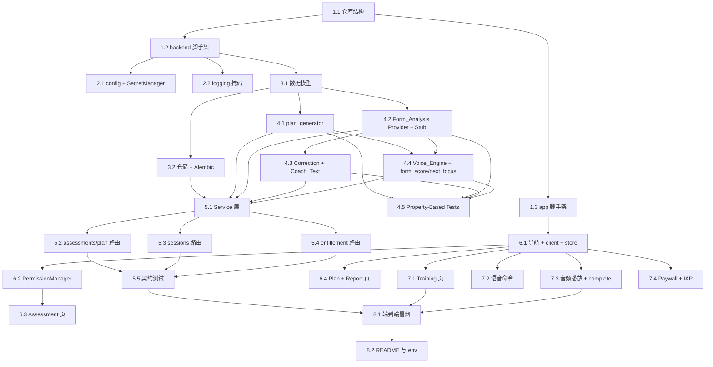

# Implementation Plan

## Overview

按"脚手架 → 后端基础设施 → 确定性能力 → Provider 能力 → 后端 API → 移动端 → 联调"拆分。属性测试集中在任务 4.5（覆盖 design.md 的 13 条 Correctness Properties 中可在后端单元层验证的部分）。动作识别模型本期仅用 `Stub_Form_Provider` 打通链路，真实模型由模型团队后续按 `Form_Analysis_Provider` 契约接入。

## Tasks

- [x] 1. 初始化仓库结构与工程脚手架
- [x] 1.1 在仓库根创建 `backend/` 与 `app/` 工作区，更新根 `README.md`，添加 `.editorconfig`，在 `.gitignore` 追加 Python（`__pycache__/`、`.venv/`、`*.pyc`）与 Expo（`.expo/`、`web-build/`）忽略项
  - _Requirements: N/A (脚手架)_

- [x] 1.2 初始化 `backend/` 工程：`pyproject.toml`（fastapi、uvicorn、pydantic v2、sqlalchemy 2.x、alembic、httpx、python-dotenv、pytest、pytest-asyncio、hypothesis），`app/main.py` 暴露 `health` 接口，`.env.example` 列出 `OPENROUTER_API_KEY`、`ELEVENLABS_API_KEY`、`DATABASE_URL` 占位
  - _Requirements: 11.2_

- [x] 1.3 初始化 `app/` 工程：Expo + React Native + TypeScript，安装 React Navigation、Zustand、Zod、`expo-camera`、`expo-av`、麦克风/ASR 依赖、StoreKit IAP 库、HealthKit 库，配置 `tsconfig.json` 严格模式
  - _Requirements: N/A (脚手架)_

- [ ] 2. 后端配置、凭证与日志安全
- [x] 2.1 在 `core/config.py` 加载环境变量（默认 SQLite `sqlite:///./dev.db`）；在 `core/secrets.py` 实现 `SecretManager.get(name)`，缺失抛 `MissingSecretError`，注册 FastAPI 异常处理器返回 503；编写单元测试
  - _Requirements: 11.1, 11.3_

- [ ] 2.2 在 `core/logging.py` 配置全局 logger 与日志中间件，对 `*_API_KEY`、`Authorization`、`api_key` 字段掩码（保留前 2 后 2 位）；单元测试断言密钥明文不出现在日志
  - _Requirements: 11.4_

- [ ] 3. 后端数据模型与仓储
- [ ] 3.1 在 `models/` 定义 `Assessment`、`TrainingPlan`/`PlanDay`/`PlanExercise`、`FormAnalysis`/`ProblemArea`、`VoiceCommandEvent`、`SetRecord`、`SessionReport`、`TrainingSession`、`PermissionRecord`、`ConsentRecord`、`UserEntitlement` 的 Pydantic 模型与 SQLAlchemy ORM 表，实现 `weekly_frequency 1~7`、`difficulty 1~5`、`form_score 0~100` 等范围校验
  - _Requirements: 1.2, 1.3, 2.2, 2.3, 7.1, 7.2, 9.4, 10.1_

- [ ] 3.2 在 `repositories/` 实现 `AssessmentRepository`、`PlanRepository`、`SessionRepository`、`EntitlementRepository`、`ConsentRepository`，提供 CRUD 与按用户分页/倒序查询；配置 Alembic 初始迁移；编写 SQLite 集成测试
  - _Requirements: 2.8, 7.6, 7.7, 10.1, 10.2, 10.3, 10.4_

- [ ] 4. 确定性能力与 Provider 能力
- [ ] 4.1 在 `deterministic/plan_generator.py` 实现 `generate_plan(assessment) -> TrainingPlan`：输出 7 天结构、训练日数=weekly_frequency、仅安排与 equipment/venue 相容的动作、按 injury_risk 规避加载部位、按 goal 调整训练量/强度；纯函数无 LLM；附单元测试
  - _Requirements: 2.1, 2.2, 2.3, 2.4, 2.5, 2.6, 2.7_

- [ ] 4.2 在 `providers/form_analysis/` 实现 `base.py`（`FormAnalysisProvider` 协议 + `FormAnalysisResult`）与 `stub.py`（可配置确定性返回）；实现输入/输出字段校验：缺 `is_standard`/`confidence` 时抛错供路由返回 422；附单元测试
  - _Requirements: 3.1, 3.2, 3.5, 3.6_

- [ ] 4.3 实现 `Correction_Composer`（基于 `problem_areas` 的模板映射生成纠正反馈，可经 Coach_Text 润色）与 `providers/coach_text/`（LLM 客户端经 OpenRouter，失败回退 `TemplateBank`，覆盖鼓励/纠正润色/报告文案）；附 LLM 不可用时回退模板的单元测试
  - _Requirements: 4.3, 4.4, 4.5, 4.6, 6.2, 12.1, 12.3_

- [ ] 4.4 实现 `providers/voice/` Voice_Engine：`synthesize(text)` 查缓存命中复用、未命中调 ElevenLabs 并写 Audio_Store，失败返回 `tts_failed=true` + 空 `audio_url`；ElevenLabs 客户端封装为可注入依赖；附缓存命中与失败降级测试。在 `deterministic/form_score.py`、`deterministic/next_focus.py` 实现动作分（0~100）与下一次重点的确定性计算 + 单元测试
  - _Requirements: 6.3, 6.4, 6.6, 7.2, 7.4, 7.5_

- [ ] 4.5 编写 Property-Based Tests（hypothesis）覆盖 design.md 的 Correctness Properties：P2 计划结构、P3 伤痛规避、P4 无 LLM 确定性、P5 契约健壮性(422)、P6 纠正反馈一致性、P7 动作分边界、P8 纠正次数一致性、P9 TTS 降级、P11 权益/付费墙一致性、P13 部分失败保真
  - _Requirements: 2.4, 2.5, 2.7, 3.5, 4.3, 4.5, 4.6, 6.6, 7.2, 7.4, 8.2, 8.7, 12.5_

- [ ] 5. 后端服务层与 REST API
- [ ] 5.1 在 `services/` 实现 `AssessmentService`（落库评估并触发计划生成）、`PlanService`、`TrainingService`（调用 Form_Analysis_Provider + Correction_Composer，写会话）、`ReportService`（确定性算分+下一次重点，Coach_Text 润色文案）、`EntitlementService`（free/pro、Free_Quota 计数、StoreKit 凭证校验、回退）；服务层不直接调用 LLM 数值
  - _Requirements: 1.7, 1.8, 2.8, 5.4, 7.1, 7.5, 8.1, 8.4, 8.5, 8.8, 12.5_

- [ ] 5.2 在 `api/routes/assessments.py` 与 `plan.py` 实现 `POST /api/assessments`（创建 user_id、触发计划）与 `GET /api/users/{user_id}/plan`；422 处理缺失/越界
  - _Requirements: 1.1, 1.5, 1.6, 1.7, 1.8, 2.9_

- [ ] 5.3 在 `api/routes/sessions.py` 实现 `POST /api/sessions`、`POST /api/sessions/{sid}/form-analysis`（分析+纠正+写会话）、`POST /api/sessions/{sid}/encourage`、`POST /api/sessions/{sid}/voice-command`（记录命令、支持 repeat 重放）、`POST /api/sessions/{sid}/complete`（生成 Session_Report）、`GET /api/users/{user_id}/sessions`
  - _Requirements: 3.4, 4.3, 4.5, 5.4, 6.1, 6.3, 7.1, 7.6, 7.7, 10.1, 10.2, 10.3_

- [ ] 5.4 在 `api/routes/entitlement.py` 实现 `GET /api/users/{user_id}/entitlement`（权益+剩余额度）与 `POST /api/users/{user_id}/entitlement/verify`（校验 StoreKit 凭证并更新）；在受限功能路由接入 Free_Quota 检查与付费墙标识
  - _Requirements: 8.1, 8.2, 8.4, 8.5, 8.7, 8.8_

- [ ] 5.5 用 FastAPI TestClient 为 5.2/5.3/5.4 全部接口编写契约测试，覆盖 happy path 与失败路径（字段缺失/越界 422、凭证缺失 503、Provider 缺字段 422、付费墙触发）
  - _Requirements: 1.5, 1.6, 3.5, 8.2, 11.3_

- [ ] 6. 移动端：基础架构、评估、计划、报告
- [ ] 6.1 配置 React Navigation 栈：`Assessment` → `Plan` → `Training` → `Report`；在 `api/client.ts` 封装 HTTP 客户端（base URL、错误处理）；在 `store/` 用 Zustand 管理 user_id、计划、会话状态、Entitlement
  - _Requirements: N/A (基础架构)_

- [ ] 6.2 实现 `permission/PermissionManager`：分项申请 camera/microphone/healthkit（功能首次使用前），管理 `sensitive_health` 同意与撤回，记录授予状态；未授权时对应功能降级
  - _Requirements: 9.1, 9.2, 9.3, 9.4, 9.5, 9.6, 9.7_

- [ ] 6.3 实现 `screens/Assessment`：Zod 校验目标/场地/器械/频率，必填缺失阻止提交、频率越界提示；采集 injury_risk 前先经 PermissionManager 取得 Sensitive_Consent；提交成功跳转计划页
  - _Requirements: 1.1, 1.2, 1.3, 1.4, 1.5, 1.6_

- [ ] 6.4 实现 `screens/Plan`（按 7 天展示计划）与 `screens/Report`（展示动作分/风险提示/纠正次数/下一次重点，含"不构成医疗建议"标注）
  - _Requirements: 2.9, 4.8, 7.1, 7.3_

- [ ] 7. 移动端：训练、语音、音频、付费墙
- [ ] 7.1 实现 `screens/Training`：挂载摄像头采集（无摄像头权限时降级手动模式），将动作上下文经 `POST /sessions/{sid}/form-analysis` 上送，`is_standard=false` 时展示 `correction_text`，`inconclusive` 时提示重新采集
  - _Requirements: 4.1, 4.2, 4.3, 4.5, 4.8_

- [ ] 7.2 实现 `voice/CommandProvider`：封装 ASR，将语音映射为 Voice_Command 枚举（pause/resume/switch/reduce/repeat/end），未匹配不执行控制并提示；麦克风未授权时禁用语音保留触控；执行后经 `/voice-command` 上报
  - _Requirements: 5.1, 5.2, 5.3, 5.4, 5.5, 5.6, 5.7_

- [ ] 7.3 实现 `audio/Player`（`expo-av` 播放鼓励音频，`tts_failed=true` 或无 `audio_url` 时降级文本）；在训练结束触发 `POST /sessions/{sid}/complete` 并跳转报告页
  - _Requirements: 6.1, 6.3, 6.5, 6.6, 7.1_

- [ ] 7.4 实现 `paywall/Paywall` 与 `iap/StoreKitClient`：免费额度耗尽时展示 Pro 权益与 IAP 入口，购买成功置 pro 并解除限制，提供"恢复购买"；通过 `/entitlement/verify` 校验凭证
  - _Requirements: 8.1, 8.2, 8.3, 8.4, 8.6, 8.7_

- [ ] 8. 端到端冒烟与文档
- [ ] 8.1 在 `backend/tests/e2e/` 编写端到端冒烟，使用 mock 的 Form_Analysis/Coach_Text/Voice/StoreKit Provider，覆盖：提交评估 → 生成 7 天计划 → 开启会话 → 提交动作分析 → 触发鼓励 → 上报语音命令 → 结束生成报告
  - _Requirements: 1, 2, 3, 4, 5, 6, 7, 8_

- [ ] 8.2 更新根 `README.md`：架构概览、`backend`/`app` 启动指南、环境变量列表（指向 `.env.example`）、"密钥不入库"、**MVP 未实现身份认证且禁止部署到对外公网**的声明；`backend/.env.example` 与 `app/.env.example` 仅放占位值
  - _Requirements: 11.2, 13.3_

## Task Dependency Graph

```json
{
  "waves": [
    { "wave": 1, "tasks": ["1.1"], "rationale": "仓库根结构最先就位。" },
    { "wave": 2, "tasks": ["1.2", "1.3"], "rationale": "backend 与 app 工程相互独立，可并行初始化。" },
    { "wave": 3, "tasks": ["2.1", "2.2", "3.1", "6.1"], "rationale": "后端配置/日志/数据模型与移动端基础架构互不依赖，可并行。" },
    { "wave": 4, "tasks": ["3.2", "4.1", "4.2", "6.2"], "rationale": "仓储依赖数据模型；计划生成器与动作分析 Provider 仅依赖模型；移动端授权管理依赖基础架构。" },
    { "wave": 5, "tasks": ["4.3", "4.4", "6.3", "6.4"], "rationale": "Coach_Text/Voice/算分依赖 Provider 与确定性骨架；评估/计划/报告页依赖授权管理与基础架构。" },
    { "wave": 6, "tasks": ["4.5", "5.1"], "rationale": "属性测试在确定性与 Provider 能力就位后统一覆盖；服务层依赖仓储与各能力。" },
    { "wave": 7, "tasks": ["5.2", "5.3", "5.4", "7.1", "7.2", "7.3", "7.4"], "rationale": "REST 路由依赖服务层；训练/语音/音频/付费墙页面依赖移动端基础能力，可与后端路由并行。" },
    { "wave": 8, "tasks": ["5.5"], "rationale": "契约测试覆盖路由层。" },
    { "wave": 9, "tasks": ["8.1"], "rationale": "端到端冒烟需后端契约与移动端关键路径就位。" },
    { "wave": 10, "tasks": ["8.2"], "rationale": "最后补齐 README 与 env 示例。" }
  ]
}
```



## Notes

- **动作识别模型边界**：本期不实现真实模型，仅交付 `Form_Analysis_Provider` 契约 + `Stub_Form_Provider`。模型团队就绪后实现同一接口接入，不改服务层/路由层（需求 3.3）。
- **确定性红线**：`generate_plan`、`form_score`、`next_focus` 为纯函数，禁止 LLM 参与数值；动作标准度判定只由 Provider 负责，禁止用本系统 LLM 判定（需求 12.2/12.4）。
- **Mock 边界**：单元/契约/端到端测试中所有 OpenRouter、ElevenLabs、StoreKit、ASR、Form_Analysis 调用必须走可注入依赖，禁止真实外呼。
- **凭证安全红线**：`.env` 不入库；凭证一律经 `SecretManager.get`；日志必经掩码中间件。
- **隐私红线**：摄像头/麦克风/HealthKit 分项授权，敏感健康信息（伤痛风险）单独同意且可撤回可删除（需求 9）。
- **平台限制**：iOS 真机打包与 StoreKit/HealthKit 真机联调需 macOS + 付费开发者账号；开发期可用 Expo Go 联调非原生权限部分。
